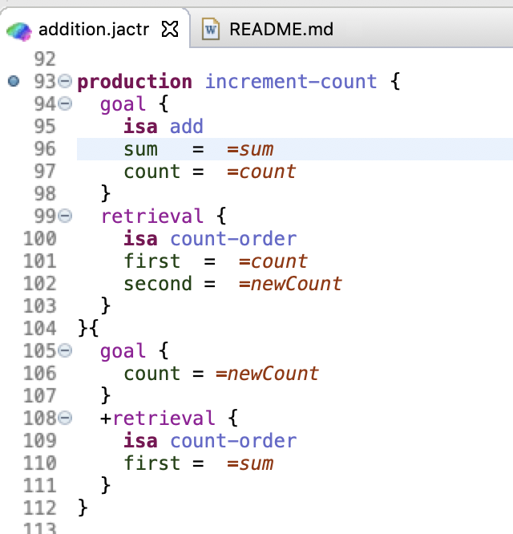

# Unit 1: Understanding Production Systems

## The ACT-R Production System

ACT-R is a production system theory that tries to explain human cognition by developing a model of the knowledge structures that underlie cognition.  There are two types of knowledge representation in ACT-R -- *declarative* knowledge and *procedural* knowledge. Declarative knowledge corresponds to things we are aware we know and can usually describe to others.  Examples of declarative knowledge include “George Washington was the first president of the United States” and “An atom is like the solar system”. Procedural knowledge is knowledge which we display in our behavior but which we are not conscious of.  For instance, no one can describe the rules by which we speak a language and yet we do.  In ACT-R declarative knowledge is represented in structures called chunks whereas procedural knowledge is represented as rules called productions.  Thus chunks and productions are the basic building blocks of an ACT-R model.

The function of Unit 1 is to present the formal notation for specifying chunks and productions and to describe how the two types of knowledge interact to produce cognition.  You will get some directed practice in interpreting and writing production systems. This tutorial will cover three models:

- [Count](#count-model)
- [Addition](#addition-model)
- [Semantic](#semantic-model)

### Chunks in ACT-R 

In ACT-R, elements of declarative knowledge are called chunks.  Chunks represent knowledge that a person might be expected to have when they solve a problem.  A chunk is defined by its type and its slots.   One can think of chunk-types as categories (e.g., birds) and slots as category attributes (e.g., color or size).   A chunk also has a name which can be used to reference it, but the name is not considered to be a part of the chunk itself.  Below are some representations of chunks that encode the facts that the dog chased the cat and that 4+3=7.  The chunks are displayed as a name and then slot and value pairs.  The type of the first chunk is chase and its slots are agent and object. The isa slot is special and specifies the type of the chunk.  The type of the second chunk is addition-fact and its slots are addend1, addend2, and sum.

```
Action023
    isa chase
    agent dog
    object cat


Fact3+4
    isa addition-fact
    addend1 three
    addend2 four
    sum seven
```

### Productions in ACT-R 
A production rule is a statement of a particular contingency that controls behavior.  Examples might be

```
IF the goal is to classify a person
    and he is unmarried
THEN classify him as a bachelor

IF the goal is to add two digits d1 and d2 in a column
    and d1 + d2 = d3
THEN set as a subgoal to write d3 in the column
```

The condition of a production rule (the IF part) consists of a specification of the chunks in various buffers.  The action of a production rule (the THEN part) consists of modifications of the chunks in the buffers, requests for other chunks to be placed into the buffers, or requests for other actions to be taken.  The above are informal English specifications of production rules.  They give an overview of what the production does in the context of the chunks in the buffers, but do not necessarily detail everything that needs to happen within the production. You will learn the syntax for precise production specification within the ACT-R system.

## Creating Knowledge Elements
To create chunks, chunk types, and productions one must issue the necessary jACT-R commands. 

### Creating New Chunk Types
To create a new type of chunk like “bird” or “addition fact”, you need to specify a frame for the chunk using the chunktype command.  This requires that you specify the name of the chunk type and the names of the slots that it will have.  The general chunk type specification looks like this:

```
chunktype add {
  arg1  = null
  arg2  = null
  count = null
  sum   = null
}
```
Here we define a chunktype *add* with four slots, each with a default value of *null*. Any chunk reference can be a default value for a chunktype.

### Creating Chunks
Once a chuntype is defined, you can specify instances and slot values for the knowledge they represent.

```
count-order aa (first=0.0, second=1.0), bb (first=1.0, second=2.0), cc (first=2.0, second=3.0),
  dd (first=3.0, second=4.0), ee (first=4.0, second=5.0), ff (first=5.0, second=6.0), gg (first=6.0, second=7.0),
  hh (first=7.0, second=8.0), ii (first=8.0, second=9.0), jj (first=9.0, second=10.0)

```
Here we define ten chunks aa..jj (jACT-R doesn't permit single letter identifiers). Each one defines a fact linking two numbers in sequence. Every chunk defined in this way is automatically added to declarative memory (at time 0), assuming the chunk is not the contents of a buffer.

### Production Rules
A production rule is a condition-action pair. The condition (also known as the left-hand side or LHS) specifies a pattern of chunks that must be present in the buffers for the production rule to apply. The action (right-hand side or RHS) specifies some actions to be taken when the production fires. 

### Buffers
Before continuing with productions we need to describe what these buffers are.  The buffers are the interface between the procedural memory system and the other components (called modules) of the ACT-R architecture. For instance, the goal buffer is the interface to the goal module.  Each buffer can hold one chunk at a time, and the actions of a production affect the contents of the buffers. Essentially, buffers operate like scratch-pads for creating and modifying chunks. 

In this chapter we will only be concerned with two buffers -- one for holding the current goal and one for holding information retrieved from the declarative memory module.  Later chapters will introduce other buffers and modules as well as further clarify the operations of the *goal* and *retrieval* buffers used here.

### Production Rules Continued
The general form of a production rule is:

```
production name {
  //lhs tests
}
{
  //rhs requests
}
```

Each production must have a unique name. The buffer tests consist of a set of patterns to match against the current buffers’ contents.  If all of the patterns correctly match, then the production is said to match and it can be selected. It is possible for more than one production to match the current buffer contents at any time. Among all the matching productions only one will be selected to fire and that production’s actions will be performed.  The process of choosing a production from those that match is call conflict resolution, and it will be discussed in detail in later units.  For now, what is important is that only one production may fire at a time.  After a production fires, matching and conflict resolution will again be performed and that will continue until the model has finished.  

## Production Rule Specification
In separate subsections to follow we will describe the syntax involved in specifying the condition and the action of a production.  In doing so we will use the following production that counts from one number to the next:

```
production increment {
  goal {
    isa count-from
    count =  =num1
    end   != =num1
  }
  retrieval {
    isa count-order
    first  =  =num1
    second =  =num2
  }
}{
  goal {
    count = =num2
  }
  +retrieval {
    isa count-order
    first =  =num2
  }
}
```
or rather:

IF the goal chunk is of type count, count is assigned to *=num1* so we can ensure that *end* and *count* are not equal, AND we have retrieved a count-order fact where *first* and *count* are the same (via the variable *=num1*), *=num2* is assigned to the value of second. THEN update our internal representation of, effectively incrementing *count*, and try to retrieve the next fact in sequence.

Variables (anything starting with *=*) are an important concept in the ACT-R production system. Variables are used in productions to test for general conditions.  They can be used for two basic purposes. In the condition they can be used to compare the values in different slots, for instance that they have the same value or different values, without needing to know all the possible values those slots could have.  They can also be used to copy values from one slot to another slot in the actions of the production.  The name of the variable can be any symbol and should be chosen to help make the purpose of the production clear.  A variable is only meaningful within a specific production.   The same variable name used in different productions does not have any relation between the two uses.  For a variable test to match there must be a value in the slot.  An empty slot, indicated with the jACT-R symbol *null*, will not match to a variable in a buffer specification.

One final thing to note is that *=goal* and *=retrieval*, as used to specify the buffers, are also variables. They will be bound to the chunk that is in the goal buffer and the chunk that is in the retrieval buffer respectively.  These variables for the chunks in the buffers can be used just like any other variable to test a value in a slot or to place that chunk into a slot as an action. 

### Buffer Requests
If the buffer name is prefixed with "+", then the action is a request to that buffer’s module.  Typically this results in the module replacing the chunk in the buffer with a different one, but could also be a request for the module to make some change to the chunk that is already in the buffer.  Each module has its own purpose and handles different types of requests.  In later units of the tutorial we will describe modules that can handle visual attention and manual control requests along with a few others.
In this unit, we are dealing only with the declarative memory and goal modules.  Requests to the declarative memory module (the module for which the retrieval buffer is the interface) are always a request to retrieve a chunk from the model’s declarative memory that matches the specification provided and to place that chunk into the retrieval buffer if one is found.

Thus this request:

```
  +retrieval {
    isa count-order
    first =  =num2
  }
```

is asking the declarative memory module to retrieve a chunk which is of type count-order and with a first slot that has the same value as =num2.  If such a chunk exists in the declarative memory of the model, then it will be placed into the retrieval buffer.  

### Buffer Clearing
The third type of action that can be performed on a buffer is to explicitly clear the chunk from the buffer.  This is done by placing "-" before the buffer name in the action. 
Thus, this action on the RHS of a production would clear the chunk from the retrieval buffer:

```
 -retrieval{}
```

### Implicit Clearing

In addition to the explicit clearing action one can make, there is also an implicit clearing that will occur for buffers.  A request of a module with a “+” action will automatically cause that buffer to be cleared.  So, this request from the example production:

```
  +retrieval {
    isa count-order
    first =  =num2
  }
```

results in the retrieval buffer being automatically cleared

## jACT-R Models
We will be going through a series of examples to illustrate how a production system works and to introduce you to the ACT-R environment.  All of your work in the ACT-R tutorial will probably involve using some variant of the jACT-R environment.  The environment is a GUI for running, inspecting, and debugging jACT-R models.  It runs within the [Eclipse IDE](http://eclipse.org/) and is available for all platforms.  

- [Count](#count-model) model
- [Addition](#addition-model) model

## Count Model
The first model is a simple production system that counts up from one number to another - for example it will count up from 2 to 4 -- 2,3,4.  It is included with the tutorial project for unit 1.  It is contained in the file called *models/org.jactr.tutorial.unit1/count.jactr*. You should now start ACT-R and the ACT-R environment if you have not done so already and open the count model.

You should now open the count model in a text editor (if you have not already) to begin looking at how the model is specified.  We will be focusing on the specification of the chunks and productions.  The other commands that are used in this unit’s models are described in the unit 1 model description document.

### Chunktypes for the Count Model
In the model file you will find the following two specifications for new chunk types used by this model:

```
chunktype count-order {
  first  = null
  second = null
}

chunktype count-from {
  start = null
  end   = null
  count = null
}
```
The count-order chunk type is used for chunks that encode the ordering of numbers.  The count-from chunk type will be used as the type for the goal chunk of the model and has slots to hold the starting number, the ending number, and the current count so far.  

### Declarative Memory for Count Model
In the model file you will find the initial chunks placed into the declarative memory of the model:

```
count-order bb (first=1.0, second=2.0), cc (first=2.0, second=3.0), dd (first=3.0, second=4.0), ee (first=4.0, second=5.0),
  ff (first=5.0, second=6.0)

count-from first-goal (start=2.0, end=4.0)
```
The first five define the counting facts named bb, cc, dd, ee, and ff (jACT-R doesn't permit one letter identifiers).  They are of the type count-order and each counting fact connects the number lower in the counting order (in slot first) to the number next in the counting order (in slot second).  This is the knowledge that enables the model to count.

The last chunk, first-goal, is of the type count-from and it encodes the goal of counting from 2 (In slot start) to 4 (in slot end).  Note that the chunk-type count-from has another slot called count which is not used when creating the chunk first-goal.  Because the count slot is not stated, it will be empty in the chunk first-goal which means that it will have the default value null. 

### Setting the Initial Goal
The chunk first-goal is declared to be the model’s current goal (placed into the goal buffer) by the buffer specification:

```
buffers {
  goal {first-goal} [
    "Activation"              : "1"
    "StrictHarvestingEnabled" : "false" ]
  ...
}
```

Now that we have seen the chunks the model has we will look at the productions that use those chunks to count.

### The Start Production
The count model has three productions: start, increment, and stop.  The first production that gets selected and fired by the model is the production start. Here is the defintion from the model:

```
production start {
  goal {
    isa count-from
    start =  =num1
    count =  null
  }
}{
  goal {
    count = =num1
  }
  +retrieval {
    isa count-order
    first =  =num1
  } 
}
```
On its LHS it tests the goal buffer.  It tests that there is a value in the start slot which it now references with the variable *=num1*.  This is often referred to as binding the variable, as in *=num1* is bound to the value that is in the start slot.  It also checks that the count slot is currently empty i.e. that it has the value *null*.

On the RHS it performs two actions.  The first is to change the value of the count slot of the chunk in the goal buffer to be the value bound to *=num1*.  The other action is to request that the declarative memory system retrieve a chunk of type count-order that has the value which is bound to *=num1* in its first slot.

### The Increment Production
Here is the specification of the increment production:

```
production increment {
  goal {
    isa count-from
    count =  =num1
    end   != =num1
  }
  retrieval {
    isa count-order
    first  =  =num1
    second =  =num2
  }
}{
  goal {
    count = =num2
  }
  +retrieval {
    isa count-order
    first =  =num2
  }
}
```
On the LHS of this production we see that it tests both the goal and retrieval buffers. In the test of the goal buffer it uses a modifier in the testing of the end slot. The “!=” between the slot and value is the negative test modifier.  It means that this production will only match if the end slot of the chunk in the goal buffer does not have the same value as the start slot. 

The retrieval buffer test checks that it has retrieved the count-order chunk with a value of its first slot that matches the current count slot from the goal buffer chunk and binds the variable =num2 to the value of its second slot.

The first two actions are very similar to the start production.  It updates the count slot of the goal chunk with the next number as found from the count-order chunk in the retrieval buffer and then requests that a count-order chunk be retrieved to get the next number.  

### The Stop Production
The final production in the model is stop:

```
production stop {
  goal {
    isa count-from
    end   =  =num
    count =  =num
  }
}{
  -goal {}
  output ( "Answer =num" ) 
  } 
}
```
The stop production matches when the values of the count and end slots of the chunk in the goal buffer are the same.  The actions it takes are to again print out the current number and now to also clear the chunk from the goal buffer. 

*output* can be used on the RHS of a production to display information in the run trace. 

###  Running Model

In the Eclipse IDE, go to Menu -> **Window** -> **Perspective** -> **Open Perspecitve** -> **jACT-R Run**. This will change the layout of the IDE so it is better suited for viewing model runs. You can change the perspective at anytime by clicking the buttons in the upper-right corner of the IDE.  

Now go to Menu -> **Run ** -> **Run Configurations...** and select *count* under **jACT-R Run**.


This is a run configuration. It is the centralized configuration for running a given model. Everything that is necessary beyond just the model is defined here. You can attach various instruments to poke and prod and model. You can define other simulation entities to participate. You can even define what information is returned to the IDE. For now, just press **Run**.

It may take a few seconds to get started (jACT-R uses aggressive caching so subsequent runs should start much faster) but eventually you'll have a populated log view.


The log view keeps track of all messages for a set amount of time (configurable in the preferences). Each timestep represents a row of messages. Selecting a row will display the full contents of the log in the lower half of the view. Which rows are displayed is configured in the log view filter menu.


To the right of the log view is the conflict resolution and buffer state views. For each timestep (row) you select in the log view, the conflict resolution and buffer contents at that time will be displayed. You can use these views to follow the flow of information in the model. 

You should take the time to walk through the model log time step by time step to familiarize yourself with how the productions were selected and what they changed in the system.

***


# Addition Model
The second example model uses a slightly larger set of count facts to do a somewhat more complicated task.  It will do addition by counting up.  Thus, given the goal to add 2 to 5 it will count 5, 6, 7, and return the answer 7.  You should load the addition model in the same way as you loaded the count model.

The initial count facts are the same as those used for the count model with the inclusion of a fact that encodes 1 follows 0 and those that encode all the numbers up to 10.  The chunk type for the goal now encodes the starting number (arg1) and the number to be added (arg2):

```
chunktype add {
  arg1  = null
  arg2  = null
  count = null
  sum   = null
}
```
There are two other slots in the goal called count and sum which will be used to hold the results of the counting and the total so far as the model progresses.  Here is the initial goal chunk created for the model:

```
add second-goal (arg1=1.0, arg2=9.0)
```

Since the count and sum slots are not specified, they are empty, which is indicated with the default value of *null*.

In this sequence we see that the model alternates between incrementing the count from 0 to 2 and incrementing the sum from 5 to 7. The production Initialize–Addition starts things going and requests a retrieval of an increment to the sum.  Increment-Sum processes that retrieval and requests a retrieval of an increment to the count.  That production fires alternately with Increment-Count, which processes the retrieval of the counter increment and requests a retrieval of an increment to the sum.  Terminate-Addition recognizes when the counter equals the second argument of the addition and modifies the goal to make the model stop.

### The Initialize-Addition and Terminate-Addition Productions
The production Initialize-Addition initializes an addition process whereby the system tries to count up from the first digit a number of times that equals the second digit and the production Terminate-Addition recognizes when this has been completed.

```
production initialize-addition {
  goal {
    isa add
    arg1 =  =num1
    arg2 =  =num2
    sum  =  null
  }
  ?retrieval {
    state =  free
  }
}{
  goal {
    count = 0.0
    sum   = =num1
  }
  +retrieval {
    isa count-order
    first =  =num1
  }
}
```
This production initializes the sum slot to be the first digit and the count slot to be zero.  It requests a retrieval of the number that follows =num1. 


Pairs of productions will apply after this to keep incrementing the sum and the count slots until the count slot equals the arg2 slot, at which time Terminate-Addition applies:

```
production terminate-addition {
  goal {
    isa add
    arg1  =  =num1
    arg2  =  =num2
    count =  =num2
    sum   =  =answer
  }
}{
  goal {
    count = null
  }
  output ( "=num1 + =num2 is =answer" ) 
}

```
This production clears the count slot of the goal by setting it to *null* (remember *null* is the value of an empty slot).  This causes the model to stop because other than Initialize-Addition, (which requires that the sum slot be empty) all the other productions require there to be a chunk in the count slot. So, after this production fires none of the productions will match the chunk in the goal buffer. 

### The Increment-Sum and Increment-Count Productions
The two productions that apply repeatedly between the previous two are Increment-Sum, that harvests the retrieval of the sum increment and requests a retrieval of the count increment, and Increment-Count, that harvests the retrieval of the count increment and requests a retrieval of the sum increment.

```
production increment-sum {
  goal {
    isa add
    sum   =  =sum
    count =  =count
    arg2  != =count
  }
  retrieval {
    isa count-order
    first  =  =sum
    second =  =newSum
  }
}{
  goal {
    sum = =newSum
  }
  +retrieval {
    isa count-order
    first =  =count
  }
} 

production increment-count {
  goal {
    isa add
    sum   =  =sum
    count =  =count
  }
  retrieval {
    isa count-order
    first  =  =count
    second =  =newCount
  }
}{
  goal {
    count = =newCount
  }
  +retrieval {
    isa count-order
    first =  =sum
  }
}
```

### Running
As before, we will be using a run configuration to run the addition model. However, this time we are going to use the debugging mode. Let's switch to the debug perspective first. Click on the box+ icon in the upper right hand corner and select **Debug**


In the *addition.jactr* file, caret to the *increment-count* production and press Ctrl-B (Command-B for Mac users). This will create a production breakpoint (denoted by the circle in the left-hand margin). When running in debug mode, the model will suspend when it reaches this point. It won't resume until you tell it to.



Let's dive in. Menu -> **Run** -> **Debug Configurations...**. Select *addition* under **jACT-R Run** and hit **Debug**. After a second, the **Debug** view (on the left hand side of the screen) should look like this:


What you are seeing is two debug targets, one for the jACTR runtime, the other for the underlying Java code. It is possible to debug both at the same time from the same interface, but for now select the runtime target (**Debug ACTRRuntime**). It is currently in a paused state. Whenever you start a model in debug mode it will always start in a paused state. It is up to you to resume it.

Click the play button or hit F8 to resume. The model will now run until it can fire breakpoint production.


# Semantic Model
The last example for this unit is the semantic model. It contains chunks which encode the following network of categories and properties.  It is capable of searching this network to make decisions about whether one category is a member of another category.


### Encoding of the Semantic Network
All of the links in this network are encoded by chunks of type property with the slots object, attribute, and value.  For instance, the following three chunks encode the links involving shark:

```
property p1 (object=shark, attribute=dangerous, value=true), p2 (object=shark, attribute=locomotion, value=swimming), p3 (object=shark, attribute=category, value=fish)
```

p1 encodes that a shark is dangerous by encoding a true value on the dangerous attribute.  p2 encodes that a shark can swim by encoding the value swimming on the locomotion attribute.  p3 encodes that a shark is a fish by encoding fish as the value on the category attribute.

You can inspect the chunks of property in the model to see how the rest of the semantic network is encoded.

### Queries about Category Membership
Queries about category membership are encoded by goals of the is-member type.  There are 3 goals provided in the initial chunks for the model.  The one initially placed in the goal buffer is g1:

```
is-member g1 (object=canary, category=bird)
```

which represents the query to decide if a canary is a bird.  The judgment slot is nil reflecting the fact that the decision has yet to be made about whether it is true.  If you run the model with g1 in the goal buffer you will see the following trace:


***
Based on the original CC licensed [ACT-R tutorials](http://act-r.psy.cmu.edu/software/), 2.25.20.
<br/>
<a rel="license" href="http://creativecommons.org/licenses/by/4.0/"></a><br />This work is licensed under a <a rel="license" href="http://creativecommons.org/licenses/by/4.0/">Creative Commons Attribution 4.0 International License</a>.

