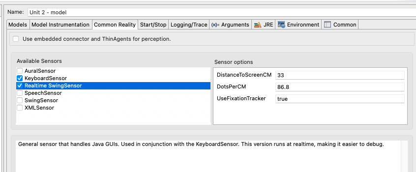

# Unit 2 Code Description
This document describes the code and configurations used for the unit 2 tutorial.
The coding patterns used here will be repeated across the various tutorials. 

## Modeling Triad
The models of unit 1 are unique in that they are self-contained within the model
itself. None of them interact with the environment or task. Every model from here
on out will have three primary components: the model itself, the task, and the
environment the task and model are situated within. jACT-R focuses maintains a clean distinction
between these elements. Here we will focus on the later
two components. 

## The Environment
The interface to the environment in jACT-R is provided by CommonReality, a simulation
middleware designed specifically for cognitive architectures. Unless you are integrating
with a new system, you should be able to get by with using one or more of the existing
interfaces.



If you look at the CommonReality tab of the run configuration for unit 2, you will see
what interfaces are being used. Specifically, it is using the **Default Keyboard Sensor** which 
provides simulated hands, virtual keyboard, and mouse, along with the **Realtime Swing Sensor** 
which provides visual access to the java windowing system and concrete implementations
of the keyboard and mouse. 

Interfaces are designed to composable and swappable. 


## The Experiment
The task component is provided by the [jACT-R experiment framework](https://github.com/amharrison/jactr-core/tree/master/org.jactr.tools.experiment).
This framework provides the skeletal structure on an experiment, providing basic building
blocks for building an experiment. It can be used on its own, as in the **Unit 2 - experiment** run configuration.
Here all that is required are the main entry point *org.jactr.tools.experiment.bootstrap.Main*, and the command line
parameter pointing to the experiment configuration file * [experiment.xml](https://github.com/amharrison/jactr-tutorials/blob/master/org.jactr.tutorial.unit2/src/org/jactr/tutorial/unit2/experiment/experiment.xml) *.
The **Unit 2 - model** run configuration shows how to set up the experiment framework for
running a model. Here we set the Start/Stop handlers to *org.jactr.tools.experiment.bootstrap.StartModelExperiments* and *org.jactr.tools.experiment.bootstrap.StopModelExperiments* respectively,
then provide the experiment configuration file as VM argument *-DConfigurationFile=org/jactr/tutorial/unit2/experiment/experiment.xml*
Take a look at the [experiment.xml](https://github.com/amharrison/jactr-tutorials/blob/master/org.jactr.tutorial.unit2/src/org/jactr/tutorial/unit2/experiment/experiment.xml) file, it
is liberally documented explaining what each tag does. 

As mentioned, the experiment framework provides a *skeletal* structure. A few pieces are missing
that are unique to every experiment: condition assignment and the actual manipulated
experiment trial. Most of the code written for jACT-R models are those pieces of the 
experimental task. In the unit 2 example, we have three main files: [DisplayTrial](https://github.com/amharrison/jactr-tutorials/blob/master/org.jactr.tutorial.unit2/src/org/jactr/tutorial/unit2/experiment/handler/DisplayTrial.java), 
[IExperimentInterface](https://github.com/amharrison/jactr-tutorials/blob/master/org.jactr.tutorial.unit2/src/org/jactr/tutorial/unit2/experiment/IExperimentInterface.java), and [GUIExperimentInterface](https://github.com/amharrison/jactr-tutorials/blob/master/org.jactr.tutorial.unit2/src/org/jactr/tutorial/unit2/experiment/ui/GUIExperimentInterface.java).

The experiment interface is by no means required. It is just a convenience and useful 
place to look if you want to integrate your own task based structures.

### DisplayTrial
DisplayTrial is the actual implementation of the ITrial interface for the experiment framework. 
In other words, it's the actual meat of the experiment. It controls which stimuli is displayed,
 when, for how long, and handles collecting of responses from the participant. What it doesn't do
is the displaying itself. That is relegated to an implementation of IExperimentInterface, specifically
GUIExperimentalInterface. By structuring the code like this we can easily and dynamically
replace the IExperimentInterface with a simulated interface when necessary (i.e., for bulk runs you generally
use simulated interfaces instead of actual ones).

### Handlers
The two remaining source files are CleanupHandler and DisplayHandler, these are explained in the
*experiment.xml* configuration file, but are basically just there so that the experiment parser knows
how to deal with the custom tags *display* and *cleanup*. 

### The Model & Locks
The experiment framework provides a useful utility in the form of named locks that can be closed or opened. Used in conjunction
with proxy conditions such as that seen in find-unattended-letter, it enables you to influence the run of the model
based on the experiment's needs. 

```
production find-unattended-letter {
  goal{
    isa read-letters
    state =  start
  }
  ?visual{
    state =  free
  }
  proxy("org.jactr.tools.experiment.production.IsUnlockedCondition"){
    lock = "demo"
  }
}{
  +visual-location{
    isa visual-location
    :attended =  null
    kind      =  label-object
  }
}
```
Normally, as in this case, the lock is used to make sure that the model is ready to go before starting an experimental 
trial, and is similarly constrained between trials. Basically, the model will not be able to fire
this production (which starts the processing off) until the DisplayTrial's start when it is unlocked using:
```
trigger.add(new UnlockAction("demo", experiment));
```

At the end of the trial, we close the named lock, preventing the model from running another trial until we are ready for it.
```
trigger.add(new LockAction("demo", experiment));
```

This is not normally used in conjunction with the visual module, as the visual module has a better method of starting off
the processing called *buffer stuffing* which will be discussed in the next unit. This method is shown to highlight the proxy
condition. This is the primary way to introduce custom conditions or actions to the architecture and are most closely related
to the !eval! calls in the Lisp version.

# Java Specifics
Since this is java, there are going to be numerous classes in various packages. The jACT-R project encompasses all of that information
and represents an independent installable unit. One of the requirements of that is we have to tell the project what packages and classes
are visible to other software (i.e., the rest of the jACT-R tooling). To do that, *any* code written must be in an exported package. 

To export a package, open **META-INF/MANIFEST.MF**. Go to the **Runtime** tab. There you will see a section for **Exported Packages**, use
the Add... button to add any package that you contribute. 

If you're familiar with java, you're familiar with classpath frustrations. Non-exported packages are the #1 classpath error when
working with jACT-R. 