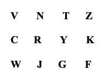

# Unit 3: Attention

This unit is concerned with developing a better understanding of how perceptual attention works in ACT-R, particularly as it is concerned with visual attention.

## Visual Locations
When a visual display such as this

is presented to ACT-R a representation of all the visual information is immediately accessible in a visual icon.  

```
 fill in image
```

### Visual Location Requests

When requesting the visual location of an object there are many slots that can be specified in the request.  In the last unit we only used the request parameter :attended.  We will expand on the use of :attended in this unit.  In addition, we will also provide more information about requests on all of the slots of the visual-location chunk-type and show another request parameter which can be specified - :nearest.  

### The Attended Test in More Detail
 
The :attended request parameter was introduced in unit 2.  It tests whether or not the model has attended the object at that location, and the possible values are new, null, and true.  Very often we use the fact that attention tags elements in the visual display as attended or not to enable us to draw attention to the previously unattended elements.  Consider the following production:

```
(p find-random-letter
   =goal>
     isa      read-letters
     state    find
==>
   +visual-location>
     isa      visual-location
     :attended nil
   =goal>
     state    attending)

```
In its action, this production requests the location of an object that has not yet been attended (:attended nil).  Otherwise, it places no preference on the location to be selected. When there is more than one item in the visicon that matches the request, the newest (most recent) one will be chosen. If multiple items also match on their recency, then one will be picked randomly. If there are no objects which meet the constraints, then the error state will be set for the visual-location buffer.  After a feature is attended (with a +visual request), it will be tagged as attended true and this production’s request for a visual-location will not return the location of such an object.

#### Finsts

There is a limit to the number of objects which can be tagged as attended t, and there is also a time limit on how long an item will remain marked as attended t.  These attentional markers are called finsts (INSTantiation FINgers) and are based on the work of Zenon Pylyshyn.  The number of finsts and the length of time that they persist can be set with the parameters :visual-num-finsts and :visual-finst-span respectively.  

The default number of finsts is four, and the default decay time is three seconds. Thus, with these default settings, at any time there can be no more than four objects marked as attended t, and after three seconds the attended state of an item will revert from t to nil.  Also, when attention is shifted to an item that would require more finsts than there are available the oldest one is reused for the new item i.e. if there are four items marked with finsts as attended t and you move attention to a fifth item the first item that had been marked as attended t will now be marked as attended nil and the fifth item will be marked as attended t. Because the default value is small, productions like the one above are not very useful for modeling tasks with a large number of items on the screen because the model will end up revisiting items very quickly.  One solution is to always set :visual-num-finsts to a value that works for your task, but one of the goals of ACT-R modeling is to produce parameter free models, so a different approach is generally desired.  After discussing some of the other specifications one can use in a request we will come back to how one could do such things. 

### Visual-location slots 

Because the vision module was designed around interacting with a 2-D screen the primary slots for visual-locations are screen-x and screen-y.  They represent the location based on its x and y position on the screen.  We will only be working with models that are interacting with a 2-D screen in the tutorial and thus all the visual items have locations based on their positions within the window the model is interacting with.  The upper left corner is screen-x 0 and screen-y 0 with x increasing from left to right and y increasing from top to bottom.  

There is also a distance slot in the visual-location chunk-type.  This represents the distance from the model to the location.  Because we are assuming a 2-D display, all the visual-locations will have a fixed value of 15 which represents a distance of 15 inches from the model to the screen.

The height and width slots hold the dimensions of the item measured in pixels. The size slot holds the approximate area covered by the item measured in degrees of visual angle squared.  These values provide the general shape and size of the item on the display.

The color slot holds a representation of the color of the item.  Typically, these will be symbolic descriptors like black or red which are chunks.  However, a modeler could use abstract values or numbers to represent the color if that inform were more useful to the task being modeled.

The kind and value slots provide a general description of the item, but typically not the specific information needed to fully describe the item.  To get specific information the model will require shifting attention to the item.  The kind slot usually specifies the chunk-type of the object that will be found when the visual-location is attended.  The value slot holds some description which is assumed to be available without attending.  For most of the visual-locations that you will see in the tutorial the kind and value slots will have the same value.

It is possible for one to specify abstract devices for a model to interact with instead of a simple computer screen.  When doing so, one may create additional chunk-types to represent the visual-location information which may have additional slots that hold other information.  Those additional slots can be tested in the same ways as any of the default slots can.  Creating new devices however is beyond the scope of the tutorial. 

### Visual-location request specification

One can specify constraints for a visual-location request based on the values of the slots in the visual-location chunk-type.  Any of the slots may be specified using any of the modifiers (-, <, >, <=, or >=) in much the same way one specifies a retrieval request.  Each of the slots may be specified any number of times. In addition, there are some special tests which one can use that will be described below.  All of the constraints specified will be used to find a visual-location in the visicon to be placed into the visual-location buffer.  If there is no visual-location in the visicon which satisfies all of the constraints then the visual-location buffer will indicate an error state.

#### Exact values

If you know the exact values for the slots you are interested in then you can specify those values directly:

```
+visual-location>
   isa      visual-location
   screen-x 50
   screen-y 124
   color    black
```

You can also use the negation test, -, with the values to indicate that you want a location which does not have that value:
```
+visual-location>
   isa      visual-location
   color    black
 - kind     text

```

Often however, one does not know the specific information about the location in the model and needs to specify things more generally.

#### General values

When the slot being tested holds a number it is also possible to use the slot modifiers <, <=, >, and >= along with specifying the value.  Thus to request a location that is to the right of screen-x 50 and at or above screen-y 124 one could use the request:

```
+visual-location>
    isa      visual-location
 >  screen-x 50
 <= screen-y 124

```

In fact, one could use two modifiers for each of the slots to restrict a request to a specific range of values.  For instance to request an object which was located somewhere within a box bounded by the corners 10,10 and 100,150 one could specify:
```
+visual-location>
   isa      visual-location
  > screen-x 10
  < screen-x 100
  > screen-y 10
  < screen-y 150

```

#### Production variables 

It is also possible to use variables from the production in the requests instead of specific values. Consider this production which uses a value from a slot in the goal to test the color:

```
(p find-by-color
   =goal>
    isa    find-color
    target =color
==>
  +visual-location>
    isa    visual-location
    color  =color
)

```
Variables from the production can be used just like specific values including with the use of the modifiers.  Assuming that the LHS of the production binds =x, =y, and =kind this would be a valid request:
```
  +visual-location>
    isa    visual-location
    kind     =kind 
 <  screen-x =x
 -  screen-x 0
 >= screen-y =y
 <  screen-y 400

```

#### Relative values

If you are not concerned with any specific values, but care more about relative settings then there are also ways to specify that. 

You can use the values lowest and highest in the specification of any slot which has a numeric value.  Of the chunks which match the other constraints the one with the numerically lowest or highest value for that slot will then be the one found.

In terms of screen-x and screen-y, remember that x coordinates increase from left to right, so lowest corresponds to leftmost and highest rightmost, while y coordinates increase from top to bottom, so lowest means topmost and highest means bottommost.  

If this is used in combination with :attended it can allow the model to find things on the screen in an ordered manner.  For instance, to read the screen from left to right you could use:

```
+visual-location>
   isa      visual-location
   :attended nil
   screen-x lowest

```
assuming that you also move attention to the items so that they become attended and that the model has sufficient finsts to tag everything.

There is one note about using lowest and highest when more than one slot is specified in that way for example:

```
+visual-location>
   isa      visual-location
   width    highest
   screen-x lowest
   color    red

```

First, all of the non-relative values are used to determine the set of items to be tested for relative values.  Then the relative tests are performed one at a time in the order provided to reduce the matching set.  Thus, the specification above would first consider all items which were red because that is a constant value.  Then it would reduce that to the set of items with the highest width (widest) and then of those it would pick the one with the lowest screen-x coordinate (leftmost).  That may not produce the same result as this request for the same set of visicon chunks:

```
+visual-location>
   isa      visual-location
   screen-x lowest
   width    highest
   color    red

```
This request will again start with all red items.  Then it will find those with the lowest x coordinate and among those will choose the widest.

#### The current value

It is also possible to use the special value current in a request.  That means the value of the slot must be the same as the value for the location of the currently attended object (the one attention was last shifted to with a move-attention request).  This request would find a location which had the same screen-x value as the current one:

```
+visual-location>
   isa      visual-location
   screen-x current

```
You can also use the value current with the modifiers. The following test will find a location which is up and to the right of the currently attended object in a different color:
```
+visual-location>
   isa      visual-location
   > screen-x current
   < screen-y current
   - color    current

```
If the model does not have a currently attended object (it has not yet attended to anything) then the tests for current are ignored.

### The :nearest request parameter

Like :attended, there is another request parameter available in visual-location requests.  The :nearest request parameter can be used to find the items closest to the currently attended location, or some other location.  To find the location of the object nearest to the currently attended location we can again use the value current:
```
+visual-location>
   isa     visual-location
   :nearest current
```
It is also possible to specify any location chunk for the nearest test, and the location of the object nearest to that location will be returned:
```
+visual-location>
   isa      visual-location
   :nearest  =some-location

```
If there are constraints other than nearest specified then they are all tested first.  The nearest of the locations that matches all of the other constraints is the one that will be placed into the buffer.  
Specifically, the nearest is determined by the straight line distance using only the screen-x and screen-y coordinates.


### Ordered Search

Above it was noted that a production using this visual-location request (in conjunction with appropriate attention shifts) could be used to read words on the screen from left to right:

```
(p read-next-word
   =goal>
      isa      read-word
      state    find
==>
   +visual-location>
      isa      visual-location
      :attended nil
      screen-x lowest
   =goal>
      state    attend)

```
However, if there are fewer finsts available than words to be read that production will result in a loop that reads only one more word than there are finsts.  For instance, if there are six words on the line and the model only has four finsts (the default) then when it attends the fifth word the finst on the first word will be removed to use because it is the oldest.  Then the sixth request will result in finding the location of the first word again because it is no longer marked as attended.  If it is attended it will get the finst from the second word, and so on. 

By using the special tests for current and lowest one could have the model perform the search from left to right without using the :attended test:

```
(p read-next-word
   =goal>
      isa      read-word
      state    find
==>
   +visual-location>
      isa      visual-location
    > screen-x current
      screen-x lowest
   =goal>
      state    attend)

```
That will always be able to find the next word to the right of the currently attended one.  Similarly, one could add tests for the screen-y coordinate to produce a top-to-bottom and left-to-right search pattern or combine that with the :nearest request parameter to perform other ordered search strategies.  

## The Sperling Task

If you open the sperling model, you will see an example of the effects of visual attention. This model contains functions for administering the Sperling experiment where subjects are briefly presented with a set of letters and must try to report them. Subjects see displays of 12 letters such as: 


