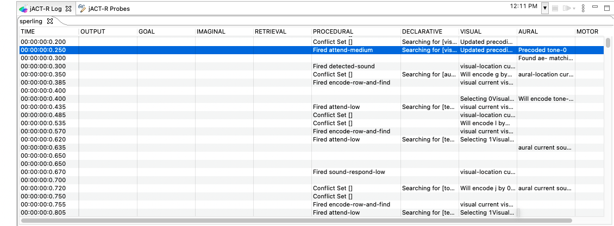

# Unit 3: Attention

This unit is concerned with developing a better understanding of how perceptual attention 
works in ACT-R, particularly as it is concerned with visual atten

## Visual Locations
When a visual display such as


is presented to ACT-R a representation of all the visual information is immediately 
accessible in a visual icon

```
 fill in image
```

### Visual Location Requests

When requesting the visual location of an object there are many slots that can be 
specified in the request.  In the last unit we only used the request parameter :attended. 
We will expand on the use of :attended in this unit.  In addition, we will also provide 
more information about requests on all of the slots of the visual-location chunk-type 
and show another request parameter which can be specified - :nearest

### The Attended Test in More Detail

The :attended request parameter was introduced in unit 2.  It tests whether or not 
the model has attended the object at that location, and the possible values are new, 
false (or null), and true.  Very often we use the fact that attention tags elements 
in the visual display as attended or not to enable us to draw attention to the previously 
unattended elements.  Consider the following production.

```
production find-random-letter{
  goal{
   isa   read-letters
   state = find
  }
}{
 +visual-location{
   isa visual-location
   :attended = false
 }
 goal{
   state = attending
 }
}

```
In its action, this production requests the location of an object that has not yet 
been attended (:attended false).  Otherwise, it places no preference on the location 
to be selected. When there is more than one item in the visicon that matches the 
request, the newest (most recent) one will be chosen. If multiple items also match 
on their recency, then one will be picked randomly. If there are no objects which 
meet the constraints, then the error state will be set for the visual-location buffer. 
After a feature is attended (with a +visual request), it will be tagged as attended 
true and this production’s request for a visual-location will not return the location 
of such an object.

#### Finsts

There is a limit to the number of objects which can be tagged as attended, and there 
is also a time limit on how long an item will remain marked as attended true.  These 
attentional markers are called finsts (INSTantiation FINgers) and are based on the 
work of Zenon Pylyshyn.  The number of finsts and the length of time that they persist 
can be set with the parameters NumberOfFINSTs and FINSTDurationTime respectively 
in the visual module.

The default number of finsts is four, and the default decay time is three seconds. 
Thus, with these default settings, at any time there can be no more than four objects 
marked as attended true, and after three seconds the attended state of an item will 
revert from true to false.  Also, when attention is shifted to an item that would 
require more finsts than there are available the oldest one is reused for the new 
item i.e. if there are four items marked with finsts as attended true and you move 
attention to a fifth item the first item that had been marked as attended true will 
now be marked as attended false and the fifth item will be marked as attended true. 
Because the default value is small, productions like the one above are not very useful 
for modeling tasks with a large number of items on the screen because the model will 
end up revisiting items very quickly.  One solution is to always set NumberOfFINSTS 
to a value that works for your task, but one of the goals of ACT-R modeling is to 
produce parameter free models, so a different approach is generally desired.  After 
discussing some of the other specifications one can use in a request we will come 
back to how one could do such thing.

### Visual-location slots 

Because the vision module was designed around interacting with a 2-D screen the primary 
slots for visual-locations are screen-x and screen-y.  Named to be consistent with 
canonical Lisp implementation, they DO NOT represent the location based on its x 
and y position on the screen, but rather visual angles measured in degrees from the 
center of the screen.  We will only be working with models that are interacting with 
a 2-D screen. The center is (0,0), increasing positively up and to the right (e.g. 
lower left corner is (-x, -y).

There is also a distance slot in the visual-location chunk-type.  This represents 
the distance from the model to the location in cm. Though this value is generally 
ignored by most models.

The height and width slots hold the dimensions of the item measured in visual degrees. 
The size slot holds the approximate area covered by the item measured in degrees 
of visual angle squared.  These values provide the general shape and size of the 
item on the display.

The color slot holds a representation of the color of the item.  Typically, these 
will be symbolic descriptors like black or red which are chunks.

The kind and value slots provide a general description of the item, but typically 
not the specific information needed to fully describe the item.  To get specific 
information the model will require shifting attention to the item.  The kind slot 
usually specifies the chunk-type of the object that will be found when the visual-location 
is attended.  The value slot holds some description which is assumed to be available 
without attending.


### Visual-location request specification

One can specify constraints for a visual-location request based on the values of 
the slots in the visual-location chunk-type.  Any of the slots may be specified using 
any of the modifiers (=, !=, <, >, <=, or >=) in much the same way one specifies 
a retrieval request.  Each of the slots may be specified any number of times. In 
addition, there are some special tests which one can use that will be described below. 
All of the constraints specified will be used to find a visual-location in the visicon 
to be placed into the visual-location buffer.  If there is no visual-location in 
the visicon which satisfies all of the constraints then the visual-location buffer 
will indicate an error state.

#### Exact values

If you know the exact values for the slots you are interested in then you can specify 
those values directly

```
+visual-location{
   isa      visual-location
   screen-x = 1.5
   screen-y = 2.7
   color    = black
 }
```

You can also use the negation test, !=, with the values to indicate that you want 
a location which does not have that value.
```
+visual-location{
   isa      visual-location
   color  =  black
   kind  !=  text
}

```

Often however, one does not know the specific information about the location in the 
model and needs to specify things more generally. In fact, it is preferred that you 
not use exact values as that makes very specific assumptions about the environment, 
assumptions that are almost certainly wrong.

#### General values

When the slot being tested holds a number it is also possible to use the slot modifiers 
!=, <, <=, >, and >= along with specifying the value.  Thus to request a location 
that is to the right of screen-x 1.5 and at or above screen-y 2.7 one could use the 
request

```
+visual-location{
    isa      visual-location
    screen-x > 1.5
    screen-y >= 2.7
}

```

In fact, one could use two modifiers for each of the slots to restrict a request 
to a specific range of values.  For instance to request an object which was located 
somewhere within a box bounded by the corners (-1,1) and (1,2) one could specify
```
+visual-location{
   isa      visual-location
   screen-x > -1
   screen-x < 1
   screen-y > 1
   screen-y < 2
}
```

#### Production variables 

It is also possible to use variables from the production in the requests instead 
of specific values. Consider this production which uses a value from a slot in the 
goal to test the color

```
production find-by-color{
   goal{
    isa    find-color
    target = =color
   }
}{
  +visual-location{
    isa    visual-location
    color  = =color
  }
}

```
Variables from the production can be used just like specific values including with 
the use of the modifiers.  Assuming that the LHS of the production binds =x, =y, 
and =kind this would be a valid request
```
  +visual-location{
    isa    visual-location
    kind     = =kind 
    screen-x < =x
    screen-x != 0
    screen-y >= =y
    screen-y < 400
}
```

#### Relative values

If you are not concerned with any specific values, but care more about relative settings 
then there are also ways to specify that.

You can use the values lowest and highest in the specification of any slot which 
has a numeric value.  Of the chunks which match the other constraints the one with 
the numerically lowest or highest value for that slot will then be the one found.

If this is used in combination with :attended it can allow the model to find things 
on the screen in an ordered manner.  For instance, to read the screen from left to 
right you could 

```
+visual-location{
   isa      visual-location
   screen-x  = lowest
   :attended = false
}

```
assuming that you also move attention to the items so that they become attended and 
that the model has sufficient finsts to tag everything.

There is one note about using lowest and highest when more than one slot is specified 
in that way for example

```
+visual-location{
   isa      visual-location
   width    = highest
   screen-x = lowest
   color    = red
}

```

Visual location slots are tested in the order that they are specified. In this example, 
we'd select all the visual locations with the highest width, then reduce that set 
by screen-x, then finally select based on color. That may not produce the same result 
as this request for the same set of visicon chunks

```
+visual-location{
   isa      visual-location
   screen-x = lowest
   width    = highest
   color    = red
}
```
This request will start with the screen-x candidates, filtered by width, then color.

#### The current value

It is also possible to use the special value current in a request.  That means the 
value of the slot must be the same as the value for the location of the currently 
attended object (the one attention was last shifted to with a attend-to request). 
This request would find a location which had the same screen-x value as the current 
one
```
+visual-location{
   isa      visual-location
   screen-x = current
}
```
You can also use the value current with the modifiers. The following test will find 
a location which is up and to the right of the currently attended object in a different 
color
```
+visual-location{
   isa      visual-location
   screen-x > current
   screen-y < current
   color   != current
}
```
If the model does not have a currently attended object (it has not yet attended to 
anything) then the tests for current are assumed to use center of gaze (0,0).

### The :nearest request parameter

Like :attended, there is another request parameter available in visual-location requests. 
The :nearest request parameter can be used to find the items closest to the currently 
attended location, or some other location.  To find the location of the object nearest 
to the currently attended location we can again use the value current
```
+visual-location{
   isa     visual-location
   :nearest = current
}
```
It is also possible to specify any location chunk for the nearest test, and the location 
of the object nearest to that location will be returned
```
+visual-location{
   isa      visual-location
   :nearest  = =some-location
}
```
If there are constraints other than nearest specified then they are all tested first. 
The nearest of the locations that matches all of the other constraints is the one 
that will be placed into the buffer. Specifically, the nearest is determined by the 
straight line distance using only the screen-x and screen-y coordinates.


### Ordered Search

Above it was noted that a production using this visual-location request (in conjunction 
with appropriate attention shifts) could be used to read words on the screen from 
left to right

```
production read-next-word{
   goal{
      isa      read-word
      state  = find
   }
}{
   +visual-location{
      isa      visual-location
      :attended = false
      screen-x  = lowest
   }
   goal{
      state   = attend
   }
}
```
However, if there are fewer finsts available than words to be read that production 
will result in a loop that reads only one more word than there are finsts.  For instance, 
if there are six words on the line and the model only has four finsts (the default) 
then when it attends the fifth word the finst on the first word will be removed to 
use because it is the oldest.  Then the sixth request will result in finding the 
location of the first word again because it is no longer marked as attended.  If 
it is attended it will get the finst from the second word, and so on.

By using the special tests for current and lowest one could have the model perform 
the search from left to right without using the :attended true

```
production read-next-word{
   =goal>
      isa       read-word
      state   = find
}{
   +visual-location{
      isa      visual-location
      screen-x > current
      screen-x = lowest
   }
   goal{
      state   = attend
   }
}
```
That will always be able to find the next word to the right of the currently attended 
one.  Similarly, one could add tests for the screen-y coordinate to produce a top-to-bottom 
and left-to-right search pattern or combine that with the :nearest request parameter 
to perform other ordered search strategies.

## The Sperling Task

If you run **Unit 3 - Sperling Experiment** you will be presented with one of twelve trials. 
For each trial, a matrix of letters will be briefly displayed such as this:
 


After a brief delay (0, 0.15, 0.3, or 1 seconds) there will be an auditory cue, a series of beeps.
The number of beeps tells you which row to report. Your job is to report as many letters from that
row as you can recall seeing. There is a thirty second break in between each trial. The original 
experiment used different pitched tones to denote rows and used a display time of 50ms (we use 500ms 
for this example. But other than that, this is true to the original experiment. 

To see the model in action, run **Unit 3 - Sperling GUI**. This will run the model in the exact same 
experiment you just ran, just much faster. 

The following is the trace of ACT-R’s performance of one trial of the task.  In this trace the sound 
is presented with onset of the display and the target row was the upper one.
  


While the sound is detected at 0.2s (*detected-sound*) it does not affect the model until 
*sound-respond-high* fires at 0.75s.  One of the things we will discuss is what determines the delay 
of that response.  Prior to that time the model is finding letters anywhere on the screen.  After the 
sound is encoded the search is restricted to the target row.  After the display disappears, there is
a delay before their percepts fully decay. That delay is determined by the visual module parameter
 `VisualPersistenceDelay`. Once the percepts are removed, the display is finally exhausted and the 
 production **start-report** fires which initiates the keying of the letters that have been encoded 
 from the target row.


## Visual Attention
As in the models from the last unit there are three steps that the model must perform to encode visual 
objects.  It must find the location of an object, shift attention to that location, and then harvest 
the object encoded when attention shifts to the location.  In the last unit this was done with three 
separate productions, but in this unit because the model is trying to do this as quickly as possible 
the encoding and request to find the next are combined into a single production, and for the first 
item there is no production that does an initial find.  

### Buffer Stuffing
Notice the first production to fire, **attend-medium**
```
production attend-medium{
  goal{
    isa read-letters
    state =  attending
  }
  visual-location{
    isa visual-location
    screen-y < 2
    screen-y > -2
  }
  ?visual{
    state =  free
  }
}{
  goal{
    location = medium
    state    = encode
  }
  +visual{
    isa attend-to
    where =  =visual-location
  }
}
```

which tests that there is a chunk in the **visual-location** buffer. It then encodes 
in the location slot of the goal which tone the letter corresponds to, based on 
the position in the visual field, and requests a shift of visual attention to the object 
at that location.  It matches and fires even though there has not been a request 
to put a chunk into the **visual-location** buffer. The details in the log from 
the *prior* row provide an explanation.
```
Attempting a stuff search with [visual-location::attended = new isBufferStuffRequest = true ]
```

This process is referred to as buffer stuffing and it occurs for both visual and aural percepts.  
It is intended as a simple approximation of a bottom-up mechanism of attention.  
When the **visual-location** buffer is empty and the model processes the display it 
can automatically place the location of one of the visual objects into the **visual-location** 
buffer.  The `isBufferStuffRequest = true` at the end of the line in the trace indicates 
that this setting of the chunk in the buffer was not the result a production’s request. This can be
turned off using the **EnabledVisualBufferStuff** parameter in the visual module.

The default specification is merely `:attended = new :nearest = current`, but this can be configured in model or
java.
 
Using buffer stuffing allows the model to detect changes to the screen.  The alternative method
 would be to continually request a location that was marked as :attended new, notice that there 
was a failure to find one, and request again until one was found.

One thing to keep in mind is that buffer stuffing only occurs if the buffer is empty.  So if you 
want to take advantage of it you must make sure that the visual-location buffer is cleared 
before the update on which you want a location to be stuffed.  That is typically not 
a problem because the *strict harvesting* mechanism that was described in the last unit 
causes some buffers to be emptied automatically when they are used in a production.

### Testing and Requesting Locations with Slot Modifiers

Something else to notice about this production is that the buffer test of the **visual-location** 
buffer shows modifiers being used when testing slots for values.  These tests allow you to do 
a comparison when the slot value is a number, and the match is successful if the comparison is 
true.  The first one (>) is a greater-than test.  If the chunk in the **visual-location** buffer 
has a value in the screen-y slot that is greater than 3, it is a successful match.  The 
second test (<) is a less-than test, and works in a similar fashion.  If the screen-y slot 
value is less than 10 it is a successful match.  Testing on a range of values like this is 
important for the visual locations because the exact location of a piece of text in the icon 
is determined by its “center” which is dependant on the font type and size.  Thus, instead of 
figuring out exactly where the text is at in the icon (which can vary from letter to letter or 
for a given letter on different computers when not using the jACT-R environment) the model is 
written to accept the text in a range of positions.

After attention shifts, the production **encode-row-and-find** harvests the visual 
representation of the object, marks it with its row designation for future reference, 
and requests the next location:
```
production encode-row-and-find{
  goal{
    isa read-letters
    location =  =pos
    upper-y  =  =uy
    lower-y  =  =ly
  }
  visual{
    isa text
  }
}{
  -visual{
    status = =pos
  }
  goal{
    location = null
    state    = attending
  }
  +visual-location{
    isa visual-location
    screen-y  > =ly
    screen-y  < =uy
    :attended != true
  }
}
```
Note that this production places the row of the letter (=pos having values high,
 medium, and low) into the status slot of the visual object currently in the *visual* 
buffer (=visual) as it is removing the chunk from the buffer. Later, when reporting, 
the system will restrict itself to recalling items from the designated row.  

We remove the chunk from the buffer so that the modified chunk goes into declarative 
memory.  Remember that declarative memory holds the chunks that have been cleared 
from the buffers.  Typically, strict harvesting will clear the buffers automatically, 
but because the chunk in the **visual** buffer is modified on the RHS of this production 
it will not be automatically cleared.  Thus, to ensure that this chunk enters 
declarative memory at this time we explicitly clear the buffer.

The production then updates the state slot of the goal and requests a new visual 
location. The request for a visual location uses the < and > modifiers for the 
screen-y slot to restrict the visual search to a particular region of the screen.  
The range is defined by the values from the upper-y and lower-y slots of the chunk 
in the goal buffer.  The initial values for the upper-y and lower-y slots are defined as defaults
for the **read-letters** chunktype.
```
chunktype read-letters {
  location = null
  tone     = null
  state    = attending
  upper-y  = 15
  lower-y  = -15
}
```
This includes a large visual field, and thus the location of any letter that is 
unattended will be potentially chosen.   When the tone is encoded those slots will
 be updated so that only the target row’s letters will be found.
 
### FINSTs in Use
There is one important feature to emphasize about this model, which may be useful 
in the assignment to follow.  The model does not repeat letters because of the 
`:attended != true` test in the requests to the visual location buffer.

When a new percept arrives in perceptual memory it is initially marked as *new*, 
meaning it has yet to be attended. After 0.5s, it is marked as being old (`:attended = false`).
This can be configured with the NewFINSTOnsetDurationTime parameter in the visual
and aural modules. 

This allows attention to be sensitive to the onset of an item.  As we saw in the 
previous unit, visual attention has to be shifted to the object before a representation 
of it is built in the visual buffer and it can be accessed by a production rule.  
This corresponds to the research in visual attention showing that preattentively 
we have access to features of an object but we do not have access to its identity.  
This preattentive access to the objects is available through the visual-location 
buffer.  When we move the model’s attention to an object its attentional status 
is changed.  

To keep this unit simple the number of finsts and the finst duration will be set 
to values large enough that it does not have to be considered.  This unit is 
concerned with how the minimum time to search the display determines the behavior 
of the system, and the searching will be based only on the marking of the attended 
feature.  

## Auditory Attention
There are a number of productions responsible for processing the auditory message 
and they serve as our first introduction to the auditory buffers.  As in the 
visual case, there is an aural-location to hold the location of an aural message 
and an aural buffer to hold the sound that is attended.  However, unlike the 
visual system we typical need only two steps to encode a sound and not three.  
This is because usually the auditory field of the model is not crowded with sounds 
and we can often rely on buffer stuffing to place the sound’s location into the 
aural-location buffer.  If a new sound is presented, and the aural-location 
buffer is empty, then the audio-event for that sound (the auditory equivalent 
of a visual-location) is placed into the buffer automatically.  However, there 
is a delay between the initial onset of the sound and when the audio-event 
becomes available.  The length of the delay depends on the type of sound being 
presented (tone, digit, or other) and represents the time necessary to encode 
its content.  This is unlike the visual-locations which are immediately available.

In this task the model will hear one of the three possible tones on each trial.  
The default delay to encode a tone sound is 50ms.  The detected-sound 
production responds to the appearance of an audio-event in the aural-location 
buffer:
```
production detected-sound{
  aural-location{
    isa audio-event
  }
  ?aural{
    state =  free
  }
}{
  +aural{
    isa attend-to
    where =  =aural-location
  }
}
```
Notice that this production does not test the goal.  If there is an audio-event 
in the aural-location buffer and the aural state is free this production can fire.  
It is not specific to this, or any task.  On its RHS it requests that attention 
shift to the sound. 

Our model for this task has three different productions to encode the sounds, 
one for each of high, medium, and low tones.  The following is the production 
for the low tone:

```
production sound-respond-low {
  goal{
    isa read-letters
    tone =  null
  }
  aural{
    isa sound
    content =  "500"
  }
}{
  goal{
    tone    = low
    upper-y = -3
    lower-y = -10
  }
}
```
The content slot of a tone sound encodes the frequency of the tone. For this 
experiment a 500 Hertz sound is considered low, a 1000 Hertz sound medium, and a 
2000 Hertz sound high.  On the RHS this production records the type of tone 
presented in the goal and updates the restrictions on the y coordinates for the 
search to constrain it to the appropriate row. Attending to and fully encoding 
the sound takes .285 seconds.

## Typing and Control
The production that initiates typing the answers is:
```
production start-report{
  goal{
    isa read-letters
    tone =  =tone
  }
  ?visual{
    state =  free
  }
  ?retrieval{
    state != busy
  }
}{
  +goal{
    isa report-row
    row =  =tone
  }
  +retrieval{
    isa text
    status =  =tone
  }
}["Utility" : "-2"]
```
 This causes a new chunk to be placed into the goal buffer rather than a modification 
 to the chunk that is currently there (as indicated by the `+goal` rather than an `goal`).  
 The goal module’s requests create new chunks the same way the imaginal module’s 
 requests do except that there is no time cost for creating a new goal chunk.  
 The goal is no longer to read letters but rather to report the target row.  
 Note also that this production issues a retrieval request for a letter in the 
 target row.

This production can match at many points in the model’s run, but we do not want 
it to apply as long as there are letters to be perceived.  We only want this rule 
to apply when there is nothing else to do.  Each production has a quantity 
associated with it called its utility.  The productions’ utilities determine which 
production gets selected during conflict resolution if there is more than one 
that matches.  We will discuss utility in more detail in later units.  For now, 
the important thing to know is that the production with the highest utility among 
those that match is the one selected.  Thus, we can make this production less 
preferred by setting its utility value low.  This parameter `Utility` is set to `"-2"`.
All elements have parameters which can be acccessed through the `[]`.

The default utility is 0.  So, this production will not be selected as long as 
there are other productions with a higher utility that match, and in particular 
that will be as long as there is still something in the target row on the screen
 to be processed by the productions that encode the screen. 

Also note that the productions that process the sound are given higher utility 
values than the default in the model.This is so that the sound will be processed 
as soon as possible – these productions will be preferred over any others that
 match at the same time.

Once the report starts, the following production is responsible for reporting 
all the letters in the target row:
```
production do-report {
  goal{
    isa report-row
    row =  =tone
  }
  retrieval{
    isa visual-object
    status =  =tone
    value  =  =val
  }
  ?motor{
    state =  free
  }
}{
  +motor{
    isa press-key
    key =  =val
  }
  +retrieval{
    isa text
    status              =  =tone
    :recently-retrieved != true
  }
}
```
This production fires when a text item has been retrieved and the motor module is 
free.  As actions, it presses the key corresponding to the letter retrieved and 
requests a retrieval of another letter.  Notice that it does not modify the chunk
 in the goal buffer (which is the only buffer that does not get cleared by strict 
 harvesting) and thus can fire again once the other conditions are met.  

Something new that you may notice in that production is the request parameter 
in the retrieval request (:recently-retrieved).  We will discuss that in the 
next section.

When there are no more letters to be reported (a retrieval failure occurs because 
the model can not retrieve any more letters from the target row), the following 
production applies to reset processing:
```
production stop-report{
  goal{
    isa report-row
    row =  =tone
  }
  ?retrieval{
    state =  error
  }
  ?motor{
    state =  free
  }
}{
  +motor{
    isa press-key
    key =  "SPACE"
  }
  +goal{ // restart
    isa read-letters
  }
  +visual{
    isa clear // reset any error
  }
}
```

## Declarative FINSTs
While doing this task the model only needs to report the letters it has seen once 
each.  One way to do that easily is to indicate which chunks have been retrieved 
previously so that they are not retrieved again.  However, one cannot modify the 
chunks in declarative memory.  Modifying the chunk in the retrieval buffer will 
result in a new chunk being added to declarative memory with that modified 
information, but the original unmodified chunk will also still be there.  Thus 
some other mechanism must be used.

The way this model handles that is by taking advantage of the declarative finsts 
built into the declarative memory module.  Like the vision system, the declarative 
system marks items that have been retrieved with tags that can be tested against 
in the retrieval request.  These finsts are not part of the chunk, but can be 
tested for with the :recently-retrieved request parameter in a retrieval request 
as shown in the do-report production:
```
+retrieval{
    isa text
    status              =  =tone
    :recently-retrieved != true
  }
```
If it is specified as != true, then only a chunk that has not been recently retrieved
 (marked with a finst) will be retrieved.  In this way the model can exhaustively 
 search declarative memory for items without repeating.  That is not always necessary 
 and there are other ways to model such tasks, but it is a convenient mechanism 
 that can be used when needed.

Like the visual system, the number and duration of the declarative finsts is also 
configurable through parameters.  The default is four declarative finsts which 
last 3 seconds each.  Those are set using the NumberOfFINSTs and 
FINSTDurationTime parameters respectively in retrieval module definition.  In this model the default of 
four finsts is sufficient, but the duration of 3 seconds is potentially too short 
because of the time it takes to retrieve the responses.  Thus in this model the span 
is set to 60 seconds to avoid any potential problems.

## Data Fitting
The process of fitting a model involves running it hundreds to thousands of times 
to collect all the necessary aggregate data. Imagine how annoying it would be to
sacrifice your display, mouse, and keyboard during that time. That's why jACT-R 
uses pluggable interfaces through CommonReality. If you look at the run configuration **Unit 3 - Sperling
iterative**, it is identical to the GUI version except that instead of using the
Swing Sensor, it uses the XML Sensor. It's the same model (sperling.jactr) and the 
same task ([experiment.xml](https://github.com/amharrison/jactr-tutorials/blob/master/org.jactr.tutorial.unit3/src/org/jactr/tutorial/unit3/sperling/experiment.xml)), but a different environment and task-environment 
interface ([SimulatedExperimentInterface](https://github.com/amharrison/jactr-tutorials/blob/master/org.jactr.tutorial.unit3/src/org/jactr/tutorial/unit3/sperling/sim/SimulatedExperimentInterface.java)). 

If you change **org.jactr.tutorial.unit3.sperling/experiment.xml** to read:
```
...
  <group id="group" choose="12" shuffle="true">
    <display row1="abcd" row2="efgh" row3="ijkl" delay="0" cue="1"/>
...
```
the model will run through twelve trials in rapid succession (three for each condition). 

### Iterative Run Configurations & Ortho parameter searches
We also defined an jACT-R Iterative run configuration, **Unit 3 - Sperling Bulk Run**. 
This is used when you're doing many runs. You can attach listeners to perform additional
tasks. In this case we are using the **Orthogonal parameter space search**. This tool takes
an xml configuration file (in this case, [visualDelay.xml](https://github.com/amharrison/jactr-tutorials/blob/master/org.jactr.tutorial.unit3/src/org/jactr/tutorial/unit3/sperling/data/visualDelay.xml))
that defines what parameters and ranges to explore as well as defines any statistical analysis code
you may have (in this case [Analyzer.java](https://github.com/amharrison/jactr-tutorials/blob/master/org.jactr.tutorial.unit3/src/org/jactr/tutorial/unit3/sperling/data/Analyzer.java)). Here we are asking it to 
spread out the 100 runs across three different values of VisualPersistenceDelay.

```
<modifier class="org.jactr.io2.tools.iterative.ortho.ModuleParameterModifier">
  <parameter name="ModuleClass" value="org.jactr.modules.pm.visual.six.DefaultVisualModule6" />
  <parameter name="ParameterName" value="VisualPersistenceDelay" />
  <parameter name="ParameterValues" value="0.6, 0.7, 0.8" />
</modifier>
``` 

If you now run **Unit 3 - Sperling Bulk Run** it will run your models, collect your statistics,
run your analyses and spit out the results in the end as a result.orthoxml file. 
Try running a few bulk runs with different values for the VisualPersistanceDelay. See if you
can find a value that consistently gets a high R-squared.


***
Once you are comfortable with the process of parameter fitting, move on to the [Subitizing Task](README2.md).

***
Based on the original CC licensed [ACT-R tutorials](http://act-r.psy.cmu.edu/software/), 2.25.20.

<a rel="license" href="http://creativecommons.org/licenses/by/4.0/"></a><br />This work is licensed under a <a rel="license" href="http://creativecommons.org/licenses/by/4.0/">Creative Commons Attribution 4.0 International License</a>.


