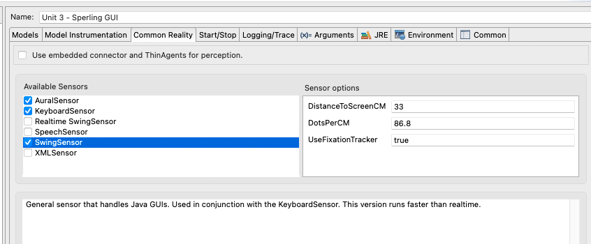
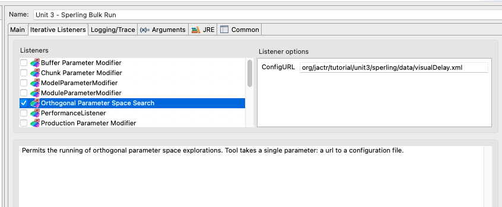

# Unit 3 Code Description
Unit 3 builds off of the code structure that we saw in Unit 2. Again, the majority
of the code is to control the experimental task, with the environment being provided
by CommonRealty sensors. However, this time we are developing both the real (human)
interface as well as a simulated interface for bulk data collection. 

# Sperling 
## The Environment
For the **Unit 3 - Sperling GUI** run configuration we are using the **Default 
Keyboard Sensor** in addition to the **Default Aural Sensor** (for sounds), and 
the regular **Swing Sensor** (which permits running faster than realtime). This 
is fine for development, but when it comes to fitting data, you don't want to 
sacrifice your display, keyboard, mouse and speakers for hundreds of runs at a time.
If you look at **Unit 3 - Sperling iterative** you will see that we've swapped 
out the **Swing Sensor** for the **XML Sensor**, and provided an actuator implementation
for **Default Keyboard Sensor**'s actuator.

### XML Sensor
The XML Sensor is a versatile sensor that injects arbitrary perceptions into a
simulation for any agent connected. It does this through the use of xml configuration
files to define the features of the individual percepts. Take, for instance, [grid.xml](https://github.com/amharrison/jactr-tutorials/blob/master/org.jactr.tutorial.unit3/src/org/jactr/tutorial/unit3/sperling/sim/grid.xml),
it defines the 3x4 matrix of letters. [Clear.xml](https://github.com/amharrison/jactr-tutorials/blob/master/org.jactr.tutorial.unit3/src/org/jactr/tutorial/unit3/sperling/sim/clear.xml) does the opposite,
it removes all percepts from the simulation. 

The XML Sensor is significantly faster than the Swing sensor since there is no actual
display being manipulated.

### Default Keyboard Sensor Actuator
The Default Keyboard Sensor provides a simulation of hands, keyboard, and mouse. However, 
that is only partially useful since you typically need to know what the keyboard and mouse
are doing. That's the role of the sensor's actuator. It is the final recipient of
any keyboard or mouse events. We use the [SimulatedKeyboard](https://github.com/amharrison/jactr-tutorials/blob/master/org.jactr.tutorial.unit3/src/org/jactr/tutorial/unit3/sperling/sim/SimulatedKeyboard.java) to
capture those keyboard and mouse events and route them back to the experiment task
for logging and interaction.

## The Experiment
As before we are using a general interface [IExperimentInterface](https://github.com/amharrison/jactr-tutorials/blob/master/org.jactr.tutorial.unit3/src/org/jactr/tutorial/unit3/sperling/IExperimentInterface.java)
to define the unique aspects of the experiment. The [GUIExperimentInterface](https://github.com/amharrison/jactr-tutorials/blob/master/org.jactr.tutorial.unit3/src/org/jactr/tutorial/unit3/sperling/ui/GUIExperimentInterface.java) is similar
to the one from Unit 2. This time, we are also providing [SimulatedExperimentInterface](https://github.com/amharrison/jactr-tutorials/blob/master/org.jactr.tutorial.unit3/src/org/jactr/tutorial/unit3/sperling/sim/SimulatedExperimentInterface.java) for
when we are connected to the XML Sensor. The [DisplayTrial](https://github.com/amharrison/jactr-tutorials/blob/master/org.jactr.tutorial.unit3/src/org/jactr/tutorial/unit3/sperling/handler/DisplayTrial.java) handles
the implementation agnostic aspects of the experiment. This time we dynamically
change the IExperimentInterface based on the result of IterativeMain.isRunning() which
is true if we are in the midst of bulk runs.

### Data Collection & Analysis
Since we will actually be fitting this data, we need something to collect the data. The experiment
configuration already defines an XML data sink which generates data files for the experiment. One could
 parse those files for any particular analysis but since the ones we are doing are so simple,
we will opt for an in-memory, data collection singleton, [DataCollection](https://github.com/amharrison/jactr-tutorials/blob/master/org.jactr.tutorial.unit3/src/org/jactr/tutorial/unit3/sperling/data/DataCollection.java).
On the data collection side this has one method logData(String condition, double value) to log the 
data for a named condition. 

Because the primary use for doing multiple models runs is to collect data for parametric analyses, jACT-R
provides an iterative listener that performs fully orthogonal parameter space searches. The **Unit 3 - Sperling Bulk Run**
configuration uses this listener and its configuration file [visualDelay.xml](https://github.com/amharrison/jactr-tutorials/blob/master/org.jactr.tutorial.unit3/src/org/jactr/tutorial/unit3/sperling/data/visualDelay.xml) to 
explore the VisualPersistenceDelay parameter.

The data is analyzed automatically using [Analyzer](https://github.com/amharrison/jactr-tutorials/blob/master/org.jactr.tutorial.unit3/src/org/jactr/tutorial/unit3/sperling/data/Analyzer.java).
This merely extracts the relevant condition data from the DataCollection class and
repackages it for analysis by [FitStatistics](https://github.com/amharrison/jactr-core/blob/master/org.jactr.tools/src/org/jactr/tools/itr/fit/FitStatistics.java) which can calculate
various statistics. The analyzer also generates summary files, and can be used to generate
charts and graphs for your particular analysis.

 