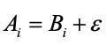
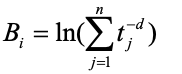
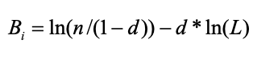
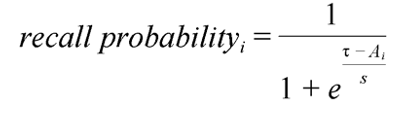
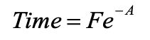
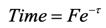
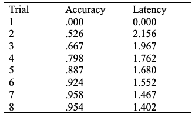

# Unit 4: Activation of Chunks and Base-Level Learning
There are two goals of this unit. The first is to introduce the subsymbolic quantity 
of activation associated with chunks.  The other is to show how those activation 
values are learned through the history of usage of the chunks.

## Introduction
We have seen retrieval requests in productions like this:
```
production example-counting{
   goal{
      isa         count
      state   =   counting
      number  =    =num1
   }   
   retrieval{
      isa         count-order
      first   =   =num1
      second  =   =num2
   }
}{
   goal{
      number  =   =num2
   }   
   +retrieval{
      isa         count-order
      first  =    =num2
    }
}

```
In this case an attempt is being made to retrieve a count-order chunk with a 
particular number (bound to =num2) in its first slot.  Up to now we have been 
working with the system at the symbolic level.  If there was a chunk that matched
that retrieval request it would be placed into the retrieval buffer, and if not
then the retrieval request would fail and the state of the declarative memory 
module would indicate an error.  The system was deterministic and we did not 
consider any timing cost associated with that retrieval or the possibility a 
chunk in declarative memory might fail to be retrieved.  For the simple tasks 
we have looked at so far that was sufficient.
  
Most psychological tasks however are not that simple and issues such as accuracy 
and latency over time or across different conditions are measured.  For modeling 
these more involved tasks one will typically need to use the subsymbolic components 
of ACT-R to accurately model and predict human performance.  For the remainder 
of the tutorial, we will be looking at the subsymbolic components that control 
the performance of the system.  To use the subsymbolic components we need to 
turn them on by including the DefaultDeclarativeLearningModule6 in the model 
definition.

## Activation
Every chunk in ACT-R’s declarative memory has associated with it a numerical value 
called its activation.  The activation reflects the degree to which past experiences
and current context indicate that chunk will be useful at any particular moment. 
When a retrieval request is made the chunk with the greatest activation among 
those that match the specification of the request will be the one placed into 
the retrieval buffer.  There is one constraint on that however.  There is a 
parameter called the retrieval threshold which sets the minimum activation a 
chunk can have and still be retrieved.  It is set with the RetrievalThreshold 
parameter in the retrieval module.

If the chunk with the highest activation among those that match the request has 
an activation which is less than the retrieval threshold, then no chunk will be 
placed into the retrieval buffer and an error state will indicate the failure.

The activation Ai of a chunk i is computed from three components – the base-level, 
a context component and a noise component.  We will discuss the context component 
in the next unit.  So, for now the activation equation is:



Bi:  The base-level activation. This reflects the recency and frequency of practice 
of the chunk i.
E: The noise value.  The noise is composed of two components: a permanent noise 
associated with each chunk and an instantaneous noise computed at the time of a 
retrieval request.

We will discuss these components in detail below.

## Base-level learning
The equation describing learning of base-level activation for a chunk i is:

    

n: The number of presentations for chunk i.
tj: The time since the jth presentation.
d: The decay parameter (BaseLevelLearningRate in the DefaultDeclarativeLearningModule6). 
 This parameter is almost always set to 0.5.

This equation describes a process in which each time an item is presented there 
is an increase in its base-level activation, which decays away as a power function 
of the time since that presentation.  These decay effects are summed and then 
passed through a logarithmic transformation. 

There are two types of events that are considered as presentations of a chunk. 
The first is its initial entry into declarative memory.  The other is any 
merging of that chunk with a chunk that is already in declarative memory.  The 
next two subsections describe those events in more detail.

### Chunks entering declarative memory
When a chunk is initially entered into declarative memory is counted as its first 
presentation.  There are two ways for a chunk to be entered into declarative 
memory, both of which have been discussed in the previous units. They are:

* Explicitly by the modeler using the add-dm command.  These chunks are entered 
at the time the call is executed, which is time 0 for a call in the body of the 
model definition.

* When the chunk is cleared from a buffer.   We have seen this happen in many 
of the previous models as visual locations, visual objects, and goal chunks are 
cleared from their buffers they can then be found among the chunks in declarative
 memory.

### Chunk Merging
Something we have not seen previously is what happens when the chunk cleared from
 a buffer is an identical match to a chunk which is already in declarative memory.
If a chunk has the same chunk-type and all of its slot values are an exact 
match with one of the existing chunks in declarative memory then instead of being
added to declarative memory it goes through a process we refer to as merging 
with that existing chunk.  Instead of adding the new chunk to declarative memory
the preexisting chunk in declarative memory is credited with a presentation. 
Then the name of the new chunk (the one which is being merged into declarative
memory) is changed to now reference the chunk that was already in declarative 
memory i.e. there is one chunk which now has two (or possibly more) names.  
This mechanism results in repeated completions of the same operations (the clearing 
of a duplicate chunk) reinforcing the chunk that represents that situation instead
 of creating lots of identical chunks each with only one presentation.  So, for 
 example, repeatedly attending the same visual stimuli would result in 
 strengthening a single chunk that represents that object. 
 
## Optimized Learning
Because of the need to separately calculate the effect of each presentation, the 
learning rule is computationally expensive and for some models the real time cost 
of computation is too great to be able to actually run the model in a reasonable 
amount time.  To reduce the computational cost there is an approximation that one 
can use when the presentations are approximately uniformly distributed over the 
time since the item was created.  This approximation can be enabled by turning 
on the optimized learning parameter - OptimizedLearning in the learning module.  
In fact, its default setting is on (the value 0). When optimized learning is 
enabled, the following equation applies:



n: The number of presentations of chunk i.
L: The lifetime of chunk i (the time since its creation).
d:  The decay parameter.

## Noise
The noise component of the activation equation contains two sources of noise.  There 
is a permanent noise which can be associated with a chunk and an instantaneous noise 
value which will be recomputed at each retrieval attempt.  Both noise values are 
generated according to a logistic distribution characterized by a parameter s. 
The mean of the logistic distribution is 0 and the variance is related to 
the s value by this equation: 


The permanent noise s value is set with the PermanentActivationNoise parameter 
and the instantaneous noise s value is set with the ActivationNoise parameter in 
the declarative module definition.  Typically, we are only concerned with the 
instantaneous noise (the variance from trial to trial) and leave the permanent 
noise turned off (a value of 0).

## Probability of Recall
If we make a retrieval request and there is a matching chunk, that chunk will only 
be retrieved if it exceeds the retrieval activation threshold, t. The probability 
of this happening depends on the expected activation, Ai, and the amount of noise 
in the system which is controlled by the parameter s:



Inspection of that formula shows that, as Ai tends higher, the probability of recall 
approaches 1, whereas, as t tends higher, the probability decreases. In fact, 
when t = Ai, the probability of recall is .5. The s parameter controls the 
sensitivity of recall to changes in activation. If s is close to 0, the transition 
from near 0% recall to near 100% will be abrupt, whereas when s is larger, the 
transition will be a slow sigmoidal curve.

## Retrieval Latency
The activation of a chunk also determines how quickly it can be retrieved.  When 
a retrieval request is made, the time it takes until the chunk that is retrieved 
is available in the retrieval buffer is given by this equation:



A: The activation of the chunk which is retrieved.
F: The latency factor parameter.  This parameter is set using the LatencyFactory 
parameter of the retrieval module definition. 

If no chunk matches the retrieval request, or no chunk has an activation which is 
greater than the retrieval threshold then a retrieval failure will occur.  The 
time it takes for the failure to be signaled is:



t: The retrieval threshold.
F: The latency factor.

## The Pair-Associate Example
Now that we have described how activation works, we will look at an example model 
which shows the effect of base-level learning.  Anderson (1981) reported an 
experiment in which subjects studied and recalled a list of 20 paired associates 
for 8 trials.  The paired associates consisted of 20 nouns like “house” associated 
with the digits 0 - 9.  Each digit was used as a response twice.  Below is the 
mean percent correct and mean latency to type the digit for each of the trials.  
Note subjects got 0% correct on the first trial because they were just studying 
them for the first time and the mean latency is 0 only because there were no 
correct responses.



Anderson, J.R. (1981).  Interference:  The relationship between response latency
 and response accuracy.  *Journal of Experimental Psychology: Human Learning and 
 Memory*, 7, 326-343.
 
As before, the experiment is defined by the [experiment.xml](https://github.com/amharrison/jactr-tutorials/blob/master/org.jactr.tutorial.unit4/src/org/jactr/tutorial/unit4/paired/experiment.xml) file. Take a look at
it, this time we have multiple groups for each of the repeated trials. If you'd
like to run yourself through the experiment, the run configuration **Unit 4 - Paired
Experiment** will run the full gui experiment.

The model can be run using **Unit 4 - Paired GUI**. The basic structure of the 
screen processing productions should be familiar by now.  The one thing to note 
is that because this model must wait for stimuli to appear on screen it takes 
advantage of the buffer stuffing mechanism so that it can wait for the change 
instead of continuously checking.  The way it does so is that the first production 
that will fire, for either the probe or the associated number, has a visual-location 
buffer test on its LHS which will only match once buffer stuffing places a chunk 
into the buffer.  Here are the attend-probe and detect-study-item productions for 
reference:

```
production attend-probe{
  goal{
    isa goal
    state =  start
  }
  visual-location{
    isa visual-location
  }
  ?visual{
    state =  free
  }
}{
  +visual{
    isa attend-to
    where =  =visual-location
  }
  goal{
    state =  attending-probe
  }
}

production detect-study-item{
  goal{
    isa goal
    state = read-study-item
  }
  visual-location{
    isa visual-location
  }
  ?visual{
    state = free
  }
}{
  +visual{
    isa attend-to
    where = =visual-location
  }
  goal{
    state = attending-target
  }
}

```

Because the buffer is cleared automatically by strict harvesting and no later 
productions issue a request for a visual-location these productions must wait for 
buffer stuffing to put a chunk into the visual-location buffer before they can 
match.  Since none of the other productions match in the mean time the model will 
essentially just wait for the screen to change before doing anything else.

Now we will focus on the productions which are responsible for forming the 
association and retrieving the chunk.  When the model attends to the probe with 
the read-probe production two actions are taken (in addition to the updating of 
the goal state):
```
production read-probe{
  goal{
    isa goal
    state =  attending-probe
  }
  visual{
    isa text
    value =  =value
  }
}{
  +imaginal{
    isa pair
    probe =  =value
  }
  +retrieval{
    isa pair
    probe =  =value
  }
  goal{
    state = testing
  }
}

```
It makes a request to the imaginal buffer to create a chunk of type pair which 
will hold the value read from the screen in the probe slot.   It also makes a 
request through the retrieval buffer to retrieve a pair chunk from declarative 
memory which has that same probe value.  

We will come back to the retrieval request shortly.  For now we will focus on 
the creation of the pair chunk.  This request will cause the imaginal module to 
create a new chunk which it will place into the imaginal buffer.  This chunk will 
encode the association between the probe and the answer which is presented later.  
The associate production fires after the model reads the number which is 
associated with the probe:
```
production associate{
  goal{
    isa goal
    state = attending-target
  }
  visual{
    isa text
    value = =value
  }
  imaginal{
    isa pair
  }
}{
  -imaginal{
    answer = =value
  }
  goal{
    state = start
  }
  +visual{
    isa clear
  }
}

```
This production sets the answer slot of the pair chunk which is in the imaginal 
buffer to the answer which was read from the screen.  It also then clears that 
chunk from the buffer so that it can be entered into declarative memory.  That 
will result in a chunk like this being added to the model’s declarative memory:
```
PAIR0-0
  ISA PAIR
   PROBE  "zinc"
   ANSWER  "9"
```
This chunk serves as the memory of this trial.  An important thing to note is 
that the chunk in the buffer is not added to the model’s declarative memory until 
that buffer is cleared.  Often that happens when the model later harvests that 
chunk from the buffer, but in this case the model does not harvest the chunk 
later so it is explicitly cleared at that point. One could imagine adding 
additional productions which would rehearse that chunk, but for the demonstration 
model that is not done. 

This production also makes a clear request to the visual buffer to stop attending 
to the item.  That is done so that the model does not have the automatic 
re-encoding when the screen is updated.

Now, consider the retrieval request in the read-probe production again:
```
+retrieval>
      isa      pair
      probe    =val

```
The declarative memory module will attempt to retrieve a pair chunk with the requested 
probe.  Depending on whether a chunk can be retrieved, one of two production rules 
may apply corresponding the either the successful retrieval of such a chunk or 
the failure to retrieve a matching chunk:
```
production recall{
  goal{
    isa goal
    state = testing
  }
  retrieval{
    isa pair
    answer = =answer
  }
  ?motor{
    state = free
  }
}{
  +motor{
    isa press-key
    key = =answer
  }
  goal{
    state =  read-study-item
  }
  +visual{
    isa clear
  }
}

production cannot-recall{
  goal{
    isa goal
    state = testing
  }
  ?retrieval{
    state = error
  }
}{
  goal{
    state = read-study-item
  }
  +visual{
    isa clear
  }
}

```
The probability of the recall production firing and the mean latency for the recall 
will be determined by the activation of the chunk that is retrieved and will increase 
with repeated presentations and harvested retrievals.  

## Parameter Estimation
The behavior of this model and the one that you have to write really depends on 
the settings of four parameters.  Here are those parameters and their settings 
in this model.  The retrieval threshold is set at -2.  This determines how active 
a chunk has to be to be retrieved 50% of the time. The instantaneous activation 
noise is set at 0.5. This determines how quickly probability of retrieval changes 
as we move past the threshold.  The latency factor is set at 0.4. This determines 
the magnitude of the activation effects on latency.  Finally, the decay rate for 
base-level learning is set to the value 0.5 which is where we recommend it be 
set for most tasks that involve the base-level learning mechanism.

How to determine those values can be a tricky process because the equations are 
all related and thus they cannot be independently manipulated for a best fit.  
Typically some sort of searching is required, and there are many ways to 
accomplish that.  For the tutorial models there will typically be only one or 
two parameters to modify and they can easily be explored using the Orthogonal
parameter space search tool with the iterative run.

## The Activation Trace
If you look under the Activation column of the log viewer, you will see a detailed
tracing of the sources and sinks of activation. You may find this detailed accounting 
of the activation computation useful in debugging your models or just in 
understanding how the system computes activation values.


***
Based on the original CC licensed [ACT-R tutorials](http://act-r.psy.cmu.edu/software/), 2.25.20.

<a rel="license" href="http://creativecommons.org/licenses/by/4.0/"></a><br />This work is licensed under a <a rel="license" href="http://creativecommons.org/licenses/by/4.0/">Creative Commons Attribution 4.0 International License</a>.

