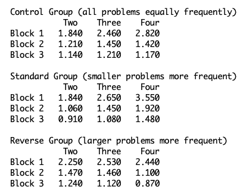

## Zbrodoff's Alpha-Arithmetic
The following data were obtained by N. J. Zbrodoff on judging alphabetic 
arithmetic problems.  Participants were presented with an equation like A + 2 = C
 and had to respond yes or no whether the equation was correct based on counting 
 in the alphabet – the preceding equation is correct, but B + 3 = F is not.  

She manipulated whether the addend was 2, 3, or 4 and whether the problem was 
true or false.  She had 2 versions of each of the 6 kinds of problems (3 addends 
x 2 responses) each with a different letter (a through f). She then manipulated 
the frequency with which problems were studied in sets of 24 trials:

* In the Control condition, each of the 2, 3 and 4 addend problems occurred twice.
* In the Standard condition, the 2 addend problems occurred three times, the 3 
addend problems twice, and the 4 addend problems once
* In the Reverse condition, the 2 addend problems occurred once, the 3 addend 
problems twice, and the 4 addend problems three times

Each participant saw problems based on one of the three conditions.  There were 
8 repetitions of a set of 24 problems in a block (192 problems), and there were 
3 blocks for 576 problems in all.  The data presented below are in seconds to 
judge the problems true or false based on the block and the addend.  They are 
aggregated over both true and false responses:



The interesting phenomenon concerns the interaction between the effect of the 
addend and amount of practice.  Presumably, the addend effect originally occurs 
because subjects have to engage in counting, but latter they come to rely mostly 
on retrieval of answers they have stored from previous computations.  

The task for this unit is to develop a model of the control group data. Functions 
to run the experiment and most of a model that can perform the task are provided 
in the zbrodoff packages and the related experiment.xml. The run configurations
for running an individual (**Unit 4 - Zbrodoff**) and bulk runs (**Unit 4 - Zbrodoff Bulk Run**) are
provided. No GUI (i.e., human runnable) version is provided.
 
The model as given does the task by counting through the alphabet and numbers 
“in its head” (using the subvocalize action of 
the speech module to produce reasonable timing data) to arrive at an answer which
it compares to the initial equation to determine how to respond.

It is always correct (64 out of 64 for each cell) but does not get any faster 
from block to block because it always uses the counting strategy.  Your first 
task is to extend the model so that it attempts to remember previous instances 
of the trials.  If it can remember the answer it does not have to resort to the 
counting strategy and can respond much faster.  The previous trials are encoded
 in the problem chunks, and encode the result of the counting.  A completed 
 problem for a trial where the stimulus was “A + 2 = C” would look like this:
```
PROBLEM0-0
  ISA PROBLEM
   ARG1  "a"
   ARG2  "2"
   RESULT  "c"

``` 
The result slot contains the result of counting 2 letters from A.  An important
thing to note is that the actual target letter for the trial is stored in the 
goal buffer for comparison after the model has finished counting to a result.  
The model only encodes the result of the counting in the problem chunks.  Thus 
the same problem chunk will result from a trial where the stimulus presented is
“A + 2 = D”.  The assumption is that the person is actually learning the letter 
counting facts and not just memorizing the stimulus-response pairings for the 
task. There will be one of those problem chunks for each of the additions which 
is encountered, which will be a total of six after it completes the first set 
of trials.
 
After your model is able to utilize a retrieval strategy along with the counting 
strategy given, your next step is to adjust the parameters so that the model’s 
performance better fits the experimental data.   

The model is still always responding correctly on all trials, the correlation is 
good, but the deviation is quite high because the model is too fast overall.  
The model’s performance will depend on the same four parameters as the paired 
associate model: latency factor, activation noise, base-level decay rate, and 
retrieval threshold.  In the model you are given, the first three are set to the 
same values as in the paired associate model and represent reasonable values for 
this task.  You should not have to adjust any of those.  However, the retrieval 
threshold (the RetrievalThreshold parameter) is set to its default value of 0.  This is the 
parameter you should manipulate to improve the fit to the data.  


***

Zbrodoff, N. J. (1995).  Why is 9 + 7 harder than 2 + 3?  Strength and interference 
as explanations of the problem-size effect.  *Memory & Cognition*, 23 (6), 689-700.