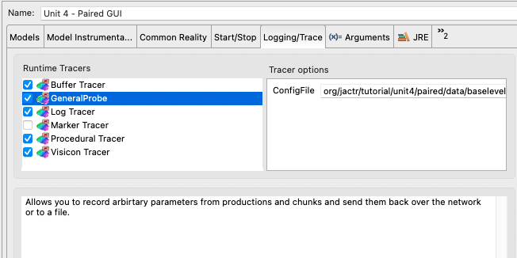

# Unit 4 Code Description
## Paired Associates
The unit 4 models use a similar structure as to what you have seen in units 2 & 3.

### Experiment Configuration
In this unit we provided both the full version of the experiment ([experiment.xml](https://github.com/amharrison/jactr-tutorials/blob/master/org.jactr.tutorial.unit4/src/org/jactr/tutorial/unit4/paired/experiment.xml)) as well as an
abbreviated one ([short.xml](https://github.com/amharrison/jactr-tutorials/blob/master/org.jactr.tutorial.unit4/src/org/jactr/tutorial/unit4/paired/short.xml)). 
This allows one to build and test the model with a smaller interaction space than
the full experiment. Changing from one configuration to the other is just a command line
option, when running indepdendently, and a VM argument *-DConfigurationFile*, when 
running a model.

### Chunk Namer
This unit introduced a snippet of custom code to control how chunks are named. The [chunk namer](https://github.com/amharrison/jactr-tutorials/blob/master/org.jactr.tutorial.unit4/src/org/jactr/tutorial/unit4/paired/chunk/ChunkNamer.java) is 
specified in **ChunkNamerClass* parameter of the declarative module definition.
```
module "org.jactr.core.module.declarative.six.DefaultDeclarativeModule6" [
  "ActivationNoise"          : "0.5"
  "BaseLevelConstant"        : "0"
  "EnablePartialMatching"    : "false"
  "MaximumDifference"        : "-1"
  "MaximumSimilarity"        : "0"
  "MismatchPenalty"          : "1"
  "PermanentActivationNoise" : "0"
  "ChunkNamerClass"          : "org.jactr.tutorial.unit4.paired.chunk.ChunkNamer"]
```

Custom names are useful when you are using a parameter probe, since the probe uses
the chunk names to select which chunks to track.

### Probes
This unit introduced the concept of parameter probes. This is a Logging/Trace option
available in the run configuration. It requires a probe configuration to properly run.



The [probe configuration](https://github.com/amharrison/jactr-tutorials/blob/master/org.jactr.tutorial.unit4/src/org/jactr/tutorial/unit4/paired/data/baselevel.xml) provided
merely tracks the **BaseLevelActivation** of all the *problem* chunks. The configuration
can be defined to probe models, modules, buffers, chunks, and productions. Elements
are selected based on [regular expressions](https://en.wikipedia.org/wiki/Regular_expression) applied to their names.

### Analyzer
For the paired associates task the [analyzer](https://github.com/amharrison/jactr-tutorials/blob/master/org.jactr.tutorial.unit4/src/org/jactr/tutorial/unit4/paired/data/Analyzer.java) handles
the fits for both latency and accuracy. We also provide graphs by way of the
[XChart](https://knowm.org/open-source/xchart/) package in the *lib/xchart-{version}.jar*. It
is normal practice to include any small dependencies in the *lib* folder. Larger dependencies
should be handled using additional projects/bundles. 

To make the library visible as a dependency, the *META-INF/MANIFEST.MF* must be edited. Specifically,
it must be listed under the Classpath section of the Runtime tab. Once done, the classpath
for the project can be recalculated using **Plugin Tools - Update Classpath...** context menu (when selecting
the project). 

## Zbrodoff Task

### Experiment Configuration
As with the paired associates task, both a [short](https://github.com/amharrison/jactr-tutorials/blob/master/org.jactr.tutorial.unit4/src/org/jactr/tutorial/unit4/zbrodoff/short.xml) and [full](https://github.com/amharrison/jactr-tutorials/blob/master/org.jactr.tutorial.unit4/src/org/jactr/tutorial/unit4/zbrodoff/experiment.xml) version of the experiment is provided.
However, due to the volume of trials in this experiment, we do not specify the individual trials
in the experiment configuration, rather we specify a node that will handle the condition assignments,
create the trials, and insert them into each group at the start.

### Model
The jACT-R version of the Zbrodoff model is slightly different than the canonical Lisp version. 
When attending we retain the visual-location chunk so that we can check its contents
during read-left, read-right, and read-middle. In the Lisp it is just assumed that the first
thing seen will be in the center thanks to buffer stuffing. However, jACT-R has a different
design that prioritizes the processing of perceptual information. Because of that, percepts are 
made available as soon the percept is processed, instead of holding them all for a cycle update. That
means it is possible, though rare, for buffer stuffing to stuff an unexpected chunk. By testing
the visual-location chunk we can be sure that we are encoding the right feature at the right time.


