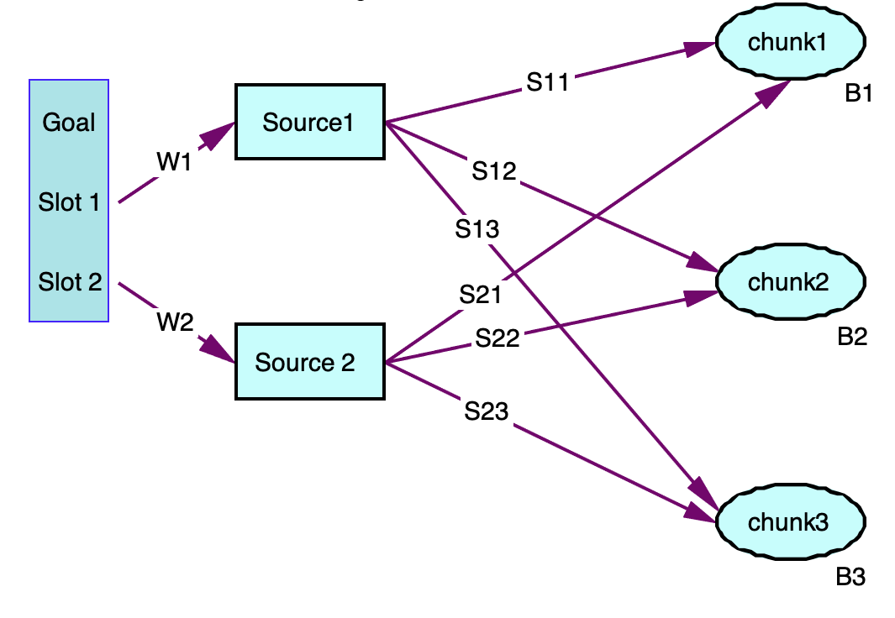

# Unit 5: Activation and Context
The goal of this unit is to introduce the components of the activation equation that reflect the context of a declarative memory retrieval.

## Spreading Activation
The first context component we will consider is called spreading activation. The chunks in the buffers provide a context in which to perform a retrieval. Those chunks can spread activation to the chunks in declarative memory based on the contents of their slots. Those slot contents spread an amount of activation based on their relation to the other chunks, which we call their strength of association. This essentially results in increasing the activation of those chunks which are related to the current context.
The equation for the activation Ai of a chunk i including spreading activation is defined as:


* Measures of Prior Learning, Bi: The base-level activation reflects the recency and frequency
of practice of the chunk as described in the previous unit.
* Across all buffers: The elements k being summed over are the buffers which have been set to provide spreading activation.
* Sources of Activation: The elements j being summed over are the chunks which are in the slots of the chunk in buffer k.
* Weighting: Wkj is the amount of activation from source j in buffer k.
* Strengths of Association: Sji is the strength of association from source j to chunk i.
* E: The noise value as described in the last unit.

The weights of the activation spread, Wkj, default to an even distribution from each slot within a buffer. The total amount of source activation for a buffer will be called Wk and is settable for each buffer. The Wkj values are then set to Wk /nk where nk is the number of slots which contain chunks in the chunk in buffer k.

The strength of association, Sji, between two chunks j and i is 0 if chunk j is not the value of a slot of chunk i and j and i are not the same chunk. Otherwise, it is set using this equation:


* S: The maximum associative strength (set with the MaximumAssociativeStrength parameter of the declarative learning module)
* fanj: is the number of chunks in declarative memory in which j is the value of a slot plus one for chunk j being associated with itself. 

That is the general form of the spreading activation equation. However, by default, only the imaginal and goal buffers serves as a source of activation. 
This can be changed by using the Activation parameter of the respective buffer. Therefore, in the default case, the activation equation can be simplified to:


With W reflecting the value of the imaginal's Activation parameter and Wj being W/n where n is the number of chunks in slots of the current imaginal buffer chunk.

Here is a diagram to help you visualize how the spreading activation works. Consider an imaginal chunk which has two chunks in its slots when a retrieval is requested and that there are three chunks in declarative memory which match the retrieval request for which the activations need to be determined.



Each of the potential chunks also has a base-level activation which we will denote as Bi, and thus the total activation of the three chunks are:


and with the default value of 1.0 for :imaginal-activation W1 = W2 = 1/2. 

There are two notes about using spreading activation. First, by default, spreading activation is disabled because MaximumAssociativeStrength defaults to the value NaN (not a number). In order to enable the spreading activation calculation MaximumAssociativeStrength must be set to a positive value. The other thing to note is that there is no recommended value for the MaximumAssociativeStrength parameter, but one almost always wants to set it high enough that all of the Sji values are positive.

## The Fan Effect
Anderson (1974) performed an experiment in which participants studied 26 facts such as the following sentences:
  1. A hippie is in the park.
  2. A hippie is in the church.
  3. A hippie is in the bank.
  4. A captain is in the park.
  5. A captain is in the cave.
  6. A debutante is in the bank.
  7. A fireman is in the park.
  8. A giant is in the beach.
  9. A giant is in the dungeon.
 10. A giant is in the castle.
 11. A earl is in the castle.
 12. A earl is in the forest.
 13. A lawyer is in the store.
 ...
 
 After studying these facts, they had to judge whether they saw facts such as the following:
 * A hippie is in the park.
 * A hippie is in the cave.
 * A lawyer is in the store.
 * A lawyer is in the park.
 * A debutante is in the bank.
 * A debutante is in the cave.
 * A captain is in the bank.
 
which contained both studied sentences (targets) and new sentences (foils).

The people and locations for the study sentences could occur in any of one, two, or three of the study sentences. That is called their fan. The following tables show the recognition latencies from the experiment in seconds for targets and foils as a function of person fan and location fan:


The main effects in the data are that as the fan increases the time to respond increases and that the foil sentences take longer to respond to than the targets. We will now show how these effects can be modeled using spreading activation.

## Fan Effect Model
The fan effect model and simulated task environment is available under the **org.jactr.tutorial.unit5.fan** package.
We have skipped the human-runnable version and gone straight to the simulation. As usual the experiment is defined
in the [experiment.xml](https://github.com/amharrison/jactr-tutorials/blob/master/org.jactr.tutorial.unit5/src/org/jactr/tutorial/unit5/fan/experiment.xml) file, which contains a trial for each probe question. You can run the model using the
**Unit 5 - Fan** run configuration. To make finding the relevant sections in the trace easier, we are using
markers and their associated **Marker Tracer** in the run configuration. Markers allow you to annotate spans of time
with type/name attributes. Here we are marking the trial type (Target/Foil) and the actual trial. In the log viewer,
Target time spans will be rendered in blue, while foil time spans will be rendered in green.

As in the prior tutorials, the bulk run configuration, **Unit 5 - Fan Bulk Run**, does parametric searches based on 
its own configuration file [fit.xml](https://github.com/amharrison/jactr-tutorials/blob/master/org.jactr.tutorial.unit5/src/org/jactr/tutorial/unit5/fan/data/fit.xml). The following fit was achieved using two parameters, LatencyFactor and
MaximumAssociativeStrength. The spreading activation value for the imaginal buffer was set to 1.

```
R-Square  : 0.78
RMSE      : 0.05

Target
Location    Person Fan
Fan   1     2     3     
1     1.09  1.14  1.17  
2     1.14  1.19  1.24  
3     1.18  1.24  1.30  

Foil
Location    Person Fan
Fan   1     2     3     
1     1.21  1.23  1.28  
2     1.25  1.28  1.30  
3     1.25  1.31  1.33  

```

We will now look at how this model performs the task and how spreading activation leads to the effects in the data.

### Model Representations
The study sentences are encoded in chunks placed into the model’s declarative memory like this:
```
comprehend-sentence p1(relation=in, arg1=hippie, arg2=park), p2(relation=in, arg1=hippie, arg2=church),
  p3(relation=in, arg1=hippie, arg2=bank), p4(relation=in, arg1=captain, arg2=park),
  p5(relation=in, arg1=captain, arg2=cave), p6(relation=in, arg1=debutante, arg2=bank),
  p7(relation=in, arg1=fireman, arg2=park), p8(relation=in, arg1=giant, arg2=beach),
  p9(relation=in, arg1=giant, arg2=castle), p10(relation=in, arg1=giant, arg2=dungeon),
  p11(relation=in, arg1=earl, arg2=castle), p12(relation=in, arg1=earl, arg2=forest),
  p13(relation=in, arg1=lawyer, arg2=store)
```
They represent the items from the study portion of the experiment in the form of an association among the concepts e.g. p13 is encoding the sentence “The lawyer is in the store”.

There are also meaning chunks which connect the text read from the display to the concepts. The base-level activations of these meaning chunks have been set to 10 to reflect the fact that they are well practiced and should not fail to be retrieved, but the activations of the comprehend- sentence chunks are left at the default of 0 to reflect that they are relatively newer having only been learned during this experiment.
```
parameters(in, store, lawyer, fireman, bank, debutante, cave, captain, church, park, hippie, giant, forest, earl,
  dungeon, castle, beach, guard)[
    "BaseLevelActivation"   : "10" //can only do because base level learning is off
  ]
```

### Perceptual Encoding
In this section we will briefly describe the productions that perform the perceptual parts of the task. This is similar to the steps that have been done in previous models and thus it should be familiar. One small difference is that this model does not use explicit state markers in the goal (in fact it does not place a chunk into the goal buffer at all) and instead relies on the states of the buffers and modules involved to constrain the ordering of the production firing.

Only the person and location are displayed for the model to perform the task. If the model were to read all of the words in the sentence it would be difficult to be able to respond fast enough to match the experimental data, and in fact studies of the fan effect done using an eye tracker verify that participants generally only fixate those two words from the sentences during the testing trials. Thus to keep the model simple we attend to the exact locations on the screen. To read and encode the words the model goes through a four step process.

The first production to fire issues a request to the visual-location buffer to find the person word and it also requests that the imaginal module create a new chunk to hold the sentence being read from the screen:
```
production find-person{
  ?visual-location{
    buffer = unrequested
  } 
  ?imaginal{
    buffer = empty
  }
}{
  +imaginal{
    isa comprehend-sentence
  }
  +visual-location{
    isa visual-location
    screen-x > -2.5
    screen-x < -1.5
  }
}
```

The first query on the LHS of that production has not been used previously in the tutorial. The check that the visual-location buffer holds a chunk which was not requested is a way to test that a new display has been presented. The buffer stuffing mechanism will automatically place a chunk into the buffer if it is empty when the screen changes and because that chunk was not the result of a request it is tagged as unrequested. Thus, this production will match whenever the screen has recently changed if the visual-location buffer was empty at the time of the change and the imaginal module is not busy.

The next production to fire harvests the requested visual-location and requests a shift of attention to it:
```
production attend-visual-location{
  visual-location{
    isa visual-location
  }
  ?visual-location{
    buffer = requested
  }
  ?visual{
    state != busy
  }
}{
  +visual{
    isa attend-to
    where = =visual-location
  } 
}
```
Then the chunk in the visual buffer is harvested and a retrieval request is made to request the chunk that represents the meaning of that word:
```
production retrieve-meaning{
  visual{
    isa text
    value = =word
  }
  ?retrieval{
    state != busy
  }
}{
  +retrieval{
    isa meaning
    word = =word
  }
}
```
Finally, the retrieved chunk is harvested and the meaning chunk is placed into a slot of the chunk in the imaginal buffer:
```
production encode-person{
  retrieval{
    isa meaning
  }
  imaginal{
    isa comprehend-sentence
    arg1 = null
  }
}{
  imaginal{
    arg1 = =retrieval
  }
  +visual-location{
    isa visual-location
    screen-x > 2.5
    screen-x < 3.5
  }
}
```
This production also issues the visual-location request to find the location word and the same sequence of productions fire to attend and encode the location ending with the encode-location production firing instead of encode-person.

### Determining the Response
After the encoding has happened the imaginal chunk will look like this for the sentence “The
lawyer is in the store.”:
```
IMAGINAL: CHUNK0-0
CHUNK0-0
   ARG1  LAWYER
   ARG2  STORE
```
At that point one of these two productions will be selected and fired to retrieve a study sentence:
```
production retrieve-from-person{
  imaginal{
    isa comprehend-sentence
    arg1 = =person
    arg2 = =location
  }
  ?retrieval{
    state = free
    buffer = empty
  }
}{
  imaginal{}
  +retrieval{
    isa comprehend-sentence
    arg1 = =person
    relation != null
  }
}

production retrieve-from-location{
  imaginal{
    isa comprehend-sentence
    arg1 = =person
    arg2 = =location
  }
  ?retrieval{
    state = free
    buffer = empty
  }
}{
  imaginal{}
  +retrieval{
    isa comprehend-sentence
    arg2 = =location
    relation != null
  }
}
```
In this model of the task would these two productions are competing and one would randomly be selected.

One important thing to notice is that those productions request the retrieval of a studied chunk based only on one of the items from the probe sentence. By doing so it ensures that one of the study sentences will be retrieved instead of a complete failure in the event of a foil. If retrieval failure were used by the model to detect the foils then there would be no difference in response times for the foil probes because the time to fail is based solely upon the retrieval threshold. However, the data clearly shows that the fan of the items affects the time to respond to both targets and foils.

After one of those productions fires a chunk representing a study trial will be retrieved and one of the following productions will fire to produce a response:
```
production respond-yes{
  imaginal{
    isa comprehend-sentence
    arg1 = =person
    arg2 = =location
  }
  retrieval{
    isa comprehend-sentence
    arg1 = =person
    arg2 = =location
  }
  ?motor{
    state = free
  }
}{
  +motor{
    isa press-key
    key = "k"
  }
  -imaginal{
    arg1 = null
    arg2 = null
  }
}

production mismatch-person{
  imaginal{
    isa comprehend-sentence
    arg1 = =person
    arg2 = =location
  }
  retrieval{
    isa comprehend-sentence
    arg1 != =person
  }
  ?motor{
    state = free
  }
}{
  +motor{
    isa press-key
    key = "d"
  }
  //prevent encoding of foils
  -imaginal{
    arg1 = null
    arg2 = null
  }
}

production mismatch-location{
  imaginal{
    isa comprehend-sentence
    arg1 = =person
    arg2 = =location
  }
  retrieval{
    isa comprehend-sentence
    arg2 != =location
  }
  ?motor{ 
    state = free
  }
}{ 
  +motor{
    isa press-key
    key = "d"
  }
  //prevent encoding of foils
  -imaginal{
    arg1 = null
    arg2 = null
  }
}
```
If the retrieved sentence matches the probe then the model responds with the true response, “k”, and if either one of the components does not match then the model responds with “d”.

## Analyzing the Retrieval of the Critical Study Chunk in the Fan Model
The perceptual and encoding actions the model performs for this task have a cost of .585 seconds and the time to respond after retrieving a comprehend-sentence chunk is .260 seconds. Those times are constant across all trials. The difference in the conditions will result from the time it takes to retrieve the studied sentence. Recall from the last unit that the time to retrieve a chunk i is based on its activation and specified by the equation:


Thus, it is differences in the activations of the chunks representing the studied items which will result in the different times to respond to different trials.
The chunk in the imaginal buffer at the time of the retrieval (after either retrieve-from-person or retrieve-from-location fires) will look like this:

```
IMAGINAL: CHUNK0-0
CHUNK0-0
  ARG1 person
  ARG2 location
```
where person and location will be the chunks that represent the meanings for the particular probe
being presented.

The retrieval request will look like this for the person:
```
+retrieval{
 isa comprehend-sentence
 arg1 = person
}
```
or this for location:
```
+retrieval{
 isa comprehend-sentence
 arg2 = location
}
```
depending on which of the productions was chosen to perform the retrieval.

The important thing to note is that because the sources of activation in the buffer are the same for either retrieval request the spreading activation will not differ between the two cases. You might wonder then why we would need to have both options. That will be described in the detailed examples below.


### A Simple Target Trial
The first case we will look at is the target sentence “The lawyer is in the store”. Both the person and location in this sentence have a fan of one in the experiment – they each only occur in that one study sentence.
The imaginal buffer’s chunk looks like this at the time of the critical retrieval (as discussed above):
```
CHUNK0-0
   ARG1  LAWYER
   ARG2 STORE
```
We will now look at the retrieval which results from the retrieve-from-person production firing.

```
ACTIVATION  : imaginal spreading 0.50 to each store lawyer 
        p13.base = 0.00
        p13.spreading = 0.91 from (in.source 0.00 x -1.04 = -0.00) (store.source 0.50 x 0.91 = 0.45) (p13.source 0.00 x 1.60 = 0.00) (lawyer.source 0.50 x 0.91 = 0.45) 
...
RETRIEVAL : Will retrieve p13 in 0.2543 @ 0.989
```

In this case, the only chunk which matches the request is chunk p13. Note that this would look exactly the same if the retrieve-from-location production had fired because it would still be the only chunk that matched the request and the sources of activation are the same regardless of which one fires.
Remember that we have set the parameter F to .63, the parameter S to 1.6, and the base-level activation for the comprehend-sentence chunks is 0 in this model.
Looking at this trace, we see the Sji values from store to p13 and lawyer to p13 are both approximately .91. That comes from the equation:


The value of S was estimated to fit the data as 1.6 and the chunk fan of both the store and lawyer chunks is 2 (not the same as the fan from the experiment which is only one) because they each occur as a slot value in only the p13 chunk plus each chunk is always credited with a reference to itself. Then substituting into the equation we get:


The Wj values (called the level in the activation trace) are .5 because the source activation from
the imaginal buffer is the default value of 1.0 and there are two source chunks. Thus the activation of chunk p13 is:


Finally, we see the time to complete the retrieval (the time between the start-retrieval and the retrieved-chunk actions) is .254 seconds (.839- .585) which is determined from the retrieval time equation based on the chunk’s activation:


Adding that retrieval time to the fixed costs of .585 seconds to do the perception and encoding and the .26 seconds to perform the response gives us a total of 1.099 seconds, which is the value in the fan 1-1 cell of the model data for targets presented above.

Now that we have looked at the details of how the retrieval and total response times are determined for the simple case we will look at a few other cases.

### A Different Target Trial
The target sentence “The hippie is in the bank” is a more interesting case. Hippie is the person in three of the study sentences and bank is the location in two of them. Now we will see why it takes the model longer to respond to such a probe. Here are the critical components from the trace when retrieve-from-person is chosen:
```
ACTIVATION  : imaginal spreading 0.50 to each bank hippie 
        p1.base = 0.00
        p1.spreading = 0.11 from (p1.source 0.00 x 1.60 = 0.00) (in.source 0.00 x -1.04 = -0.00) (hippie.source 0.50 x 0.21 = 0.11) (park.source 0.00 x 0.21 = 0.00) 
        p2.base = 0.00
        p2.spreading = 0.11 from (p2.source 0.00 x 1.60 = 0.00) (in.source 0.00 x -1.04 = -0.00) (church.source 0.00 x 0.91 = 0.00) (hippie.source 0.50 x 0.21 = 0.11) 
        p3.base = 0.00
        p3.spreading = 0.36 from (bank.source 0.50 x 0.50 = 0.25) (p3.source 0.00 x 1.60 = 0.00) (in.source 0.00 x -1.04 = -0.00) (hippie.source 0.50 x 0.21 = 0.11) 

```
There are three chunks that match the request for a chunk with an arg1 value of hippie. Each receives the same amount of activation being spread from hippie. Because hippie is a member of three chunks it has a chunk fan of 4 and thus the S(hippie)i value is:


Chunk p3 also contains the chunk bank in its arg2 slot and thus receives the source spreading
from it as well.

If retrieve-from-location where to fire instead, there are only two chunks which match the request for a chunk with an arg2 value of bank.

Regardless of which production fired to request the retrieval, chunk p3 had the highest activation because it received spreading activation from both sources. Thus, even if there is more than one chunk which matches the retrieval request issued by retrieve-from-person or retrieve-from- location the correct study sentence will always be retrieved because its activation will be the highest, and that activation value will be the same in both cases.

Notice that the activation of chunk p3 is less than the activation that chunk p13 had in the previous example because the source activation being spread to p3 is less. That is because the sources in that case have a higher fan, and thus a lesser Sji. Because the activation is smaller, it takes longer to retrieve such a fact and that gives us the difference in response time effect of fan in the data.

### A Foil Trial
Now we will look at a foil trial. The foil probe “The giant is in the bank” is similar to the target that we looked at in the last section. The person has an experimental fan of three and the location has an experimental fan of two. This time however there is no matching study sentence. Here are the critical components from the trace when retrieve-from-person is chosen:

```
ACTIVATION  : imaginal spreading 0.50 to each bank giant 
        p10.base = 0.00
        p10.spreading = 0.11 from (p10.source 0.00 x 1.60 = 0.00) (dungeon.source 0.00 x 0.91 = 0.00) (in.source 0.00 x -1.04 = -0.00) (giant.source 0.50 x 0.21 = 0.11) 
        p8.base = 0.00
        p8.spreading = 0.11 from (p8.source 0.00 x 1.60 = 0.00) (in.source 0.00 x -1.04 = -0.00) (giant.source 0.50 x 0.21 = 0.11) (beach.source 0.00 x 0.91 = 0.00) 
        p9.base = 0.00
        p9.spreading = 0.11 from (castle.source 0.00 x 0.50 = 0.00) (p9.source 0.00 x 1.60 = 0.00) (in.source 0.00 x -1.04 = -0.00) (giant.source 0.50 x 0.21 = 0.11) 
RETRIEVAL : Searching for [comprehend-sentence:arg1 = giant relation != null ]
        Evaluating exact matches : [p10, p8, p9] 
        p10.(0.11=0.00+0.11) is best candidate yet 
        p8.(0.11=0.00+0.11) doesn't have the highest activation 
        p9.(0.11=0.00+0.11) doesn't have the highest activation         
```
There are three chunks that match the request for a chunk with an arg1 value of giant and each receives the same amount of activation being spread from giant. However, none contain an arg2 value of bank. Thus they only get activation spread from one source and have a lesser activation value than the corresponding target sentence had. Because the activation is smaller, the retrieval time is greater. This results in the effect of foil trials taking longer than target trials.

If retrieve-from-location were fired instead, again only two chunks which match the request for a chunk with an arg2 value of bank. Again, the activation of the chunk retrieved is less than the corresponding target trial, but it is not the same as when retrieve-from-person fired. That is why the model is run with each of those productions fired once for each probe with the results being averaged together. Otherwise the foil data would only show the effect of fan for the item that was used to retrieve the study chunk.

***
When you are comfortable with your understanding of associative links and spreading activation, it's time to move on to [partial matching](README2.md).


***
Based on the original CC licensed [ACT-R tutorials](http://act-r.psy.cmu.edu/software/), 2.25.20.

<a rel="license" href="http://creativecommons.org/licenses/by/4.0/"></a><br />This work is licensed under a <a rel="license" href="http://creativecommons.org/licenses/by/4.0/">Creative Commons Attribution 4.0 International License</a>.
