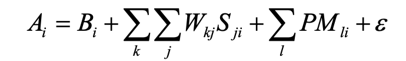

## Partial Matching
Up to now models have either always retrieved a chunk which matched the retrieval request or resulted in a failure to retrieve anything. Now we will look at modeling errors in recall in more detail. There are two kinds of errors that can occur. One is an error of commission when the wrong item is recalled. This will occur when the activation of the wrong chunk is greater than the activation of the correct chunk. The second is an error of omission when nothing is recalled. This will occur when no chunk has activation above the retrieval threshold.

We will continue to look at productions from the fan model for now. In particular, this production requests the retrieval of a chunk:
```
production retrieve-from-person{
  imaginal{
    isa comprehend-sentence
    arg1 = =person
    arg2 = =location
  }
  ?retrieval{
    state = free
    buffer = empty
  }
}{
  imaginal{}
  +retrieval{
    isa comprehend-sentence
    arg1 = =person
    relation != null
  }
}
```
In this case an attempt is being made to retrieve a chunk with a particular person (the value bound to =person) that had been studied. If =person were the chunk giant, this retrieval request wouldbelookingforachunkwithgiantinthearg1slot. As was shown above, there were three
chunks in the model from the study set which matched that request and one of those was retrieved.

However, let us consider the case where there had been no study sentences with the person giant but there had been a sentence with the person titan in the location being probed with giant i.e. there was a study sentence “The titan is in the bank” and the test sentence is now “The giant is in the bank”. In this situation one might expect that some human participants might incorrectly classify the probe sentence as one that was studied because of the similarity between the words giant and titan. The current model however could not make such an error.

Producing errors like that requires the use of the partial matching mechanism. When partial matching is enabled (by setting the EnablePartialMatching parameter to true) the similarity between the chunks in the retrieval request and the chunks in the slots of the chunks in declarative memory are taken into consideration. The chunk with the highest activation is still the one retrieved, but with partial matching enabled that chunk might not have the exact slot values as specified in the retrieval request.

Adding the partial matching component into the activation equation, we now have the activation Ai of a chunk i defined fully as:



Bi, Wkj, Sji, and E have been discussed previously. The new term is the partial matching component.
* Specification elements l: The matching summation is computed over the slot values of the retrieval specification.
* Match Scale, **P**: This reflects the amount of weighting given to the similarity in slot l. This is a constant across all slots and is set with the MismatchPenalty parameter.
* Match Similarities, **Mli**: The similarity between the value l in the retrieval specification and the value in the corresponding slot of chunk i.

The similarity value, the Mli, can be set by the modeler along with the scale on which they are defined. The scale range is set with a maximum similarity (set using the :ms parameter) and a maximum difference (set using the :md parameter). By default, MaximumSimilarity is 0 and MaximumDifference is -1.0. The similarity between anything and itself is automatically set to the maximum similarity and by default the similarity between any other pair of values is the maximum difference.
Note that maximum similarity defaults to 0 and similarity values are actually negative. If a slot value matches the request then it does not penalize the activation, but if it mismatches then the activation is decreased. To demonstrate partial matching in use we will look at two example models.

## Grouped Recall
The first of these models is called grouped and located under the **org.jactr.tutorial.unit5.grouped** packages. There
is not code other than the model for this example. This is a simple demonstration model of a grouped recall task which is based on a larger model of a complex recall experiment. As with the fan model, the studied items are already specified in the model, so it does not model the encoding and study of the items. In addition, the response times and error profiles of this model are not fit to any data. This demonstration model is designed to show the mechanism of partial matching and how it can lead to errors of commission and errors of omission. Because the model is not fit to any data, and the mechanism being studied does not rely on any of the perceptual or motor modules of ACT-R, they are not being used, and instead only a chunk in the goal buffer is used to hold both the task state and problem representation. This technique of using only the cognitive system in ACT-R can be useful when modeling a task where the timing is not important or other situations where accounting for “real world” interaction is not necessary to accomplish the objectives of the model.

If you check the parameter settings for this model you will see that it has a value of .15 for the transient noise s parameter and a retrieval threshold of -.5. Also, to simplify the demonstration, the spreading activation described above is disabled by not including the declarative learning module.
This model is set up to recall a list of nine items which are encoded in groups of three elements. The list that should be recalled is (123) (456) (789).
To run the model, select the **Unit 5 - Grouped** run configuration.

Because the RandomSeed parameter of the random module is set in the model you will always get the same result with the model recalling the sequence 1,2,3,5,7,8,9 (you can remove the setting of the :seed parameter to produce different results if you would like to explore the model further). 
It makes three errors in recalling that list, it mis-ordered the recall of the 5 and 4 and it failed to recall 4 and 6. We will now look at the details of how those errors happened.

If one turns on the activation trace for this model you will again see the details of the activation computations taking place. 
The following is from the activation trace of the error of commission when the model recalls 5 in the first position of the second group instead of the correct item, 4. 
The critical comparison is between item4, which should be retrieved and item5, which is instead retrieved:
```
RETRIEVAL : Retrieved group2 id=group2,parent=list,position=second
        Evaluating partial matches : [item5, item4] 
        item1 is best candidate yet (-1.10=0.00+0.00 [1.00 discount])
        rejecting item2, there is no overlap with retrieval pattern [item:parent = group2 position = first ]
        rejecting item3, there is no overlap with retrieval pattern [item:parent = group2 position = first ]
        item4 is best candidate yet (-0.15=0.00+0.00 [0.00 discount])
        item5 is best candidate yet (-0.11=0.00+0.00 [0.50 discount])
        item6 doesn't have the highest activation (-0.53=0.00+0.00 [1.00 discount])
        item7 doesn't have the highest activation (-1.70=0.00+0.00 [1.00 discount])
        rejecting item8, there is no overlap with retrieval pattern [item:parent = group2 position = first ]
        rejecting item9, there is no overlap with retrieval pattern [item:parent = group2 position = first ]
        
        item5 was not recently retrieved. Selecting.
```
The amount of activation lost is explicitly stated in *[0.50 discount]*.
In these examples the base-level activations, Bi, have their default value of 0, the match scale, P, has the value 1, and the only noise value is the transient component with an s of 0.15. So the calculations are really just a matter of adding up the match similarities and adding the transient noise.

One thing to notice is that the :recently-retrieved request parameter is specified in all of the requests the model makes to retrieve the items, like this one:
```
 +retrieval{
  isa item
  group    = =group
  position = second
  :recently-retrieved = false
 }
```
Thus, only those chunks without a declarative finst are attempted for the matching. :recently- retrieved is not a slot of the chunk and thus does not undergo the partial matching calculation.

Looking at the matching of item4 above we see that it matches on both the group and position slots resulting in the addition of 0 to the base-level activation as a result of mismatch. It then receives an addition of about -0.15 in noise which is then its final activation value.

Next comes the matching of item5. The group slot matches the requested value of group2, but the position slots do not match. The requested value is first but item5 has a value of second. The similarity between first and second is set to -0.5 in the model, and that value is added to the activation. 
Then a transient noise of 0.39 is added to the activation for a total activation of -0.11. This value is greater than the activation of item4 and thus because of random fluctuations item5 gets retrieved in error.

The similarities are set via the Similarities parameter of either chunk. Setting it for one chunk, sets it for both.
```
chunk first["Similarities" : "((first 1.0), (second -0.5), (third -1))"],
  second["Similarities" : "((second 1.0), (third -0.5))"],
  third, fourth
```

### Error of Omission
Here is the portion of the trace detailing the failure after retrieving incorrectly item5.
```
RETRIEVAL : Retrieved item5 name=5,parent=group2,position=second
        Evaluating partial matches : [item5] 
        rejecting item1, there is no overlap with retrieval pattern [item:parent = group2 position = second ]
        item2 is best candidate yet (-1.31=0.00+0.00 [1.00 discount])
        rejecting item3, there is no overlap with retrieval pattern [item:parent = group2 position = second ]
        item4 is best candidate yet (-0.60=0.00+0.00 [0.50 discount])
        item5 is best candidate yet (0.19=0.00+0.00 [0.00 discount])
        item6 doesn't have the highest activation (-0.91=0.00+0.00 [0.50 discount])
        rejecting item7, there is no overlap with retrieval pattern [item:parent = group2 position = second ]
        item8 doesn't have the highest activation (-1.02=0.00+0.00 [1.00 discount])
        rejecting item9, there is no overlap with retrieval pattern [item:parent = group2 position = second ]
        
        item5 was recently retrieved. Ignoring.
```

We see that item5 is the best match (with 0 discount), but it was recently retrieved. The next two best options
are item4 or item6, both of which are below threshold due to their 0.5 discount and noise.


***
Once you are comfortable with how partial matching works, it's time to move on to [simple addition](README3.md).

