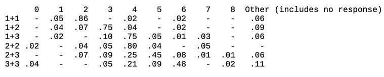

## Simple Addition
The other example model for the unit which uses partial matching is fit to experimental data. The task is an experiment performed by Siegler and Shrager on the relative frequencies of different responses by 4 year olds to addition problems. The children were asked to recall the answers to simple addition problems without counting on their fingers or otherwise computing the answer. It seems likely that many of the kids did not know the answers to the larger problems that were tested. So we will only focus on the addition table from 1+1 to 3+3, and here are the data they reported:



The Siegler model and code is under the **org.jactr.tutorial.unit5.siegler** package. As before, there is no human-runnable interface available. That should not be too much of a problem however because one would guess that you would make very few errors if presented with such a task.
Both the full [experiment.xml](https://github.com/amharrison/jactr-tutorials/blob/master/org.jactr.tutorial.unit5/src/org/jactr/tutorial/unit5/siegler/experiment.xml) and abbreviated [short.xml](https://github.com/amharrison/jactr-tutorials/blob/master/org.jactr.tutorial.unit5/src/org/jactr/tutorial/unit5/siegler/short.xml) versions of the experiment are available for running. **Unit 5 - Siegler** will run the abbreviated model with full tracing. 
**Unit 5 - Siegler Bulk Run** will run the iterative parameter search using [fit.xml](https://github.com/amharrison/jactr-tutorials/blob/master/org.jactr.tutorial.unit5/src/org/jactr/tutorial/unit5/siegler/data/fit.xml). 

Since there is no learning involved with this experiment, the model does not generate additional declarative chunks. It is presented the numbers to add aurally and responds by speaking a number. Here is an example of the output:
```
R-Squared : 0.97
RMSE : 0.07

      0     1     2     3     4     5     6     7     8     9
1+1 0.00  0.11  0.78  0.08  0.03  0.00  0.00  0.00  0.00  0.00  
1+2 0.00  0.00  0.12  0.81  0.07  0.00  0.00  0.00  0.00  0.00  
1+3 0.00  0.00  0.00  0.16  0.81  0.04  0.00  0.00  0.00  0.00  
2+2 0.00  0.00  0.00  0.07  0.91  0.02  0.00  0.00  0.00  0.00  
2+3 0.00  0.00  0.00  0.01  0.24  0.67  0.07  0.01  0.00  0.00  
3+3 0.00  0.00  0.00  0.00  0.03  0.00  0.86  0.11  0.00  0.00  
```

Like the fan model, this model does not rely on the goal buffer at all for tracking its progress. The model builds up its representation of the problem in the imaginal buffer and relies on the module states and buffer contents to determine what needs to be done next. Most of the conditions and actions in the productions for this model are similar to those that have been used in other tutorial models. Thus, you should be able to understand and follow the basic operation of the model and we will not cover it in detail here. However, there are two productions which have actions that have not been used previously in the tutorial. We will describe those new actions and then look at how we determined the parameter settings used to match the data.

### Modification Request
This production in the siegler model has an action for the imaginal buffer which has not been
discussed previously in the tutorial:
```
production harvest-arg2{
  retrieval{
    isa number
  }
  imaginal{
    isa plus
    add2 =  null
  }
  ?imaginal{
    state =  free
  }
}{
  +imaginal{
    add2 = =retrieval
  }
}
```
An action for a buffer that has no chunktype is called a modification request. It works
similarly to a regular request in that it is asking the buffer’s module to perform some action which can vary from module to module. The modification request differs from the normal request in that it does not clear the buffer automatically in the process of making the request. Not every module supports modification requests, but both the goal and imaginal modules do and they both handle them in the same manner.

A modification request to the goal or imaginal buffer is a request for the module to modify the chunk that is in the buffer in the same way that a production would modify the chunk with modification action.

For the imaginal module there is another difference between the modification and and request. As we saw previously a request to create a chunk in the imaginal buffer has a time cost of 200ms. The same cost applies to modifications made to the chunk in the imaginal buffer by the imaginal module, whereas the production makes a modification immediately. 
The imaginal request is the recommended way to make changes to the chunk in the imaginal buffer because it includes the time cost for the imaginal module to make the change. However if one is not as concerned about timing or the imaginal cost is not important for the task being modeled then the modification can be used for simplicity as has been done up to this point in the tutorial.

### An Indirect Request
This production in the siegler model has a retrieval request using syntax that has not been
discussed previously in the tutorial:

```
production harvest-answer{
  retrieval{
    isa plus
    sum =  =number
  }
  imaginal{
    isa plus
  }
  ?imaginal{
    state =  free
  }
}{
  +imaginal{
    sum = =number
  }
  +retrieval{
    =number
  }
}
```
This production harvests the chunk in the retrieval buffer and copies the value from the sum slot of that chunk into the sum slot of the imaginal buffer and also makes what is called an indirect request to the retrieval buffer to retrieve the chunk which is contained in that slot. That chunk must be retrieved so that the value in its vocal-rep slot can be used to speak the response.

An indirect request can be made through any buffer by specifying a chunk or a variable bound to a chunk as the only component of the request. The actual request which is sent to the module in such a situation is constructed as if all of the slots and values of that chunk were specified explicitly. Otherwise an indirect request will be handled by the module exactly the same way as a normal request.

In this case, since it is a retrieval request, it will undergo the same activation calculations and be subject to partial matching just like any other retrieval request. Thus an indirect request to the retrieval buffer is not guaranteed to put that chunk into the buffer. In this model, the correct chunk should always be retrieved because it will match on all of its slots and thus receive no penalty to its activation while all the other number chunks will receive twice the maximum difference penalty to their activation since they will mismatch on both slots and there are no similarities set in the model between numbers as used in the aural-rep slot or the strings used in the vocal-rep slot.

### Parameters to be adjusted
To achieve that fit to the data we will be using partial matching and adjusting the base-level activations of the plus-facts for the model. We are not going to use spreading activation for this demonstration. However, if you would like to explore the effect it has on the model feel free to enable it and experiment with adjusting the source spread from the imaginal buffer which is holding the contextual information in this task.

The specific parameters that we will need to adjust for the model are those related to activation in general (the retrieval threshold, RetrievalThreshold, and the activation noise, ActivationNoise), those related to partial matching (the similarities among the number chunks used as the addends of the plus-facts and the match scale value, MismatchPenalty), and the base-level activation values of the chunks.

That is potentially a lot of free parameters in the model. Treating them that way one could likely produce an extremely strong fit to the reported data. However, doing that is not very practical nor does it result in a model that is of much use for demonstrating anything other than the ability to fit 60 data points using more than 60 parameters.

In the following sections we will describe the effects that the particular parameters have on the model’s performance and outline an approach which can be taken to arrive at the parameter settings in a model.

### Initial Model
The first thing to do for the model is make sure that it can do the task. In this case that is hear the numbers, attempt to retrieve an addition fact, and then speak the result. To do that, we will start without enabling the subsymbolic components of the system. Making sure the model works right with basic symbolic information is a good start for modeling complex tasks because once the subsymbolic components are enabled and more sources of randomness or indeterminate behavior are introduced it can be very difficult to find potential errors in the productions or basic logic of the model.

The assumptions for the model are that the children know the numbers from zero through nine and that they have encountered the addition facts for problems with addends from zero to five. Thus these will be the declarative memory elements with which the model will start. Along with that, we are assuming that the children are not going to use any complex problem solving to try to remember the answers and that if there is a failure to remember a fact after one try the model will just give-up and answer that it does not know. For a task of this nature where we are modeling the aggregate data, using a single idealized strategy for the model is often a reasonable approach, and has been how all the other models seen so far in the tutorial operate. In other circumstances, particularly when individual participant data is being modeled, the specific strategy used to perform the task may be important, and in those cases it may be necessary to include different strategies into the model to account for the data.

With the model working correctly in a purely symbolic fashion we should see it answering correctly on every trial and here are the results of the model in that case providing the starting point for the adjustments to be made:

```
       0     1     2     3     4     5     6     7     8   Other
1+1  0.00  0.00  1.00  0.00  0.00  0.00  0.00  0.00  0.00  0.00
1+2  0.00  0.00  0.00  1.00  0.00  0.00  0.00  0.00  0.00  0.00
1+3  0.00  0.00  0.00  0.00  1.00  0.00  0.00  0.00  0.00  0.00
2+2  0.00  0.00  0.00  0.00  1.00  0.00  0.00  0.00  0.00  0.00
2+3  0.00  0.00  0.00  0.00  0.00  1.00  0.00  0.00  0.00  0.00
3+3  0.00  0.00  0.00  0.00  0.00  0.00  1.00  0.00  0.00  0.00
```

### Making errors
Now that we have a model which performs perfectly we need to consider how we want it to model the errors. For this task we have chosen to use partial matching to do that. Specifically, we want the model to retrieve an incorrect addition fact as it does the task and also to sometimes fail to retrieve an addition fact at all (an important source of the “other” results for the model). What we do not want it to do is retrieve an incorrect number chunk or fail to retrieve one while encoding the audio input or producing the vocal output. The reason for that is because we are assuming that the children know their numbers and thus do not produce errors because they are failing to understand what they hear or failing to say an answer correctly. That is important because we are not just looking to have the model fit the data but to actually have it do so in a manner which seems plausible for the task.

To make those errors through partial matching requires that the model occasionally retrieve the wrong chunk for the critical request which looks like this:
```
+retrieval{
    isa plus
    add1 =  =add1
    add2 =  =add2
  }
```
where the =val1 and =val2 variables are bound to number chunks, for example one and three. Thus, the items which need to be similar are those number chunks which are the values requested in the retrieval, and that is where we will start in setting the parameters.

### Setting similarities
The similarity settings between the number chunks will affect the distribution of incorrect retrievals. While this looks like a lot of free parameters to be fit, in practice that is just not reasonable. For a situation like this, where the chunks represent numbers, it is better to set the similarity between two numbers based on the numerical difference between them using a single formula to specify all of the similarities. There is a lot of research into how people rate the similarity of numbers and there are many equations which have been proposed to describe it. For this task, we are going to use a linear function of the difference between the numbers.

Also, to keep things simple we will use the default range of similarity values for the model, which are from 0.0 for most similar to -1.0 for most dissimilar. Since we are working with numbers from 0-9 an obvious choice for setting them seems to be:


To set those similarities we will use the Similarities parameter for the chunks. Because the similarities are symmetric we only need to set each pair of numbers once and we do not need to set the similarity between a chunk and itself because that defaults to the most similar value. We also note that since the model only has chunks for encoding the facts with addends from 0-5 we only need to set the similarities for the chunks which are relevant to the task. Thus, here are the initial similarity values set in the model:

```
number zero(aural="0", vocal="zero")["Similarities" : "((one -0.1),(two -0.2),(three -0.3),(four -0.4),(five -0.5))"],
  one(aural="1", vocal="one")["Similarities" : "((two -0.1), (three -0.2), (four -0.3),(five -0.4))"],
  two(aural="2", vocal="two")["Similarities" : "((three -0.1), (four -0.2), (five -0.3))"],
  three(aural="3", vocal="three")["Similarities" : "((four -0.1),(five -0.2))"],
  four(aural="4", vocal="four")["Similarities" : "((five -0.1))"],
```
In addition to the similarities, we will also need to set the match scale parameter for the model. Adjusting the match scale will determine how much the similarity values affect the activation of the chunks since it is used to multiply the similarity values. Because we have chosen a linear scale for our similarity values we will actually be able to just use the match scale parameter to handle all of our adjustments instead of needing to adjust the available range or the parameter we chose in our similarity equation.

The similarity value and the match scale are going to determine how close the activations between the correct and incorrect chunks are. How large that needs to be to create the effect we want is going to depend on other settings in the model. Thus, there is not really a good guideline for determining where it should be initially, but from experience we know that it is often easier to adjust the parameters later if we start with values that allow us to see the effect each has on the results. Therefore we want to make sure that we pick a value here which ensures that the similarity will make a difference in the activation values. Since the default base-level activation of chunks is 0.0 when the learning is off we are going to choose a large initial MismatchPenalty value, like 5, to make sure that the activations will differ noticeably.

With just these settings however, the model will still not make any errors because the correct chunk will always have the highest activation and be the one retrieved. To actually get some errors we will need to also add some noise to the activation values.

### Activation noise
In the previous unit, we saw how the activation noise affects the probability that a chunk will be above the retrieval threshold. Now, since there are multiple chunks which could all be above the threshold, it is also going to affect the frequency of retrieving the correct chunk among the incorrect alternatives. The more noise there is the less likely it is that the correct chunk will have the highest activation.

As with the MismatchPenalty value, choosing the initial value for the ActivationNoise is not obvious because its effect is determined by other settings in the model. For this parameter however, we do have some general guidelines to work with based on past experience. For many models that have been created in the past an activation noise value in the range of 0.0-1.0 has been a good setting and for most of those the value tends to fall somewhere between 0.2 and 0.5. So, based on that, we will start this model off with a value of .5, as was used for the models of the previous unit, and then adjust things from there if needed later.

Now, given these settings, ActivationNoise .5 and MismatchPenalty 5 with the similarities set as shown above, we can run the model and see what happens.

The model is almost never correct and most of the errors are in the other category which means that it probably did not respond. The important thing to do next is to understand why that is happening. One should not just start adjusting the parameters to try to improve the fit without understanding why the model is performing in that way.

### Retrieval threshold and base-levels
Running the model on a few single trials and stepping through its operations shows that the problem is happening because the model is failing to retrieve chunks during all the retrieval requests, including the initial encoding of the numbers. We want the model to sometimes fail on the retrieval of the addition fact chunks, but we do not want it to be failing during the encoding steps.

So, there are two changes which we will make at this point. The first is to adjust the retrieval threshold so that we eliminate most, if not all, of the retrieval failures. This will allow us to work on setting the other parameters to match the data with the model answering the questions. Then we can come back to the retrieval threshold later and increase it to introduce more of the non- answer responses into the model. Thus, for now we will set the retrieval threshold to a value of -10.0 to make it very unlikely that any chunk will have an activation below the threshold.

The other thing we will do at this time is consider how to keep the number chunks from failing once we bring the retrieval threshold back up to a reasonable value. The easiest way to handle that is to increase the base-level activation of the number chunks so that the noise will be unlikely to ever take them below the retrieval threshold. The justification for doing so in the model is that it is assumed the children have a strong knowledge of the numbers and do not confuse or forget them and thus we need to provide the model with a comparable ability.

To do that we will use the parameters command. Again, this seems like it is a lot of free parameters, but since we are not measuring the response time in this model all that matters is that the chunks have a value large enough to not fail to be retrieved – differences among them will not affect the error rate results as long as they are all being retrieved. We will start by assigning them a value of 10 which is significantly larger than the retrieval threshold we have now of -10 which should result in no failures for retrieving number chunks. When we increase the retrieval threshold later we may need to adjust this value, but for now we will add these settings to the model:

```
parameters (zero, one, two, three, four, five, six, seven, eight, nine)["BaseLevelActivation" : "10"]
```
Unlike the similarities where we only needed to set the values for the numbers from 0-5 based on the task, here we need to set all of the numbers from 0-9 since any of those values is a potential sum of an addition fact in the model’s declarative memory which may need to be retrieved.

After making those additions to the model the model shows a better fit to the data than the last one, though still not as good as we want, or in fact as good as it was when perfect. Looking at the trace of a few individual runs seems to indicate that the model is working as we would expect – the errors are only due to retrieving the wrong addition fact because of partial matching.

### Adjusting the parameters
The next step to take depends on what the objectives of the modeling task are – what are you trying to accomplish with the model and what do you consider as a sufficient fit to the data. If that fit to the data is good enough, then as a next step you would then want to start bringing the retrieval threshold up to introduce more of the “other” responses (failure to respond) and hopefully improve things a little more. In this case however we are not going to consider that sufficient and will first investigate other settings for the ActivationNoise and MismatchPenalty parameters before moving on to adjusting the retrieval threshold.

To do that we are going to search across those parameters for values which improve the model’s fit to the data. When searching for parameters in a model there are a lot of approaches which can be taken. In this case, we are going to keep it simple and try manually adjusting the parameters and running the model to see if we can find some better values. When the number of parameters to search is small, the model runs fairly quickly, and one is not looking to precisely model every point this method can work reasonably well. For other tasks, which require longer runs or which have many more parameters to adjust other means may be required. That can involve writing some code to adjust the parameters and perform a more thorough search or going as far as creating an abstraction of the model based on the underlying equations and using a tool like MATLAB or Mathematica to solve those for the best values.

The approach that we use when searching by hand is to search on only one parameter at a time. Pick one parameter and then adjust that to get a better fit. Then, fix that value and pick another parameter to adjust. Do that until each of the parameters has been adjusted. Often, one pass through each of the parameters will result in a much better fit to the data, but sometimes it may require multiple passes to arrive at the performance level you desire (assuming of course that the model is capable of producing such a fit through manipulating the parameters).

Sometimes it is also helpful to work with only a subset of the parameters if you have an idea of the effects which they will have on the data. For example, in this task we know that the retrieval threshold will primarily determine the frequency with which the model gives up. Thus we are going to hold back on trying to fit that parameter until we have adjusted the others to better fit the majority of the data for the trials where it produces an answer.

Since we are starting with a noise value that was based on other tasks and our match scale value was chosen somewhat arbitrarily we will start searching across the match scale parameter. Keeping the noise value at .5 we found that a value of 16 for the match scale parameter seems to be our best fit.

Then, fixing the match scale parameter at 16 and adjusting the noise value we do not seem to find a value which does any better than the starting value of .5. So, we will adjust the retrieval threshold to introduce more of the other responses and hopefully improve the fit some more. Searching there finds that a value of .7 improves the fit.

One important thing to do at this point is to make sure that the model is still doing the task as we expect – that changing the parameters has not introduced some problems, like failing to retrieve the number chunks. For the current model, looking at a couple of single trial runs in detail shows that things are still working as expected. So, at this point we could go back and perform another pass through all the parameters trying to find a better fit, but instead we are going to stop and look at where our model seems to be deviating from the experimental data before trying to just find better parameters.

### Adjusting the model
It seems that one trend in the data which we are missing is that the children seem to respond correctly more often to the smaller problems and that when they respond incorrectly the answers are more often smaller than the correct answer. There seems to be a bias for the smaller answers. This agrees with other research which finds that addition facts with smaller addends are encountered more frequently in the world.

Accounting for that component of the data is going to require making some adjustment to the model other than just modifying the parameters which we have. The research which finds that the smaller problems occur more frequently suggests a possible approach to take. The base-level activation of a chunk represents its history of use, and thus by increasing the base-level activation of the smaller plus-fact chunks we can simulate that increase in frequency and increase the probability that the model will retrieve them. This should help improve the data fit in a plausible manner.

Like the similarities, this is another instance where it looks like there are a lot of free parameters that could be used to fit the data, but again a principled approach is advised. In this case we are going to increase the base-level activation of all the small plus facts (which we have chosen to be those with a sum less than or equal to four), and we are going to give all of those chunks the same increase to their base-level activation. The default base-level activation for the plus-facts is 0. So we are going to set those chunks to have a value above that by using the set-base-levels command as we have done with the number chunks like this:
```
parameters(f00, f01, f02, f03, f04, f10, f11, f12, f13, f20, f21, f22, f30, f31, f40)["BaseLevelActivation" : "0.65"]
```

Using the values for the other parameters found previously we will search for a base-level value which improves the data fit and what we find is that a value of .5 seems to improve things.

Given that, we will make one more pass over all the parameters (noise, match scale, retrieval threshold, and small plus-fact base-level offset) to find the final set of parameter values which are set in the given model and produce a better fit.

We could continue to search over the parameters or attempt other changes, like modifying the similarities used to something other than linear, but these results are sufficient for this demonstration. You are free to explore other changes to the parameters or the model if you are interested.

***

Once you are comfortable with these parametric manipulations, it's time to move on to [one hit black-jack](README4.md).

