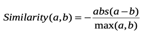
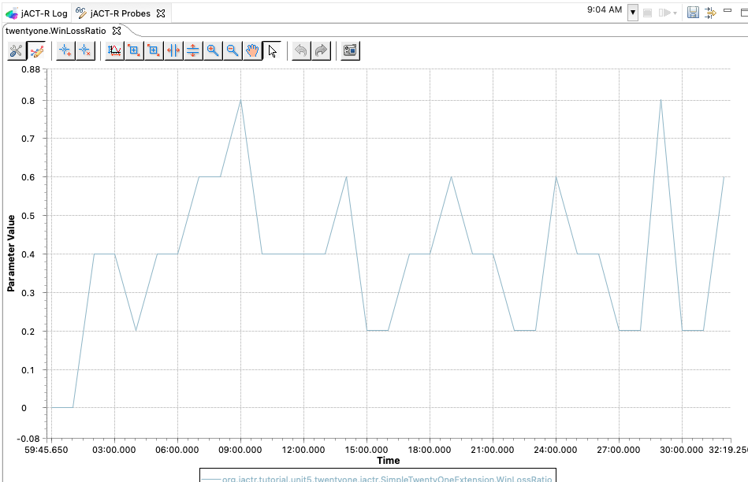
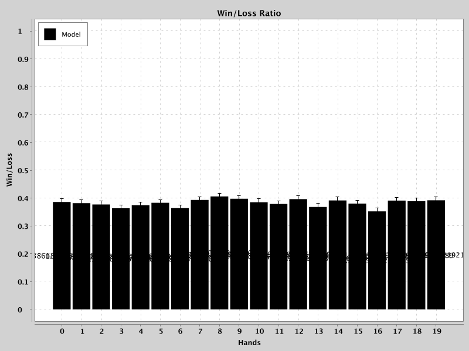
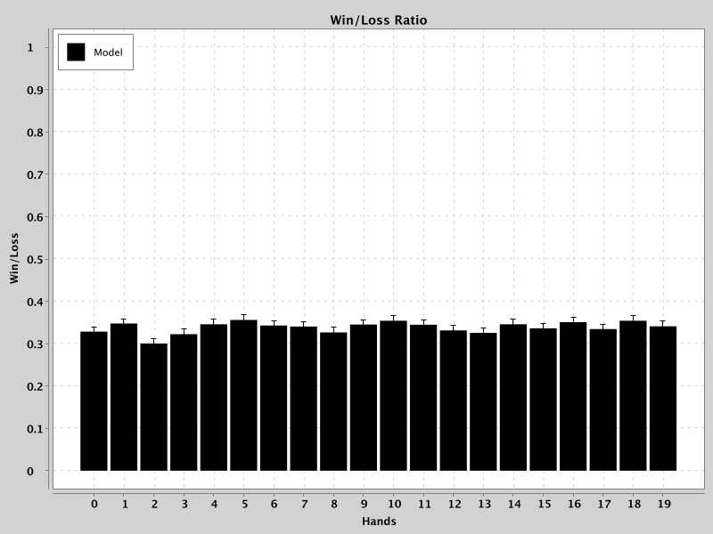

## Learning from exprience
The task for this assignment will be to create a model which can learn to perform a task better based on the experience it gains while doing the task. One way to do that is using declarative memory to retrieve a past experience which can be used to decide on an action to take. The complication however is that in many situations one may not have experienced exactly the same situation in the past. Thus, one will need to retrieve a similar experience to guide the current action, and the partial matching mechanism provides a model with a way to do that.

Instead of writing a model to fit data from an experiment, in this unit we will be writing a model which can perform a more general task. Specifically, the model must learn to play a game better. The model will be assumed to know the rules of the game, but will not have any initial experience with the game thus must learn the best actions to take as it plays. In the following sections we will introduce the rules of the game, how the model interacts with the game, a description of the starting model, what is expected of your model, and how to use the provided code to run the game.

### 1-hit Blackjack
The game we will be playing is a simplified version of the casino game Blackjack or Twenty- one. In our variant there are only two players and they each have only one decision to make.

The game is played with 2 decks of cards, one for each player, consisting of cards numbered 1- 10. The number of cards in the decks and the distribution of the cards in the decks are not known to the players in advance. A game will consist of several hands. On each hand, the objective of the game is to collect cards whose sum is less than or equal to 21 and greater than the sum of the opponent’s cards. When summing the values of the cards a 1 card may be counted as 11 if that sum is not greater than 21, otherwise it must be considered as only 1. At the start of a hand each player is dealt two cards. One of the cards is face up and the other is face down. A player can see both of his cards’ values but only the value of the face up card of the opponent. Each player then decides if he would like one additional card or not. Choosing to take an additional card is referred to as a “hit” and choosing to not take a card is referred to as a “stay”. This choice is made without knowing your opponent’s choice – each player makes the choice in secret. An additional constraint is that the players must act quickly. The choice must be made within a preset time limit to prevent excessive calculation or contemplation of the actions and to keep the game moving. If a player hits then he is given one additional card from his deck and his final score is the sum of the three cards (with a 1 counted as 11 if that does not exceed 21). If a player stays then his score is the sum of the two starting cards (with a 1 counted as 11). Once any extra cards have been given both players show all of the cards in their hands and the outcome is determined. If a player’s total is greater than 21 then he has lost. That is referred to as “busting”. It is possible for both players to bust in the same hand. If only one player busts then the player who did not bust wins the hand. If neither player busts then the player with the greater total wins the hand. If the players have the same total then that is considered a loss for both players. Thus to win a hand a player must have a total less than or equal to 21 and either have a greater total than the opponent’s total or have the opponent bust. After a hand is over the cards are returned to the players’ decks, they are reshuffled and another hand begins. The objective of the game is to win as many hands as possible.

There are many unknown factors in this game making it difficult to know what the optimal strategy is at the start. However, over the course of many hands one should be able to improve their winnings as they acquire more information about the current game. One complication is that the opponent may also be adapting as the game goes on. To simplify things for this assignment we will assume that the model’s opponent always plays a fixed strategy, but that that strategy is not known to the model in advance. Thus, the model will start out without knowing the specifics of the game it is playing, but should still be able to learn and improve over time.

### General modeling task description
To keep the focus of this modeling task on the learning aspect we have abstracted away from a real interface to the game in much the same way as the fan and grouped models abstracted away from a simulation of the complete experimental task. Thus the model will not have to use either the visual or aural module for acquiring the game state. Similarly, the model will also not have to compute the scores or determine the specific outcomes of each hand. The model will be provided with all of the available game state information in a chunk in the goal buffer at two points in the hand and will only need to make one of two responses to signal its action.
This abstraction will pull us away from the clean model/task/environment delineation that we've used in most of the tutorial models. It requires some custom Java programming, but that cost comes with the benefit that the model runs are significantly (x6-10) faster.

At the start of the hand the model will be given its two starting cards, the sum of those cards, and the value of the opponent’s face up card. The model then must decide whether to hit or stay. The model has exactly 10 seconds in which to make this choice and if it does not respond within that time it is considered as staying for the hand. After 10 seconds have passed, the model’s goal chunk will be modified to reflect the actions of both players and the outcome of the game. The model will then have all of its own cards’ values, all of the opponent’s cards’ values, the final totals for its hand and the opponent’s hand, as well as the outcome for each player. The model must then use that information to determine what, if anything, it should learn from this hand before the next hand begins. The time between the feedback and the next hand will also be 10 seconds.

### Goal chunk specifics
Here is the chunk-type definition which specifies the slots used for the chunk that will be placed into the goal buffer:
```
chunktype game-state {
  mc1     = null //model card 1
  mc2     = null //model card 2
  mc3     = null //model card 3, if hit
  mstart  = null //model sum at start
  mtot    = null //model total at end
  mresult = null //model win/lose/bust
  oc1     = null //other card 1
  oc2     = null //other card 2
  oc3     = null //other card 3, if hit
  ostart  = null //other sum at start (1 card)
  otot    = null //other total at end
  oresult = null //other result
  state   = start
}
```
The slots of the chunk in the goal buffer will be set by the game playing code for the model as follows:

1. At the start of a new hand
* state slot will be start
* mc1 slot will hold the value of the first card (1-10)
* mc2 slot will hold the value of the second card (1-10)
* mstart will hold the score of the model's first two cards (4-21)
* oc1 will hold the value of opponent's face up card
* ostart will hold the score of the opponent at start
* the remaining slots will be null at the start

2. After 10 seconds for deciding have expired and players should have made a response
* state will be set to results
* mc1, mc2, mstart, oc1, ostart will have the same values as above
* mc3 will hold the value of the hit card, if taken
* mtot is the total of the model's hand
* mresult holds the win/lose/bust status
* oc2 will hold the opponent's second card
* oc3 will hold the opponent's third card if hit was taken
* otot will hold the opponent's final score
* oresult will hold the opponent's reulst, win/lose/bust

For testing, the model will be played through a series of 100 hands and its percentage of winning in each group of 5 hands will be computed. For a fixed opponent’s strategy and particular distribution of cards in the decks there is an optimal strategy and it may be possible to create rules which play a “perfect” game under those circumstances. However, since the model will not know that information in advance it will have to learn to play better, and the objective is to have a model which can improve its performance over time for a variety of different opponents and different possible decks of cards. Of course, since the cards received are likely random for any given sequence of 100 hands the model’s performance will vary and even a perfect strategy could lose all of them. Thus to determine the effectiveness of the model it will play several games of 100 hands and the results will be averaged to determine how well it is learning.

### Starting model
A starting model for this task can be found in the **org.jactr.tutorial.unit5.twentyone** packages. Specifically,
the model is defined in [twentyone.jactr](https://github.com/amharrison/jactr-tutorials/blob/master/org.jactr.tutorial.unit5/models/org/jactr/tutorial/unit5/twentyone/twentyone.jactr), and can executed using **Unit 5- TwentyOne** run configuration. The given model uses a very simple approach to learn to play the game. It attempts to retrieve a chunk which contains an action to perform that is similar to the current hand from those which it created based on the feedback on previous hands. If it can retrieve such a chunk it performs the action that it contains, and if not it chooses to stay. Then, based on the feedback from the hand the model may create a new chunk which holds the learned information for this hand to use on future hands. As described below however, the feedback used by this model is not very helpful in producing a useful chunk for learning about the game – it learns a strategy of always hitting.

Because there are many more potential starting configurations than hands which will be played, this model uses the partial matching mechanism to allow it to retrieve a similar chunk when a chunk which matches exactly is not available. The given code provides the model with similarity values between numbers by using a function.
This is done by setting the SimilarityHandlers parameter to the class name of our ISimilarityHandler [implementation](https://github.com/amharrison/jactr-tutorials/blob/master/org.jactr.tutorial.unit5/src/org/jactr/tutorial/unit5/twentyone/jactr/NumericSimilarityHandler.java). This is by far easier than setting similarities by hand, but does require a little bit of programming.

The equation that is used to set the similarities between the card values is:



This ratio has two features which should work well for this task and it corresponds to results found in the psychology literature. First, the similarity is relative to the difference between the numbers so that the closer the numbers are to each other the more similar they are. Thus, 1 and 2 are more similar than 1 and 3. The other feature is that larger numbers are more similar than smaller numbers for a given difference. Therefore 21 and 22 are more similar than 1 and 2 are.

There are several other parameters which are also set in the starting model.

We start with base-level learning for declarative memory with a decay of .5 (the recommended value) and specifies that the optimized learning equation be used for the base-level calculation. 
Randomness is enabled to break ties for activations and during conflict resolution. 
Finally, the latency factor is set to 0 so that all retrievals complete immediately which is a simplification to avoid having to tune the model’s chunk activation values to achieve appropriate timing since we are not matching latency data, but do have a time constraint of 10 seconds. Those settings should also be used in the assignment model which you write.

Additional parameters you may want to look at are ActrivationNoise, MismatchPenalty, and RetrievalThreshold. These values worked well for the solution model, but may need to be adjusted for your model.

### The Assignment
The assignment for the task is to create a model which can learn to play better in a 100 hand game without knowing the details of the opponent or the distribution of cards in the decks in advance. Thus, it must learn based on the information it acquires as it plays the game.

Although the specific information learned by the starting model does not do a good job of learning to play better it does represent a reasonable approach for a model of this game. The recommended way to approach this assignment is to modify that starting model so that it learns to play better. You are not required to use that model, but your solution must use partial matching and it must be able to learn verses a variety of opponents and with different distributions of cards in the decks – it should not incorporate any information specific to the strategy of the default opponent provided or the default distribution of cards in the decks.

Here is a high level description of how this model plays the game in English from the model’s perspective. At the start of the game, can I remember a similar situation and the action I took? If so, make that action. If not then I should stay. When I get the feedback is there some pattern in the cards, actions, and results which indicates the action I should have taken? If so create a memory of the situation for this game and the action to take. Otherwise, just wait for the next hand to start.

If you choose to use the starting model, then there are two things that you will need to change about it to make it learn to play the game better. One is the information which it considers when making its initial choice, and the other is how it interprets the feedback so that it creates chunks which have appropriate information about the actions it should take based on the information that is available.

Specifically, you will need to do the following things:

* Change the learned-info chunk-type to specify the slots which hold the information your model needs to describe the situation for the game (the current model only considers one of its own cards).
* Change the start production to retrieve a chunk given the information you have determined is appropriate.
* Change or replace the results-should-hit and results-should-stay productions to better test the information available at the end of the game to decide on a good action to learn (the current model does not require any particular pattern and just has two productions, one of which says it should hit regardless of the details and one which says stay regardless of the details). You may want to add more than two options as well because there are many reasonable ways to decide what move would have been “right”, but you should probably start with a small set of simple choices and see how it works before trying to cover all possible options. If you have overlapping patterns you may want to set the utilities to provide a preference between them (the current model sets the results-should-hit production to have a higher utility than results-should-stay).

With an appropriate choice of initial information and some reasonable handling of the feedback that should be sufficient to produce a model which can learn against a variety of opponents.

There are other things which you could do that may improve that model’s learning even more, and some of those are listed below. It is strongly recommended that you get a simple model which can learn to play the game using the basic operation described above before attempting to improve it with any of these or other mechanisms:

* Change the noise level and the mismatch penalty parameters to adjust the learning rate or flexibility of the model.
* Add more productions to analyze the starting position either before or after retrieving an appropriate chunk.
* Provide a strategy other than just choosing to stay when no relevant information can be retrieved.

The important thing to remember however is that the model should not make any assumptions about the distribution of cards in the decks or the strategy of the opponent.

### Running the Game and Model
There are two parameters that can be used to run the model through the game. Each is described below.

#### Playing a number of hands
The [SimpleTwentyOneExtension](https://github.com/amharrison/jactr-tutorials/blob/master/org.jactr.tutorial.unit5/src/org/jactr/tutorial/unit5/twentyone/jactr/SimpleTwentyOneExtension.java) exposes a parameter "HandsToPlay". Setting it to a number will determine how many hands the model will play before exiting. 

### Different opponent
The [SimpleTwentyOneExtension](https://github.com/amharrison/jactr-tutorials/blob/master/org.jactr.tutorial.unit5/src/org/jactr/tutorial/unit5/twentyone/jactr/SimpleTwentyOneExtension.java) exposes a parameter "DealerStandsOn" which is the value that the opponent will stand on.

### Showing learning over time
The [SimpleTwentyOneExtension](https://github.com/amharrison/jactr-tutorials/blob/master/org.jactr.tutorial.unit5/src/org/jactr/tutorial/unit5/twentyone/jactr/SimpleTwentyOneExtension.java) exposes a read-only parameter "WinLossRatio". By using the general probe tracer, you can plot the win/loss ratio as the model runs.



### Bulk runs
Because the win/loss rate is so noisy, you'll have to run many iterations to see the learning effect clearly. The
**Unit 5 - TwentyOne Bulk Run** has already been configured with a parameter search space [configuration](https://github.com/amharrison/jactr-tutorials/blob/master/org.jactr.tutorial.unit5/src/org/jactr/tutorial/unit5/twentyone/data/fit.xml) and [analyzer](https://github.com/amharrison/jactr-tutorials/blob/master/org.jactr.tutorial.unit5/src/org/jactr/tutorial/unit5/twentyone/data/Analyzer.java) to graph
the average over the iterative runs. Here you can see the accuracy for our solution is roughly 40% which is pretty good.



Where as the supplied model is roughly 35%.



***
More details about the various implementations in this unit can be found [here](README5.md).