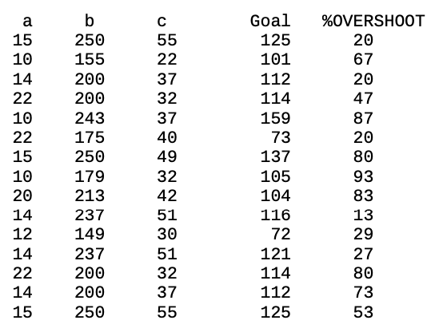

# Unit 6: Selecting PRoductions on the Basis of Their Utilities and Learning those Utilities
Occasionally, we have had cause to set parameters of productions so that one production will be preferred over another in the conflict resolution process. Now we will examine how production utilities are computed and used in conflict resolution. We will also look at how these utilities are learned.

## The Utility Theory
Each production has a utility associated with it which can be set directly as we have seen in some of the previous units. Like activations, utilities have noise added to them. The noise is controlled by the utility noise parameter s which is set with the parameter ExpectedUtilityNoise of the procedural module. The noise is distributed according to a logistic distribution with a mean of 0 and a variance of


If there are a number of productions competing with expected utility values Uj the probability of choosing production i is described by the formula


where the summation j is over all the productions which currently have their conditions satisfied. Note however that that equation only serves to describe the production selection process. It is not actually computed by the system. The production with the highest utility (after noise is added) will be the one chosen to fire.

## Building Sticks Example
We will illustrate these ideas with an example from problem solving. Lovett (1998) looked at participants solving the building-sticks problem illustrated in the figure below. This is an isomorph of Luchins waterjug problem that has a number of experimental advantages. Participants are given an unlimited supply of building sticks of three lengths and are told that their objective is to create a target stick of a particular length. There are two basic strategies they can select – they can either start with a stick smaller than the desired length and add sticks (like the addition strategy in Luchins waterjugs) or they can start with a stick that is too long and “saw off” lengths equal to various sticks until they reach the desired length (like the subtraction strategy). We will call the first of those the
undershoot strategy and the second the overshoot strategy. Subjects show a strong tendency to hillclimb and choose as their first stick a stick that will get them closest to the target stick.


You can go through a version of this experiment using the **Unit 6 - BST Experiment** run configuration. As expected it runs through the [experiment.xml]() configuration for the BST task.

The experiment will look something like this:


To do the task you will see four lines initially. The top three are black and correspond to the building sticks you have available. The fourth line is green and that is the target length you are attempting to build. The current stick you have built so far will be blue and below the target stick. You will build the current stick by pressing the button to the left of a stick you would like to use next. If your current line is shorter than the target the new stick will be added to the current stick, and if your current line is longer than the target the new stick will be subtracted from the current stick. When you have successfully matched the target length the word “Done” will appear below the current stick and you will progress to the next trial. At any time you can hit the button labeled Reset to clear the current stick and start over.

As it turns out, both of the problems presented in that test set can only be solved by the overshoot strategy. However, the first one looks like it can be solved more easily by the undershoot strategy. The exact lengths of the sticks in pixels for that problem are:

A = 15  B = 200  C = 41 Goal = 103

The difference between B and the goal is 97 pixels while the difference between C and the goal is only 62 pixels – a 35 pixel difference of differences. However, the only solution to the problem is B – 2C – A. The same solution holds for the second problem:

A = 10  B = 200 C = 29 Goal = 132

But in this case the difference between B and the goal is 68 pixels while the difference between C and the goal is 103 pixels – a 35 pixel difference of differences in the other direction. You can run the model on these problems and it will tend to choose undershoot for the first about 75% of the time and overshoot for the second about 75% of the time.

You can run the model through the experiment using **Unit 6 - BST GUI**. The model for the task involves many productions for encoding the screen and selecting sticks. However, the critical behavior of the model is controlled by four productions that make the decision as to whether to apply the overshoot or the undershoot strategy.

```

production decide-over{
  goal{
    isa try-strategy
    state    =  choose-strategy
    strategy =  null
  }
  imaginal{
    isa encoding
    over  =  =over
    under =  =under
  }
  proxy("org.jactr.tutorial.unit6.bst.jactr.LessThanDelta")
  {
    arg1      = =over
    arg2      = =under
    threshold = 25
  }
}{
  imaginal{}
  goal{
    state    = prepare-mouse
    strategy = over
  }
  +visual-location{
    isa visual-location
    kind  =  button-object
    value =  "B"
  }
}

production force-over{
  goal{
    isa try-strategy
    state    =  choose-strategy
    strategy != over
  }
}{
  goal{
    state    = prepare-mouse
    strategy = over
  }
  +visual-location{
    isa visual-location
    kind  =  button-object
    value =  "B"
  }
}


production decide-under{
  goal{
    isa try-strategy
    state    =  choose-strategy
    strategy =  null
  }
  imaginal{
    isa encoding
    over  =  =over
    under =  =under
  }
  proxy("org.jactr.tutorial.unit6.bst.jactr.LessThanDelta")
  {
    arg1      = =under
    arg2      = =over
    threshold = 25
  }
}{
  imaginal{}
  goal{
    state    = prepare-mouse
    strategy = under
  }
  +visual-location{
    isa visual-location
    kind  =  button-object
    value =  "C"
  }
}

production force-under{
  goal{
    isa try-strategy
    state    =  choose-strategy
    strategy != under
  }
}{
  goal{
    state    = prepare-mouse
    strategy = under
  }
  +visual-location{
    isa visual-location
    kind  =  button-object
    value =  "C"
  }
}
```
The key information is in the over and under slots of the chunk in the imaginal buffer. The over slot encodes the pixel difference between stick b and the target stick, and the under slot encodes the difference between the target stick and stick c. These values have been computed by prior productions that encode the problem. If one of these differences appears to get the model much closer to the target (more than 25 pixels closer than the other) then the decide-under or decide-over productions can fire to choose the strategy. In all situations, the other two productions, force-under and force-over, can apply. Thus, if there is a clear difference in how close the two sticks are to the target stick there will be three productions (one decide, two force) that can apply and if there is not then just the two force productions can apply.

Their initial utilities are set using the *parameters* command.
```
parameters (decide-under, decide-over)["Utility" : "13"]
parameters (force-under, force-over)["Utility" : "10"]
```

But they could have been specified with the productions using the *[]* notation. The Utility parameters are set to 10 for the force productions and to 13 for the decide productions since making the decision based on which one looks closer should be preferred to just guessing, at least initially. 
The ExpectedUtility value shown in the output from spp indicates the last computed utility value for the production during a conflict- resolution event and includes the utility noise. The value of NaN in the output above before the model runs indicates that the production has not yet been used.


After running the model, you should notice two extra folders in the folder the model ran from. *start* and *stop* where contributed
by the Model Recorder instrument. It saves the full model at the start and end of the run. Looking at the
model at the end of the run, you can see the utilities for productions in question. Or, you can look at the Probe Viewer, which
is tracking the ExpectedUtility of each of those productions.
```

production decide-over {
  goal {
    isa try-strategy
    state    =  choose-strategy
    strategy =  null
  }
  imaginal {
    isa encoding
    over  =  =over
    under =  =under
  }
  proxy ( "org.jactr.tutorial.unit6.bst.jactr.LessThanDelta" ) {
    arg1      = =over
    arg2      = =under
    threshold = 25.0
  }
}{
  imaginal {}
  goal {
    state    = prepare-mouse
    strategy = over
  }
  +visual-location {
    isa visual-location
    kind  =  button-object
    value =  "B"
  }
} [
  "ExpectedUtility" : "13.57194"
  "Utility"         : "13.0"
  "Reward"          : "NaN"
  "FiringTime"      : "0.05"
  "CreationTime"    : "0.0" ]

production decide-under {
  goal {
    isa try-strategy
    state    =  choose-strategy
    strategy =  null
  }
  imaginal {
    isa encoding
    over  =  =over
    under =  =under
  }
  proxy ( "org.jactr.tutorial.unit6.bst.jactr.LessThanDelta" ) {
    arg1      = =under
    arg2      = =over
    threshold = 25.0
  }
}{
  imaginal {}
  goal {
    state    = prepare-mouse
    strategy = under
  }
  +visual-location {
    isa visual-location
    kind  =  button-object
    value =  "C"
  }
} [
  "ExpectedUtility" : "10.364364000000002"
  "Utility"         : "13.0"
  "Reward"          : "NaN"
  "FiringTime"      : "0.05"
  "CreationTime"    : "0.0" ]

production force-over {
  goal {
    isa try-strategy
    state    =  choose-strategy
    strategy != over
  }
}{
  goal {
    state    = prepare-mouse
    strategy = over
  }
  +visual-location {
    isa visual-location
    kind  =  button-object
    value =  "B"
  }
} [
  "ExpectedUtility" : "13.67845542136013"
  "Utility"         : "10.0"
  "Reward"          : "NaN"
  "FiringTime"      : "0.05"
  "CreationTime"    : "0.0" ]

production force-under {
  goal {
    isa try-strategy
    state    =  choose-strategy
    strategy != under
  }
}{
  goal {
    state    = prepare-mouse
    strategy = under
  }
  +visual-location {
    isa visual-location
    kind  =  button-object
    value =  "C"
  }
} [
  "ExpectedUtility" : "9.884676000000002"
  "Utility"         : "10.0"
  "Reward"          : "NaN"
  "FiringTime"      : "0.05"
  "CreationTime"    : "0.0" ]    
```


The Utility parameters for the force productions are set to 10 while they are set to a more optimistic 13 for the decide productions.
The ExpectedUtility parameter shows the last computed utility value for the production during a conflict-resolution event but does not include the effect of utility noise (that is handled by the instantiation of the production). The above four productions are the only ones in the model with non-zero values.

Let us consider how these productions apply in the case of the two problems in the model. Since the difference between the under and over differences is 35 pixels, there will be one decide and two force productions that match for both problems. Let us consider the probability of choosing each production using the equation shown above, and the fact that the noise parameter, s, is set to 3 in the model.


In the model, the parameter s is set at 3.  First, consider the probability of the decide production:


Similarly, the probability of the two force productions can be shown to be .248.  Thus, there is a .248 probability that a force production will fire that has the model try to solve the problem in the direction other than it appears.

## Utility Learning
So far we have only considered the situation where the production parameters are static. The utilities of productions can also be learned as the model runs based on rewards that are received by the model. When utility learning is enabled, the productions’ utilities are updated according to a simple integrator model (e.g. see Bush & Mosteller, 1955).. If Ui(n-1) is the utility of a production i after its n-1st application and Ri(n) is the reward the production receives for its nth application, then its utility Ui(n) after its nth application will be:


where alpha is the learning rate and is typically set at .2 (this can be changed by adjusting the ParameterLearningRate parameter of the procedural learning module). This is also basically the Rescorla-Wagner learning rule (Rescorla & Wagner, 1972). According to this equation the utility of a production will be gradually adjusted until it matches the average reward that the production receives.

There are a couple of things to mention about the rewards. The rewards can occur at any time, and are not necessarily associated with any particular production. Also, a number of productions may have fired before a reward is delivered. The reward Ri(n) that production i will receive will be the external reward received minus the time from production i’s selection to the reward. This serves to give less reward to more distant productions. This is like the temporal discounting in reinforcement learning but proves to be more robust within the ACT-R architecture (not suggesting it is generally more robust). This reinforcement goes back to all of the productions which have been selected between the current reward and the previous reward.

There are two ways to provide rewards to a model: at any time the trigger-reward command can be used to provide a reward or rewards can be attached to productions and those rewards will be applied after the corresponding production fires. Attaching rewards to productions can be the more convenient way to provide rewards to a model when they correspond to situations which the model will explicitly process. For instance, in the building sticks task the rewards are provided when the model successfully completes a problem and when it has to reset and start over, and there are productions which handle those situations: read-done detects that it has completed the problem and pick-another- strategy is responsible for choosing again after resetting. One can associate rewards with these outcomes by setting the reward values of those productions:

```
production read-done{
  goal{
    isa try-strategy
    state =  read-done
  }
  visual{
    isa visual-object
    value =  "Done"
  }
}{
  +goal{
    isa try-strategy
    state =  start
  }
}["Reward" : "20"]

production pick-another-strategy{
  goal{
    isa try-strategy
    state =  wait-for-click
  }
  ?motor{
    state =  free
  }
  visual{
    isa visual-object
    value =  "Reset"
  }
}{
  goal{
    state = choose-strategy
  }
}["Reward" : "0"]
```
When read-done fires it will propagate a reward of 20 back to the previous productions which have been fired. Of course, productions earlier in the chain will receive smaller values because the time to the reward is subtracted from the reward. If pick-another- strategy fires, a reward of 0 will be propagated back – which means that previous productions will actually receive a negative reward because of the time that passed. Consider what happens when a sequence of productions leads to a dead end, pick- another-strategy fires, another sequence of productions fire that leads to a solution, and then read-done fires. The reward associated with read-done will propagate back only to the production which fired after pick-another-strategy and no further because the reward only goes back as far as the last reward. Note that the production read-done will receive its own reward, but pick-another-strategy will not receive any of read-done’s reward since it will have received the reward from its own firing.

## Learning in the Building Sticks Task
The following are the lengths of the sticks and the percent choice of overshoot for each of the problems in the testing set from an experiment with a building sticks task reported in Lovett & Anderson (1996):



The majority of these problems look like they can be solved by undershoot and in some cases the pixel difference is greater than 25. However, the majority of the problems can only be solved by overshoot. The first and last problems are interesting because they are identical and look strongly like they are undershoot problems. It is the only problem that can be solved either by overshoot or undershoot. Only 20% of the participants solve the first problem by overshoot but when presented with the same problem at the end of the experiment 53% use overshoot.

You can run **Unit 6 - BST Bulk Run** to see how the model performs over many iterations. As before, we've provided a [fit.xml]() configuration file to explore specific parameters. Here we look at the role of ExpectedUtilityNoise on the various fits.
It will provide a graph of the results as well as a summary of the average utilities for the critical productions.

```
decide-over 13.29
decide-under  11.34
force-over  12.97
force-under 7.25
```
As can be seen, the two over productions have increased their utility while the under productions have had a drop off. On average, the force-over production has a slightly higher value than the decide-under production. It is this change in utility values that creates the increased tendency to choose the overshoot strategy.

## Additional Chunk-type Capabilities
Before discussing the assignment task for this unit we will look at a few of the productions in this model which appear to be doing things differently than previous units.

### Default chunk-type slot values
Up until now when we have created chunk-types we have only specified the set of slots which it can include, but in addition to that one can specify default initial values for specific slots. If a chunk-type indicates that a slot should have a value by default, then when that chunk-type is declared any slots with default values that are not specified in the chunk definition or production statement will automatically be included with their default values.

Specifying a default slot is done in the chunktype definition.
```
chunktype try-strategy {
  strategy = null
  state    = start
}
```
For the slots with default values the chunks which specify the slot get the value specified, whereas the ones that do not get the default value. The same process applies to conditions and actions in a production.
The chunktypes move-mouse and click-mouse are created by the motor module an include default values for its slots:
```
chunktype click-mouse extends finger-command { 
  hand   = right
  finger = index
}
```

### Chunk-type hierarchy
As can be seen in the above example, chunktypes can extend other chunktypes. When they do this, they inherit all the slots of the parent chunktype.
This is particularly useful for visual chunks, which must all be derived from *visual-object*. For BST we created a custom line-object representation
that contains the length of the line in pixels (since that is how the original model is written). 
```
chunktype line-object extends visual-object {length = null}
```
In general one can create an arbitrary hierarchy of chunk-types with each subtype inheriting the slots and default values of its parent chunk-type (or even multiple parent chunk-types). A hierarchy of chunk-types can be helpful to the modeler in specifying chunks and productions, but other than through the inclusion of default slot values, such a hierarchy has no effect on the actual chunks or productions in the model.


## Learning in a Probability Choice Experiment
Your assignment is to develop a model for a "probability matching" experiment run by Friedman et al (1964). However, unlike the assignments for previous units, you are not provided with the code that implements the experiment this time. Therefore you will need to first write the experiment, and then develop the model, which more closely represents the typical modeling situation. The experiment to be implemented is very simple. Here is the basic procedure which is repeated for 48 trials:
1. The participant is presented with a screen saying "Choose"
2. The participant either presses the ‘h’ key for heads or the ‘t’ key for tails
3. When the key is pressed the screen is cleared and the feedback indicating the correct answer, either "Heads" or "Tails", is displayed.
4. That feedback stays on the screen for exactly 1 second before the next trial is presented.

Friedman et al arranged it so that heads was the correct choice on 10%, 20%, 30%, 40%, 50%, 60%, 70%, 80%, and 90% of the trials (independent of what the participant had done). For your experiment you will only be concerned with the 90% condition. Thus, your experiment will be 48 trials long and “Heads” will be the correct answer 90% of the time. We have averaged together the data from the 10% and 90% conditions (flipping responses) to get an average proportion of choice of the dominant answer in blocks of 12 trials. These proportions are 0.664, 0.778, 0.804, and 0.818. This is the data that your model is to fit. It is important to note that this is the **proportion of choice for heads**, not the proportion of correct responses – the correctness of the response does not matter.

Your model must begin with a 50% chance of saying heads, then based on the feedback from the experiment it must adjust its choice through utility learning so that it averages responding heads close to 66% over the first block of 12 trials, and increases to about 82% by the final block. You will run the model through the experiment many times (resetting before each experiment) and average the data of those runs for comparison. 

We have provided some skeleltal implementations of various pieces of glue to speed you along. You will need to do the following:

1. Finish the implementation of [DisplayTrial]() to handle the logic of the experiment trial.
2. Define a run configuration for the experiment itself and run yourself in the GUI version to familiarize yourself with the task.
3. Implement a model that can complete a single task, as defined in [short.xml]().
4. Define a run configuration for the model, using the appropriate interfaces.
5. You can use the [GUIExperimentInterface](), or implement a simulated interface like we've done in the past tutorials. 
6. Verify the model runs with one trial, then try the full [experiment.xml](). You may find the probe viewer useful during debugging of expected utilities.
7. Finish the implementation of [Analyzer]() to handle bulk run analyses.
8. Define a stripped down run configuration to be used by iterative run.
9. Define the iterative run configuration to use the stripped down configuration, the orthogonal parameter space search, and its configuration [fit.xml]().
