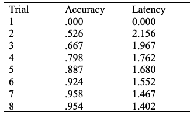

# Unit 7: Production Rule Learning

In this unit we will discuss how new production rules are learned. As we will see, a model can acquire new production rules by collapsing two production rules that apply in succession into a single rule. Through this process the model will transform knowledge that is stored declaratively into a procedural form. We call this process of forming new production rules production compilation and refer to the specific act of combining two productions as a composition.

## The Basic Idea
A good pair of productions for illustrating production compilation is the two that fire in succession to retrieve a paired associate in the paired model from Unit 4:
```
production read-probe{
  goal{
    isa goal
    state =  attending-probe
  }
  visual{
    isa text
    value =  =value
  }
}{
  +imaginal{
    isa pair
    probe =  =value
  }
  +retrieval{
    isa pair
    probe =  =value
  }
  goal{
    state = testing
  }
}

production recall{
  goal{
    isa goal
    state =  testing
  }
  retrieval{
    isa pair
    answer =  =answer
  }
  ?motor{
    state =  free
  }
}{
  +motor{
    isa press-key
    key =  =answer
  }
  goal{
    state =  read-study-item
  }
  +visual{
    isa clear
  }
}
```
If these two productions fired and retrieved the chunk for the pair of zinc & 9, production compilation would compose these two rules into the following single production:
```
fill in with zinc and 9
```
This production combines the work of the two productions and has built into it the paired associate components. In the next two subsections we will describe the general principles used for composing two production rules together and the factors that control how these productions compete in the conflict resolution process.

## Forming a New Production
The basic idea behind forming a new production is to combine the tests in the two conditions into a single set of tests that will recognize when the pair of productions will apply and combine the two sets of actions into a single set of actions that has the same overall effect. Since the conditions consist of a set of buffer tests and the actions consist of a set of buffer transformations (either direct modifications or new requests) this can be done largely on a buffer-by-buffer basis. The complications occur when there is a buffer transformation in the action of the first production and either a test of that buffer in the condition of the second production or another transformation of the same buffer in the action of the second production. The productions above illustrate both complications with respect to the goal buffer. Because the change to the state slot of the goal buffer chunk in the first production is tested as a condition in the second production that test can be omitted from the tests of the composed production. Then, because that state slot is changed again by the second production, and the composed production only needs to reproduce the final state of the original two productions, that first goal change can also be omitted from the actions of the compiled production. The result of the overlap in the goal buffer is just a simplification of the production rule but in other cases other responses are necessary.

Because different modules use their buffers in different ways the production compilation process needs to be sensitive to those differences. For instance, in the above production we see that the retrieval buffer request was omitted from the newly formed production, but the imaginal buffer request was not. The production compilation mechanism is built around sets of rules that we call styles and each buffer is handled using the rules for the style which best categorizes its use. For each style the rules specify when two productions that use that same buffer can be combined through compilation and how to compose the uses of that buffer. By default there are five styles to which the buffers of ACT-R are assigned and we will describe the mechanisms used for those styles in the following sections. It is possible to add new styles and also to adjust the assignment of buffers to styles, but that is beyond the scope of the tutorial.

### Motor Style Buffers
Let us first consider the compilation policy for the motor style buffers. The buffers that fit this style are the manual and vocal buffers. The main distinction of these buffers is that they never hold a chunk. They are used for requesting actions of a module which can only process one request at a time and they are only tested through queries. If the first production makes a request of one of these buffers then it is not possible to compose it with a second production if that production also makes a request of that buffer or queries the buffer for anything other than state busy. If both productions make a request, then there is a danger of jamming if both requests were to occur at the same time, and any queries that are not checking to see if the module is busy in the second production are probably there to prevent jamming in the future, and thus also block the composition.

### Perceptual Style Buffers
Now let us consider the compilation policy for the perceptual buffers. These are the buffers in the perceptual style: visual-location, visual, aural-location, and aural. These buffers will hold chunks generated by their modules. The important characteristic about them is that those chunks are based on information in the external world, and thus are not guaranteed to result in the same request generating the same result at another time. First, like the motor style buffers, it is not possible to compose two productions which both make requests of the same perceptual style buffer or if the first production makes a request and the second production makes a query for other than state busy of that buffer because of the possibility of jamming. In addition, if the first production makes a request of one of these buffers then it is not possible to compose it with the second production if that production tests the contents of the buffer. This is because of the unpredictable nature of such requests – one does not want to create productions that encapsulate information that is based on external information which may not be valid ever again (at least not for most modeling purposes). The idea is that we only want to create new productions that are “safe”, and by safe we mean that the new production can only match if the productions that it was generated from would match and that its actions are the same as those of its parent productions. Basically, for the default mechanism, we do not want composed productions to be generated that introduce new errors into the model.

Thus, points where a request is made of a perceptual or motor style buffer are points where there are natural breaks in the compilation process. The standard production compilation mechanisms will not compose a production that makes such a request with a following production that operates on the same buffer.

### Retrieval Style Buffer
Next let us consider the compilation policy for the retrieval buffer (the only buffer of the retrieval style). Because declarative memory is an internal mechanism (i.e., not subject to the whims of the outside world) it is more predictable and thus offers an opportunity for economy. The interesting opportunity for economy occurs when the first production requests a retrieval and the second tests the result of that retrieval. In this case, one can delete the request and test and instead specialize the composed production. Any variables specified in the retrieval request and bound in the harvesting of the chunk can be replaced with the specific values based on the chunk that was actually retrieved. This was what happened in the example production above where the retrieved paired-associate for zinc & 9 was built into the new production0. There is one case, however, which blocks the composition of a production which makes a retrieval request with a subsequent production. That is when the second production has a query for a retrieval failure. This cannot be composed because declarative memory grows monotonically and it is not safe to predict that in the future there will be a retrieval failure. This suggests that it is preferable, if possible, to write production rules that do not depend on retrieval failures.

### Goal and Imaginal Style Buffers
The goal and imaginal buffers are also internal buffers allowing economies to be achieved. The mechanisms used for these two buffers are very similar, and thus will be described together. The difference between them arises from the fact that the imaginal buffer requests take time to complete, and that difference will be described below. First, we will analyze the process for which they are the same and that is broken down into cases based on whether the first production involves a request to the buffer or not.

#### First production does not make a request
Let C1 and C2 be the conditions for the buffer in the first and second production and A1 and A2 be the corresponding productions’ buffer modification actions for that buffer. Then, the buffer test for the composed production is C1+(C2-A1) where (C2-A1) specifies those things tested in C2 that were not created in A1. The modification for the combined production is A2+(A1 \~A2) where (A1 \~A2) indicates the modifications that were in A1 that are not undone by A2. If the second production makes a request, then that request can just be included in the composed production.

#### First production makes a request
This case breaks down into two subcases depending on whether the second production also makes a request.

##### The second production does not also make a request. 
In this case the second production’s buffer test can be deleted since its satisfaction is guaranteed by the first production. Let C1 be the buffer condition of the first production, A1 be the buffer modification action of the first production, N1 be the new request in the first production, and A2 be the buffer modification of the second production. Then the buffer test of the composed production is just C1, the goal modification is just A1, and the new request is A2+(N1\~A2).

##### The second production also makes a request.
In this case the two productions cannot be composed because this would require either skipping over the intermediate request, which would result in a chunk not being created in the new production which was generated by the initial two productions, or making two requests to the buffer in one production which could lead to jamming the module.

#### Difference between goal and imaginal
The difference between the two comes down to the use of queries. Because the imaginal module’s requests take time one typically needs to make queries to test whether it is free or busy whereas the goal module’s requests complete immediately and thus the state is never busy. So, for goal style buffers production compilation is blocked by any queries in either production because that represents an unusual situation and is thus deemed unsafe. For imaginal style buffers productions which have queries are allowed when the queries and actions between the productions are “consistent”. All of the rules for composition consistency with the imaginal style buffers are a little too complex to describe here, but generally speaking if the first production has a request then the second must either test the buffer for state busy and not also make a request (like motor style buffers) or explicitly test that the buffer is free and make only modifications to the buffer.

## Utility of newly created productions
So far we have discussed how new production rules are created but not how they are used. When a new production is composed it enters the procedural module and is treated just like the productions which are specified in the model definition. They are matched against the current state along with all the rest of the productions and among all the productions which match the current state the one with the highest utility is selected and fired. When a new production, which we will call New, is composed from old productions, which we will call Old1 and Old2 and which fired in that order, it is the case that whenever New could apply Old1 could also apply. (Note however because New might be specialized it does not follow that whenever Old1 could apply New could also apply.) The choice between New, Old1, and any other productions which might also apply will be determined by their utilities as was discussed in the previous unit.

A newly learned production New will initially receive a utility of zero by default (that can be changed with the :nu parameter). Assuming Old1 has a positive utility value, this means that New will almost always lose in conflict resolution with Old1. However, each time New is recreated from Old1 and Old2, its utility is updated with a reward equal to the current utility of Old1, using the same learning equation as discussed in the previous unit:


As a consequence, even though New may not fire initially, its utility will gradually approach the utility of Old1. Once the utility of New and Old1 are close enough, New will occasionally be selected because of the noise in utilities. Once New is selected it will receive a reward like any other production which fires, and its utility can surpass Old1’s utility if it is better (it is usually a little better because it typically leads to rewards faster since it saves a production rule firing and often a retrieval from declarative memory).

## Learning from Instruction
Generally, production compilation allows a problem to be solved with fewer productions over time and therefore performed faster. In addition to this speed-up, production compilation results in the drop-out of declarative retrieval as part of the task performance. As we saw in the example in the first section, production rules are produced that just "do it" and do not bother retrieving the intervening information. The classic case of where this applies in experimental psychology is in the learning of experimental instructions. These instructions are told to the participant and initially the participant needs to interpret these declarative instructions. However, with practice the participant will come to embed these instructions into productions that directly perform the task. These productions will be like the productions we normally write to model participant performance in the task. Essentially these are productions that participants learn in the warm-up phase of the experiment.
The model [paired.jactr](https://github.com/amharrison/jactr-tutorials/blob/master/org.jactr.tutorial.unit7/models/org/jactr/tutorial/unit7/paired/paired.jactr), located in **org.jactr.tutorial.unit7.paired**, contains an example of a system that interprets instructions about how to perform a paired associate task and learns the productions that do the task directly.

In the model we use the following chunks to represent the understanding of the instructions for the paired associate task (in some of our work we have built productions that read the instructions from the screen and build these chunks but we are skipping that step here to focus on the mechanisms of this unit):

1. operator op1(pre=start, action=read, arg1=create, post=stimulus-read)
2. operator op2(pre=stimulus-read, action=associate, arg1=filled, arg2=fill, post=recalled)
3. operator op3(pre=recalled, action=test-arg2, arg1=respond, arg2=wait)  
4. operator op4(pre=respond, action=type, arg2=response, post=wait)
5. operator op5(pre=wait, action=read, arg2=fill, post=new-trial)
6. operator op6(pre=new-trial, action=complete-task, post=start)

These are represented as operators that indicate what to do in various states during the course of a paired­associate trial. They consist of a statement of what that state is in the pre slot and what state will occur after the action in the post slot. In addition, there is an action slot to specify the action to perform and two slots, arg1 and arg2, for holding possible arguments needed during the task execution. So to loosely translate the six operators above:

1. At the start read the word and create an encoding of it as the stimulus
2. After reading the stimulus try to retrieve an associate to the stimulus
3. Test whether an item has been recalled and if it has not then just wait
4. If an item has been recalled type it and then wait
5. Store the response you read with the stimulus
6. This trial is complete so start the next one

The model uses a chunk in the goal buffer to maintain a current state and sub step within that state and a chunk in the imaginal buffer to hold the items relevant to the current state. For this task, the arguments are the stimulus and probe for a trial.

The model must retrieve operators from declarative memory which apply to the current state to determine what to do, and in this simple model we really just need one production which requests the retrieval of an operator relevant to the current state:
```
production retrieve-operator{
  goal{
    isa task
    state =  =state
    step  =  ready
  }
  ?retrieval{
    state != busy
  }
}{
  +retrieval{
    isa operator
    pre =  =state
  }
  goal{
    step = retrieving-operator
  }
}
```
The particular actions specified in the operators (read, associate, test-arg2, type, and complete-task) are all general actions not specific to a paired associate task. We assume that the participant knows how to do these things going into the experiment. This amounts to assuming that there are productions for processing these actions. For instance, the following two productions are responsible for reading an item and creating a chunk in the imaginal buffer which encodes the item into the arg1 slot of that chunk:
```
production read-arg1{
  goal{
    isa task
    step =  retrieving-operator
  }
  retrieval{
    isa operator
    action =  read
    arg1   =  create
    post   =  =state
  }
  visual-location{
    isa visual-location
  }
  ?visual{
    state =  free
  }
  ?imaginal{
    state  =  free
    buffer =  empty
  }
}{
  +imaginal{
    isa args
    arg1 =  fill
  }
  +visual{
    isa attend-to
    where =  =visual-location
  }
  goal{
    state = =state
    step  = attending
  }
}

production encode-arg1{
  goal{
    isa task
    step =  attending
  }
  visual{
    isa text
    value =  =value
  }
  imaginal{
    isa args
    arg1 =  fill
  }
  ?imaginal{
    state =  free
  }
}{
  +imaginal{
    arg1 =  =value
  }
  goal{
    step = ready
  }
}

```
The first production responds to the retrieval of the operator and requests a visual attention shift to an item. It also changes the state slot in the goal buffer to the operator’s post state. The second production modifies the representation in the imaginal buffer with the value from the chunk in the visual buffer and sets the goal buffer’s step slot to indicate that it is ready to retrieve the operator relevant to the next state.

This model performs the same task as the paired model you used for Unit 4. However, rather than having specific productions for doing the task it interprets these operators that represent the instructions for doing this task. For reference, here is the data that is being modeled again:




***
When you are comfortable with the concepts involved with production compilation, it's time to move on to the [past-tense](README2.md) learning model.


***
Based on the original CC licensed [ACT-R tutorials](http://act-r.psy.cmu.edu/software/), 12.25.20.

<a rel="license" href="http://creativecommons.org/licenses/by/4.0/"></a><br />This work is licensed under a <a rel="license" href="http://creativecommons.org/licenses/by/4.0/">Creative Commons Attribution 4.0 International License</a>.

