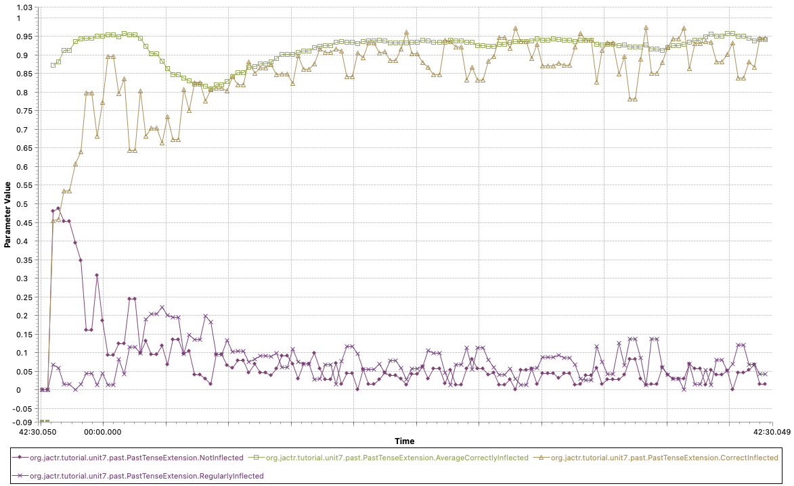
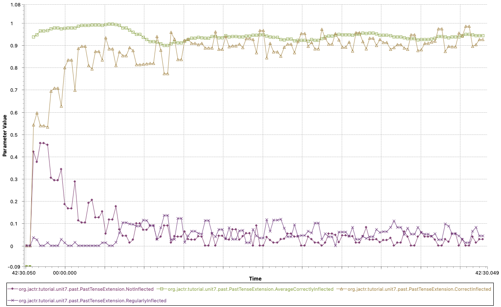
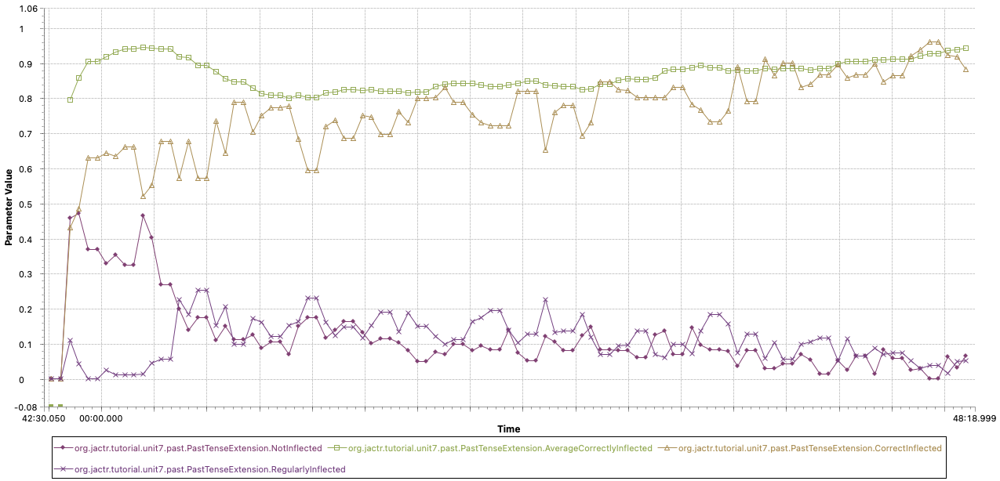

## Past-tense Learning
Your assignment is to make a model that learns the past tense of verbs in English. The learning process of the English past tense is characterized by the so-called U-shaped learning with irregular verbs. That is, at a certain age children inflect irregular verbs like “to break” correctly, so they say “broke” if they want to use the past tense. But at a later age, they overgeneralize, and start saying “breaked”, and then at an even later stage they again inflect irregular verbs correctly. Some people, such as Pinker and Marcus, interpret this as evidence that a rule is learned to create a regular past tense (add “ed” to the stem). According to Pinker and Marcus, after this rule has been learned, it is overgeneralized so that it will also produce regularized versions of irregular verbs.

The start of a model to learn the past tense of verbs is included with the unit, [past.jactr](https://github.com/amharrison/jactr-tutorials/blob/master/org.jactr.tutorial.unit7/models/org/jactr/tutorial/unit7/past/past.jactr) under the **org.jactr.tutorial.unit7.past** package. The assignment is to make the model learn a production which represents the regular rule for making the past tense and also specific productions for producing the past tense of each verb. So eventually it should learn productions which act essentially like this:

```
IF the goal is to make the past tense of a verb 
THEN copy that verb and add –ed

IF the goal is to make the past tense of the verb have 
THEN the past tense is had
```

The task is controlled by the [PastTenseExtension](https://github.com/amharrison/jactr-tutorials/blob/master/org.jactr.tutorial.unit7/src/org/jactr/tutorial/unit7/past/PastTenseExtension.java), which is installed using the ```extension``` definition:
```
extension "org.jactr.tutorial.unit7.past.PastTenseExtension"[
  "MaximumTrials"  : "7500"
  "ReportInterval" : "100"]
```

Installed into the model like this, the extension is able to access to model's internals. It does two things. It adds correct past tenses to declarative memory, reflecting the fact that a child hears and then encodes correct past tenses from others. It also creates goals which indicate to the model that it should generate the past tense of a verb found in the imaginal buffer and then runs the model to do so. The model will be given two correct past tenses for every one that it must generate.

The past tense of verbs are encoded in chunks using the slots of this chunk-type:
```
chunktype past-tense {
  verb   = null
  stem   = null
  suffix = null
}
```
Where the verb slot holds the base form of the verb and the combination of the stem and suffix slots forms the past tense, with the value blank in the suffix slot meaning that there is no suffix to add (which is used instead of not specifying the slot so that one can distinguish a complete past tense from one that is malformed). Here are examples of correctly formed past tenses for the irregular verb have and the regular verb use:
```
PAST-TENSE1
     verb have
     stem had
     suffix blank
PAST-TENSE234
     verb use
     stem use
     suffix ed
```

To indicate to the model that it should create a past tense the chunk in the goal buffer will have a state slot with a value of start and the chunk in the imaginal buffer will contain a chunk which has a verb slot with the base form of a verb. Here is what those buffers’ contents would look like at the start of a run to form the past tense of the verb work:
```
GOAL: STARTING-GOAL-0 [STARTING-GOAL]
STARTING-GOAL-0
  STATE START
IMAGINAL: CHUNK2-0 [CHUNK2]
CHUNK2-0
  VERB WORK
```
The model then has to fill in the stem and suffix slots of the chunk in the imaginal buffer to indicate the past tense form of the verb and set the state slot of the chunk in the goal buffer to done to indicate that it is finished. Once the state slot is set to done, one of the three productions provided with the model should fire to simulate the final encoding and “use” of the word, each of which has a different reward. There are three possible cases:

* An irregular inflection, this is when there is a value in the stem slot and the suffix is marked explicitly as blank. This use has the highest reward, because irregular verbs tend to be short.
* A regular inflection, in which the stem slot is the same as the verb slot and the suffix slot has a value which is not blank. This has a slightly lower reward.
* Non-inflected when neither the stem nor suffix slots are set in the chunk. The non- inflection case applies when the model cannot come up with a past tense at all, either because it has no example to retrieve, no production to create it, or no strategy to come up with anything based on a retrieved past tense. The non- inflection situation receives the lowest reward because the past tense would have to be indicated by some other method, for example by adding “yesterday” or some other explicit reference to time.

An important thing to notice is that all three of those situations receive a reward. The model receives no feedback as to whether the past tenses it produces are correct – any validly formed result is considered a success and rewarded. The only feedback it receives with respect to the correct form of past tenses is the correctly constructed verbs that it hears between the attempts to generate its own.

You can run the model using the **Unit 7 - Past Tense** run configuration. It already has probes configured to track the performance of the model.
As the model runs, the probes will track four values: proportion of verbs that were not inflected, regularly inflected, irregularly inflected, and a rolling average proportion of correct irregular inflections. These values are updated once every *ReportInterval* trials. The model stops running after *MaximumTrials* has elapsed.  It is this last value that you should see the U-shape.

 

It usually requires more than 5000 trials to see the effect and often 15000~20000 trials are necessary before the entire U-shape in the learning forms.

What you are looking for from the model is a graph that looks something like the above. Here you can see the average increasing from 87% to 95% as the model learns the words for the first time. During this time, no inflection is strong, upwards of 50% due to the unfamiliarity of the words. Then after a critical point, the regularization kicks in and regularized verbs become more frequent. At this time, average irregular inflection begins to fall off, dropping as low as 80%. As time progresses, the proportion of irregular inflections increases and the proportion of regular inflections decreases, resulting in the recovery of the average irregular inflection rate.
Peak-performance to peak-performance, you can see the U-shape. 

This model differs from other models in the tutorial in that it does not model a particular experiment, but rather some long term development. This has a couple of consequences for the model. One of those is that using the perceptual and motor modules does not contribute much to the objective of the model. Thus things like actually hearing the past tenses and the generation of the word as speech are not modeled for the purpose of this exercise. They could be modeled, but it is not what the model and exercise are about and would really only serve to make things more complicated with little to no benefit. Another consequence of the nature of this task is a practical one with how long it takes to run the model to see those long term results. Because of that, we are not averaging multiple runs of the model together to report the results because the learning trajectory can vary significantly between trials and it would take a very large number of runs to reliably see the U-shape in the average results which would take a much longer time to run. Also contributing to that variability is that we are only using a very small vocabulary (though still maintaining the appropriate frequency of irregular and regular verb usage) again to keep the time needed to run it reasonable for an exercise, which leads to less data for averaging.

For reference, here are some more images of the results for the same model as shown above:



In fact, even a “correct” model may sometimes fail to show the U-shape, for example never dipping down because it learns the right inflections before it learns the regular rule or never really coming back up after dipping down because the regular rule is reinforce too much. However, on most runs (90% or more) a good model should show the U-shape in some form.

Having that sort of variability between runs is not entirely bad, as children also differ quite a bit with respect to U-shaped learning. However that does make comparing this model to data difficult, and hard data on the phenomenon are also scarce, although the phenomenon of the U-shape is reported often. 

In terms of the assignment, the objective is to write a model that learns the appropriate productions for producing past tenses. There is no parameter adjustment or data fitting required. All one needs to do is write productions which can generate past tenses based on retrieving previous past tenses, and which through production compilation will over time result in new productions which directly apply the regular rule or produce the specific past tense.

The key to a successful model is to implement two different retrieval strategies in the model. The model can either try to remember the past tense for the specific verb or the model can try to generate a past tense based on retrieving any past-tense. These should be competing strategies, and only one applied on any given attempt. If the chosen strategy fails to produce a result the model should “give up” and not inflect the verb. The reason for doing that is that language generation is a rapid process and not something for which a lot of time per word can be allocated.

Additionally, the productions you write should have no explicit reference to either of the suffixes, ed or blank, because that is what the model is to eventually learn, i.e., you do not write a production that says add ed, but through the production compilation mechanism such a production is learned. Although the experiment code is only outfitted with a limited set of words, the frequency with which the words are presented to the model is in accordance with the frequency they appear in real life, and because of that, if your model learns appropriate productions it should generate the U-shaped learning automatically (although it won’t always look the same on every run as seen above). Unlike the other models in the tutorial, for this task there is a fairly small set of “good” solutions which will result in the generation of the U-shaped learning because it is actually the model’s starting productions which get composed to result in the learning of specific productions over time, and those starting productions need to allow the production compositions to happen which restricts the types of things that they can do.

There are two important things to make sure to address when writing your model with respect to performing the task. It must set the state slot of the chunk in the goal buffer to done on each trial, and the chunk in the imaginal buffer must have one of the forms described above: either a chunk with values in each of the verb, stem and suffix slots or a chunk with only a value in the verb slot. Those conditions are necessary so that one of the provided productions will fire and propagate a reward. If it does not do so, then there will be no reward propagated to promote the utility learning for that trial and the reward from a later trial will be propagated back to the productions which fired on the trial which didn’t get a reward. That later reward will be very negative because there are 200 seconds between trials, and that will make it very difficult, if not impossible, to produce the U-shaped learning. Essentially this represents the model saying something every time it tries to produce a past-tense while speaking.

One final thing to note is that when the model doesn’t give up it should produce a reasonable answer. One aspect of being reasonable is that the resulting chunk in the imaginal buffer should have the same value in the verb slot that it started with. Similarly, if there is a value in the stem slot, then it should be either that verb or the correct irregular form of that verb. For example, if it starts with “have” in the verb slot acceptable values would be “have” or “had” in the stem slot, but if it starts with a regular verb, like “use” the only acceptable value for the stem would be “use” because it shouldn’t be trying to create some irregular form for a regular verb. If the model does produce an unreasonable result there will be a warning printed showing the starting verb and the result which the model created like this:


## References
Marcus, G. F., Pinker, S., Ullman, M., Hollander, M., Rosen, T. J., & Xu, F. (1992). [Overregularization in Language Acquisition](https://www.jstor.org/stable/1166115). Monographs of the Society for Research in Child Development,57(4).


***
Based on the original CC licensed [ACT-R tutorials](http://act-r.psy.cmu.edu/software/), 12.25.20.

<a rel="license" href="http://creativecommons.org/licenses/by/4.0/"></a><br />This work is licensed under a <a rel="license" href="http://creativecommons.org/licenses/by/4.0/">Creative Commons Attribution 4.0 International License</a>.